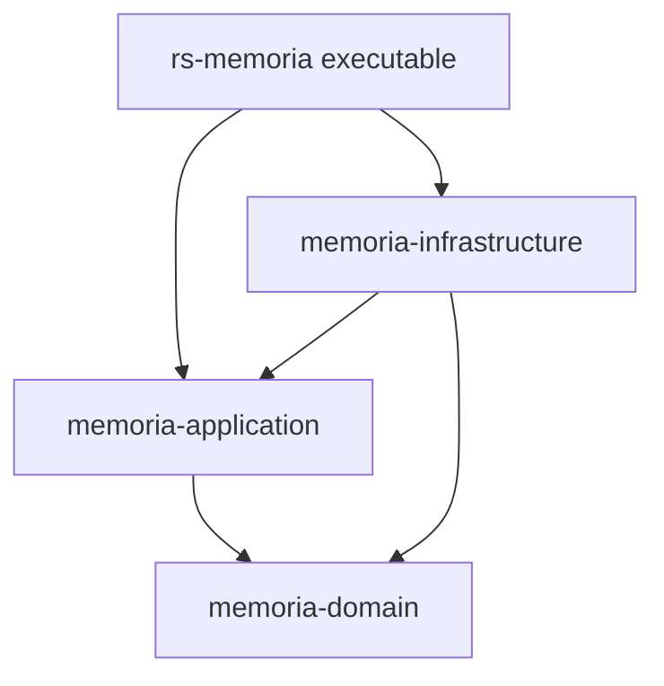

# Memoria

Memoria is a command-line tool that identifies which READMEs require review after project files change.

Code changes can leave documentation out of date.
Memoria connects each README to the files that it explains.
You or an agent examines the explanation, and Memoria records the reviewed inputs.
Later changes produce a list of required reviews.

## Use cases

Memoria supports these tasks:

- After a feature change, a developer finds the affected READMEs.
- Before a merge, CI identifies documentation reviews that remain open.
- During agent work, the reviewer receives source text and repository writing rules together.
- After a writing-policy change, a maintainer requests reviews without a code change.

## Try a small example

Install Memoria from this checkout:

```sh
cargo install --locked --path .
```

The example uses an existing Git project with one README and no saved Memoria reviews.
A document boundary groups the selected files that one README explains.
The nearest README owns each selected file.
A child README starts a separate boundary.

In that project, prepare the first review:

1. Invoke `memoria init`. It creates missing configuration, a root README, and empty review state.
2. Invoke `memoria status`. It shows the current state without changing files.
3. Invoke `memoria review`. It lists required reviews in order without recording a review result.

`init` preserves valid existing files.

Pending means that a README requires a review.
In this example, the plan lists `README.md` as pending because it has no recorded review.

## Finish one review

A review packet is a file that contains one README and the exact inputs for its review.
It also contains the applicable writing rules.
The reviewer uses this packet as evidence for the explanation.

An acknowledgement records who reviewed the README and why its explanation is correct.
A revision counts successful acknowledgements for that README.
A token is the packet identifier that connects an acknowledgement to the reviewed document, revision, and inputs.

The `lint` command examines documentation structure, such as markers and references between READMEs.
The `check` command also requires current reviews and current copies of shared text.
A current README has no remaining review cause.
Neither command records a review result.

The review has five stages:

1. `memoria review` selects the next README.
2. `memoria review <README.md> --format json` creates its packet.
3. The reviewer examines the inputs and updates the explanation. After edits, a fresh packet captures the final text.
4. `memoria lint` examines the structure, and `memoria ack` records the review against the final packet and token.
5. After all required reviews, `memoria check` succeeds.

Memoria determines whether the recorded inputs still match.
The reviewer remains responsible for the meaning of the prose.
Memoria makes no LLM calls.

## Share a short explanation between READMEs

An export is a marked section that another README can reuse.
An import declares a managed copy of that section.
The README that supplies it is the provider, and the README that copies it is the consumer.

The `render` command updates these copies from their providers.
It changes the imported text but does not record a review result.
If a copy is outdated, the plan requests `render` before the consumer review.

A source change first affects its README owner.
Consumers wait for their providers to finish review.
If a provider export stays unchanged, that source change does not create a review cause for its consumers.
Normal Markdown links provide navigation without review dependencies.

## Request a review without a file change

An invalidation is an explicit review request with a recorded reason.
It makes the selected READMEs pending without changing their text.
This is useful after a change to writing rules or project decisions.
A writing-policy edit alone does not request a review.

## Examine the self-demo

This repository uses the same workflow for its own documentation.
Six READMEs define its document boundaries.
The root README imports five short summaries from those boundaries.
Memoria stores the review results in `.memoria/state.json`.

Start the self-demo:

1. Invoke `memoria status`.
2. Invoke `memoria invalidate all --reason "Review the documentation against the repository writing policy."`.
3. Invoke `memoria review`.

The plan puts the five providers before the root README.
The policy in `memoria.toml` enters every packet.
It requires the `simple-english` and `i-have-adhd` skills before documentation edits.
If a required skill is unavailable, the policy requires the author to stop and name it.

## Continue with the relevant guide

| Guide | Reader task |
| --- | --- |
| [Review workflow](docs/workflow.md) | Process a required review with packet and acknowledgement commands. |
| [Command reference](docs/cli.md) | Find arguments, state changes, limits, and diagnostics. |
| [Agent skill](skills/memoria/SKILL.md) | Read the generic procedure that the executable supplies to agents. |
| [Specification](docs/specification.md) | Examine the original requirements and proposed decisions. |

This checkout uses `memoria.toml`, raw byte fingerprints, and local Git worktrees on Linux.
The [toolchain file](rust-toolchain.toml) identifies its Rust version.
The [command reference](docs/cli.md#fingerprints-and-limits-of-the-result) describes the implementation limits.

## Repository structure

The domain crate contains review rules.
The application crate coordinates commands through ports, which are contracts for external operations.
Infrastructure adapters implement those contracts with Git, file access, and format libraries.
The `memoria` executable constructs these parts.



Each arrow means that one workspace package declares a dependency on another.
All paths point toward the domain, which declares no runtime dependency.
Source evidence: [root manifest](Cargo.toml), [application manifest](crates/memoria-application/Cargo.toml), [infrastructure manifest](crates/memoria-infrastructure/Cargo.toml), and [domain manifest](crates/memoria-domain/Cargo.toml).

The imported summaries identify the local implementation boundaries.
Each linked README supplies enough context for a developer or agent who opens it directly.


### [Domain](crates/memoria-domain/README.md)

<!-- memoria:import src="crates/memoria-domain/README.md#summary" -->
The domain crate assigns selected files to their nearest README.
It compares recorded review inputs with current inputs.
Its rules determine which READMEs require review and their order.
<!-- /memoria:import -->

### [Application](crates/memoria-application/README.md)

<!-- memoria:import src="crates/memoria-application/README.md#summary" -->
The application crate coordinates Memoria commands through domain rules.
Its ports describe external operations, and adapters supply those operations.
Each command returns structured results for the executable.
<!-- /memoria:import -->

### [Infrastructure](crates/memoria-infrastructure/README.md)

<!-- memoria:import src="crates/memoria-infrastructure/README.md#summary" -->
The infrastructure crate implements Git, file, parser, and storage operations.
It supplies these operations through application ports.
Its writers compare expected content before replacement.
<!-- /memoria:import -->

### [Command entry point](src/README.md)

<!-- memoria:import src="src/README.md#summary" -->
The executable parses arguments, constructs adapters, and calls the application.
It writes human text or JSON and returns a process exit status.
<!-- /memoria:import -->

### [Command behavior tests](tests/README.md)

<!-- memoria:import src="tests/README.md#summary" -->
The integration tests invoke Memoria commands in temporary Git worktrees.
They compare output, exit statuses, and stored files.
The sample repositories stay outside this project documentation scope.
<!-- /memoria:import -->

The root README owns the shared guides, root build files, license, and source skill.
The configuration excludes `tests/fixtures/**` because those files represent other repositories.

<details>
<summary>Development commands</summary>

```sh
cargo fmt --all -- --check
cargo clippy --workspace --all-targets --all-features --locked -- -D warnings
cargo test --workspace --all-targets --all-features --locked
cargo test --workspace --doc --all-features --locked
cargo build --release --locked --bin memoria
```

</details>

The project uses the [MIT license](LICENSE).

Invoke `memoria status` to examine the documentation state in your project.
