# Memoria

Memoria identifies the README reviews that a Git worktree requires after its documentation inputs change.

Each selected file has a README owner.
Short exports connect those local explanations to their consumers.
A human or agent reviews the prose, and Memoria records the reviewed inputs.

This repository uses Memoria to maintain its own documentation.
Six READMEs define the boundaries, and the root imports five short summaries.
The review state stays in `.memoria/state.json`.
`memoria status` shows the current review state without changing it.

## Install from this checkout

Install the binary:

```sh
cargo install --locked --path .
```

Examine the command help:

```sh
memoria --help
```

The [toolchain file](rust-toolchain.toml) identifies the Rust version for this checkout.
The [workflow](docs/workflow.md) explains the first review in an existing Git project.

## The domain connects local explanations

| Term | Meaning |
| --- | --- |
| Owner | The nearest README owns a selected file. |
| Export | A marked section supplies text to another README. |
| Import | A declared reference creates a review dependency and a managed copy. |
| Packet | A packet contains the exact inputs for one document review. |
| Acknowledgement | A reviewer records a result against that packet and its token. |

A source change first affects its owner.
If the owner export stays unchanged, consumers do not acquire a new review cause from that change.
Consumers still wait until their providers have current reviews.
Normal Markdown links supply navigation without review dependencies.

Source evidence: [ownership.rs:18](crates/memoria-domain/src/ownership.rs#L18) and [schedule.rs:66](crates/memoria-domain/src/schedule.rs#L66).

## Dependencies point toward the domain

The domain defines rules, the application coordinates commands, and infrastructure implements adapter contracts.
The binary assembles these parts.



The **application arrow** and **adapter arrows** show declared workspace dependencies toward the domain.
The domain declares no runtime dependency.
Source evidence: [root manifest](Cargo.toml), [application manifest](crates/memoria-application/Cargo.toml), [infrastructure manifest](crates/memoria-infrastructure/Cargo.toml), and [domain manifest](crates/memoria-domain/Cargo.toml).

The imported summaries describe each boundary in that order.
Each linked README supplies the local mechanism and error behavior.

### [Domain](crates/memoria-domain/README.md)

<!-- memoria:import src="crates/memoria-domain/README.md#summary" -->
The domain crate assigns selected files to their nearest README.
It separates ownership, imports, and navigation.
Its manifests describe review inputs, and its review rules determine pending work.
It orders providers before consumers without file access or Git processes.
<!-- /memoria:import -->

### [Application](crates/memoria-application/README.md)

<!-- memoria:import src="crates/memoria-application/README.md#summary" -->
The application crate applies domain rules to a snapshot of repository inputs.
Its ports define the contracts for adapters.
Its use cases prepare packets, update imports, and record acknowledgements.
Each outcome carries data and diagnostics for the binary.
<!-- /memoria:import -->

### [Infrastructure](crates/memoria-infrastructure/README.md)

<!-- memoria:import src="crates/memoria-infrastructure/README.md#summary" -->
The infrastructure crate supplies Git, filesystem, parser, hashing, and storage adapters.
It converts external inputs into application values.
Its writers compare expected content before replacement.
The application uses these adapters to save review state and update import bodies.
<!-- /memoria:import -->

### [Binary](src/README.md)

<!-- memoria:import src="src/README.md#summary" -->
The binary builds the adapters and passes them to an application use case.
It converts the outcome to human text or a JSON envelope.
It also maps application errors and output errors to process exit statuses.
<!-- /memoria:import -->

### [Tests](tests/README.md)

<!-- memoria:import src="tests/README.md#summary" -->
The integration tests exercise the binary in temporary Git worktrees.
They cover ownership, review order, packets, imports, invalidation, and installation.
Regression cases compare diagnostics and stored bytes after errors.
The sample repositories stay outside this project documentation scope.
<!-- /memoria:import -->

## Review this repository with Memoria

The writing policy in [memoria.yml](memoria.yml) enters every review packet.
It requires strict Simplified English and short passages that make ownership, state, and next actions visible.
A policy edit alone does not make reviews pending.
An explicit invalidation requests review against the new policy.

Start a documentation review:

1. Invoke `memoria status`.
2. Invoke `memoria invalidate all --reason "Review the documentation against the repository writing policy."`.
3. Invoke `memoria review`.
4. Process the next action with the [packet procedure](docs/workflow.md#review-one-document).
5. After the review plan is empty, invoke `memoria check`.

The workflow uses `memoria render` for managed imports and `memoria ack` for review state.
Each acknowledgement describes the evidence for its result.
The [self-hosting cycle](docs/workflow.md#self-hosting-cycle) explains how changed summaries affect this root README.

## Boundaries of the result

Memoria does not call an LLM or judge whether prose is correct.
The final check establishes matching inputs and valid documentation structure.
A human or agent remains responsible for the explanation.

This release uses raw byte fingerprints and local Git worktrees.
The root configuration excludes `tests/fixtures/**` because those files represent other repositories.
The root README owns the shared guides, diagram assets, root build files, license, and source skill.
The [specification](docs/specification.md) remains the original scoping draft.
The source and [command reference](docs/cli.md) describe the implemented behavior.

## Continue from the relevant guide

| Document | Reader action |
| --- | --- |
| [Workflow](docs/workflow.md) | Review a document and record its acknowledgement. |
| [Command reference](docs/cli.md) | Find a command, limit, or diagnostic. |
| [Source skill](skills/memoria/SKILL.md) | Examine the procedure that the binary embeds for agents. |
| [Specification](docs/specification.md) | Read the original requirements and proposed decisions. |

<details>
<summary>Development commands</summary>

```sh
cargo fmt --all -- --check
cargo clippy --workspace --all-targets --all-features --locked -- -D warnings
cargo test --workspace --all-targets --all-features --locked
cargo test --workspace --doc --all-features --locked
cargo build --release --locked --bin memoria
```

</details>

The project uses the [MIT license](LICENSE).

Invoke `memoria status` to examine the current documentation state.
