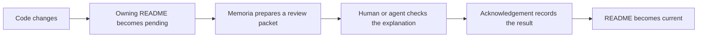
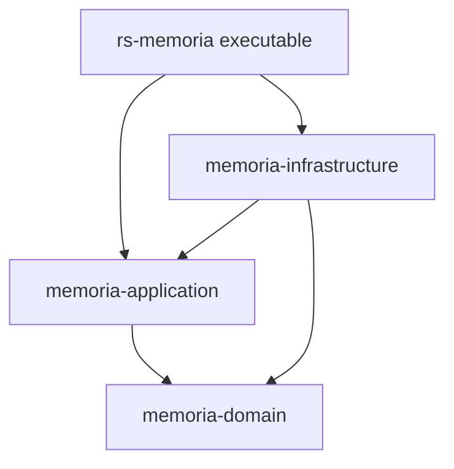

# Memoria

**Keep project documentation connected to the code it explains.**

README drift rarely announces itself. A feature changes, the tests move on, and the explanation that once made sense quietly becomes misleading. In a large repository, even finding the documentation that deserves another look can be harder than fixing it.

Memoria turns that problem into a review queue. It maps files to nearby READMEs, shows which explanations may be affected, packages the relevant evidence for a human or agent, and remembers what was reviewed. It does not write your documentation or decide that the prose is correct; it makes that decision focused, repeatable, and visible.

## Contents

- [Quick start](#quick-start)
- [How Memoria works](#how-memoria-works)
- [Command-line interface](#command-line-interface)
- [Find the right guide](#find-the-right-guide)
- [Self-hosting and development](#self-hosting-and-development)

## Quick start

Install Memoria from this checkout:

```sh
cargo install --locked --path .
```

Then open an existing Git project and let Memoria create its starting files:

```sh
memoria init
memoria status
memoria review
```

`init` adds `memoria.toml`, a root README if one is missing, and empty review state under `.memoria/`. It preserves valid files that already exist. `status` gives you the overview, while `review` tells you exactly what to do next.

When a README needs attention, capture a focused JSON packet outside the repository:

```sh
memoria review README.md --format json > /tmp/memoria-review.json
```

Read the packet, compare the README with its included source evidence, and update the prose when necessary. Then run `memoria lint`, create a fresh packet, and acknowledge that exact snapshot:

```sh
memoria lint
memoria review README.md --format json > /tmp/memoria-review.json
memoria_token=$(jq -r '.data.token' /tmp/memoria-review.json)

memoria ack README.md \
  --packet /tmp/memoria-review.json \
  --token "$memoria_token" \
  --reviewer "Your name" \
  --result updated \
  --note "The README now describes the reviewed inputs."

memoria check
```

Use `--result no-update` when you inspected the evidence and the README was already correct. An acknowledgement makes one document current and advances its revision. It never claims that Memoria wrote or understood the prose.

For the complete packet procedure, including the required fresh-packet step after an edit, follow the [review workflow](docs/workflow.md).

## How Memoria works

Every README creates a documentation boundary. By default, it owns the selected files beneath it until another README creates a more specific boundary. When an owned input changes, Memoria marks that README for review.



This workflow is useful in several common situations:

- A feature changes, and a developer needs to find the affected explanations.
- CI must block a merge until required documentation reviews are complete.
- An agent needs the relevant source and writing policy in one bounded handoff.
- A policy or architecture decision calls for review even though no source file changed.

The packet is the handoff. It contains the README, its selected files, imported text, review reasons, and the writing instructions from project configuration. A compact token binds the acknowledgement to that exact document revision and evidence. If the repository changes before acknowledgement, Memoria rejects the stale packet instead of approving different inputs by accident.

READMEs can also share small, stable explanations. A provider marks an export, and a consumer declares an import. `memoria render` refreshes only those managed copies. The provider finishes first, so consumers never review text from an unfinished dependency.

Sometimes the reason for another review is not a file diff. `memoria invalidate` records an explicit request, such as a changed writing policy or architecture decision, and carries that reason into the packet.

## Command-line interface

This is the complete top-level interface. The command entry-point documentation owns this snapshot, and Memoria imports it here.

<!-- memoria:import src="src/README.md#cli-help" -->
```text
Keep a project's documented mental model connected to its code.

Usage: memoria [OPTIONS] <COMMAND>

Commands:
  init        Create root configuration, a minimal root README, and empty state
  status      Show coverage, input size, and review state
  lint        Check structure, configuration, markers, and link hints
  review      Show the ordered review plan, or a focused packet for one README
  render      Refresh declared import blocks only
  ack         Record a review result against the exact packet snapshot
  invalidate  Mark one README, a subtree, or the whole project for semantic review
  check       Run read-only validation for CI
  graph       Show documentation ownership, imports, navigation, and status
  agent       Install or remove the managed Memoria skill for an agent
  help        Print this message or the help of the given subcommand(s)

Options:
      --root <DIRECTORY>  Project root. Must be the Git worktree root. Defaults to discovery from the current directory
      --format <FORMAT>   Output format [default: human] [possible values: human, json]
  -h, --help              Print help
  -V, --version           Print version
```
<!-- /memoria:import -->

The [command reference](docs/cli.md) covers every argument, state change, diagnostic, and exit status.

## Find the right guide

| If you want to… | Read… |
| --- | --- |
| Complete a documentation review | [Review workflow](docs/workflow.md) |
| Look up a command or failure | [Command reference](docs/cli.md) |
| Install the reusable agent procedure | [Agent skill](skills/memoria/SKILL.md) |
| Understand the product contract | [Specification](docs/specification.md) |
| Explore the implementation | [Repository map](#repository-map) |

The workflow is task-oriented; start there if you are using Memoria for the first time. The command reference is the detailed lookup guide. The specification preserves the product rules and their original rationale.

## Self-hosting and development

Memoria is its own first real project. This repository has six README boundaries, and the root README imports short summaries from the other five. The review state in `.memoria/state.json` records the evidence that each explanation was checked against.

The repository policy in `memoria.toml` also travels inside every review packet. It asks documentation agents to load the `simple-english` and `i-have-adhd` skills, makes this root page the only exception to strict Simplified Technical English, and establishes Mermaid as the diagram format.

To watch the repository review itself:

```sh
memoria status
memoria invalidate all --reason "Review the documentation against the repository writing policy."
memoria review
```

The plan schedules the five provider READMEs before this root consumer. Run `memoria graph` to see the same ownership and import relationships as data.

### Repository map

The workspace follows domain-driven and clean-architecture dependency boundaries:



Each arrow means that one workspace package declares a dependency on another. All paths point toward the domain, which has no runtime dependency. The [root manifest](Cargo.toml), [application manifest](crates/memoria-application/Cargo.toml), [infrastructure manifest](crates/memoria-infrastructure/Cargo.toml), and [domain manifest](crates/memoria-domain/Cargo.toml) are the source evidence.

The summaries below are managed imports. Each implementation boundary owns its explanation locally, while this page gives readers a compact map of the whole system.

#### [Domain](crates/memoria-domain/README.md)

<!-- memoria:import src="crates/memoria-domain/README.md#summary" -->
The domain crate assigns selected files to their nearest README.
It compares recorded review inputs with current inputs.
Its rules determine which READMEs require review and their order.
<!-- /memoria:import -->

#### [Application](crates/memoria-application/README.md)

<!-- memoria:import src="crates/memoria-application/README.md#summary" -->
The application crate coordinates Memoria commands through domain rules.
Its ports describe external operations, and adapters supply those operations.
Each command returns structured results for the executable.
<!-- /memoria:import -->

#### [Infrastructure](crates/memoria-infrastructure/README.md)

<!-- memoria:import src="crates/memoria-infrastructure/README.md#summary" -->
The infrastructure crate implements Git, file, parser, and storage operations.
It supplies these operations through application ports.
Its writers compare expected content before replacement.
<!-- /memoria:import -->

#### [Command entry point](src/README.md)

<!-- memoria:import src="src/README.md#summary" -->
The executable parses arguments, constructs adapters, and calls the application.
It writes human text or JSON and returns a process exit status.
<!-- /memoria:import -->

#### [Command behavior tests](tests/README.md)

<!-- memoria:import src="tests/README.md#summary" -->
The integration tests invoke Memoria commands in temporary Git worktrees.
They compare output, exit statuses, and stored files.
The sample repositories stay outside this project documentation scope.
<!-- /memoria:import -->

The root README owns the shared guides, root build files, license, and source skill. The configuration excludes `tests/fixtures/**` because those files represent other repositories.

<details>
<summary>Development checks</summary>

```sh
cargo fmt --all -- --check
cargo clippy --workspace --all-targets --all-features --locked -- -D warnings
cargo test --workspace --all-targets --all-features --locked
cargo test --workspace --doc --all-features --locked
cargo build --release --locked --bin memoria
```

</details>

Memoria is available under the [MIT license](LICENSE).

Start with `memoria status`; it will tell you what the documentation needs next.
