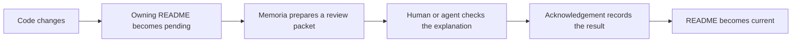
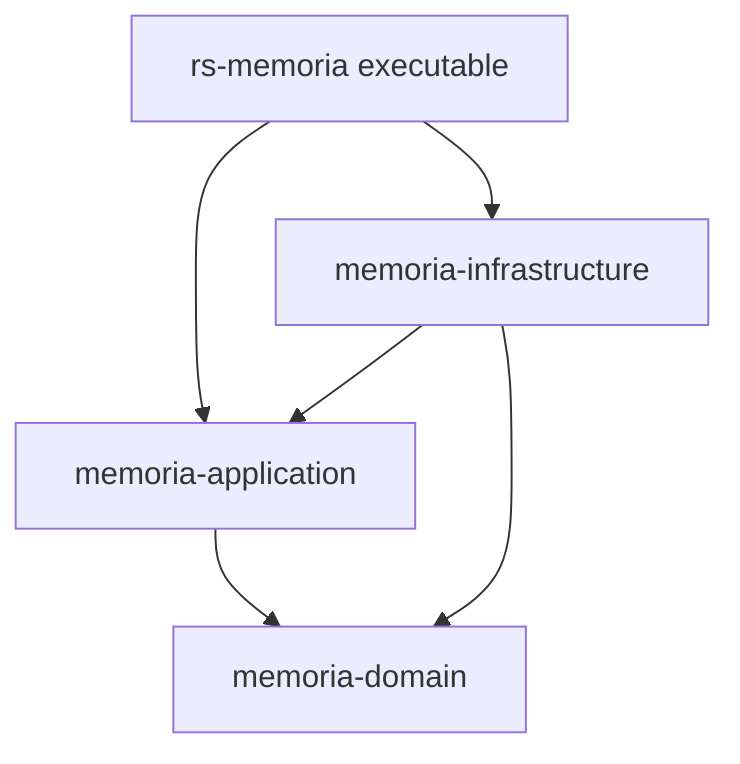

# Memoria

**Memoria tracks documentation freshness. You choose what your README hierarchy represents. Memoria records reviewed inputs and shows which documents need another review.**

**Memoria does not write documentation and does not decide whether its explanation is correct.**

README drift rarely announces itself. A feature changes, the tests move on, and the explanation that once made sense quietly becomes misleading. In a large repository, even finding the documentation that deserves another look can be harder than fixing it.

Memoria turns that into a review queue. It records fingerprints of the exact inputs a reviewer examined, watches those inputs for change, and tells you which explanations are now unverified. The judgment stays yours.

## Contents

- [Purpose](#what-memoria-does-and-does-not-do) and [documentation strategy](#your-documentation-strategy)
- [Quick start](#quick-start)
- [Review workflow](#the-review-workflow) and [project guidance](#project-documentation-guidance)
- [Command-line interface](#command-line-interface) and [task guides](#find-the-right-guide)
- [Self-hosting and development](#self-hosting-and-development)

## What Memoria does and does not do

Memoria answers one question: *which explanations have not been checked against their current inputs?*

It does that by remembering, for each README, the exact files and bytes a reviewer looked at. When those bytes change, that README goes back in the queue. When you tell Memoria that the goals themselves changed, it queues the documents you name.

What Memoria will never do:

- Write or edit your prose. Only `memoria render` changes README text, and only inside explicitly declared import blocks.
- Judge whether an explanation is good, complete, or true. A person or an agent does that.
- Decide what a README should be about. That choice is yours, and Memoria works with whichever one you make.

It earns its keep when:

- A feature changes and you need to find every explanation it touches.
- CI must block a merge until the required documentation reviews are done.
- An agent needs the relevant source, the project's writing goals, and the review history in one bounded handoff.
- A policy or architecture decision calls for review even though no source file changed.

## Your documentation strategy

Memoria has exactly one structural rule: **the nearest README above a file owns that file.** Another README starts a new boundary.

What those boundaries *mean* is entirely up to you. Projects commonly pick one of these:

| Strategy | One README for each… |
| --- | --- |
| Architecture modules | crate, package, or layer boundary |
| Business concepts | domain concept, with its rules and its code |
| Operational workflows | workflow, from its entry point to its outputs |

None of these is more correct than the others, and Memoria will not choose for you. Run `memoria init` to see the choice laid out before anything is written:

```sh
memoria init
```

That is a preview. It reads your project, explains the model, lists the two files it would create, and writes nothing at all. When you are ready:

```sh
memoria init --apply
```

Apply creates `memoria.toml` and `memoria.lock` beside each other. It needs a root `README.md` that you wrote yourself — Memoria will not invent one, because the root explanation is the part only you can write.

## Quick start

**macOS (Apple Silicon or Intel)** — install from the [Homebrew tap](https://github.com/viktordanov/homebrew-tap):

```sh
brew install viktordanov/tap/memoria
```

**Arch Linux (x86_64)** — install [memoria-bin from the AUR](https://aur.archlinux.org/packages/memoria-bin) with `yay`:

```sh
yay -S memoria-bin
```

To build Memoria from this checkout instead, install it with Cargo:

```sh
cargo install --locked --path .
```

Then, in a Git project that already has a root README:

```sh
memoria init --apply
memoria status
memoria review
```

`status` gives you the overview. `review` tells you exactly which README to look at next, and in which order.

When a README needs attention, read the project's guidance first, then capture a focused JSON packet outside the repository:

```sh
memoria guidance README.md
memoria review README.md --format json > /tmp/memoria-review.json
```

Compare the README with the source evidence the packet carries, and update the prose where it no longer matches. Then run `memoria lint`, capture a **fresh** packet, and acknowledge that exact snapshot:

```sh
memoria lint
memoria review README.md --format json > /tmp/memoria-review.json
memoria_token=$(jq -r '.data.token' /tmp/memoria-review.json)

memoria ack README.md \
  --packet /tmp/memoria-review.json \
  --token "$memoria_token" \
  --reviewer "Your name" \
  --result updated \
  --note "The README now describes the reviewed inputs."

memoria check
```

Use `--result no-update` when you read the evidence and the README was already right. Either way, the acknowledgement makes that one document current and advances its revision. It records that you looked; it never claims Memoria understood the prose.

The fresh-packet step matters. If anything changed after the packet was made, Memoria rejects it rather than approving inputs nobody read. The [review workflow](docs/workflow.md) walks through the whole procedure.

## The review workflow

Every README creates a documentation boundary and owns the selected files beneath it. When an owned input changes, that README becomes pending.



The default human view shows changes, evidence, scope, and the next command. Save the full JSON packet outside the project, then use `memoria packet view` to read its exact saved sections. Full review remains the default; the experimental incremental policy is opt-in, and its model-quality evaluation is unrun.

The packet is the handoff. It carries the README, its selected files, imported text, the reasons a review is due, and the project's documentation guidance. A compact token binds an acknowledgement to that exact snapshot.

Acknowledging changes one file: `memoria.lock`. Two files belong in Git:

- `memoria.toml` — your configuration, which only you edit.
- `memoria.lock` — generated, machine-owned review state, which only Memoria writes. Commit it; do not edit it. Read it with `memoria state inspect`.

Because the state travels with the repository, a colleague who clones the project sees the same freshness you do — even with completely different local Git ignore settings on their machine. Their host settings still decide which untracked files exist for them, but they never change what has been reviewed.

READMEs can also share small, stable explanations. A provider marks an export, a consumer declares an import, and `memoria render` refreshes only those managed copies. The provider is scheduled first, so consumers never review text from an unfinished dependency.

Sometimes the reason for another review is not a file diff at all. `memoria invalidate` records an explicit request — a changed policy, a new architecture decision — and carries your reason into the packet.

To see why a boundary needs review, run `memoria explain README.md`. It starts with changed paths, available hunks, and reasons for missing evidence. Hunks require historical bytes that match the last acknowledged inputs. Use `--full` for hashes and detailed context. To compare saved review records, use `memoria state diff before.lock after.lock`; that comparison does not establish current freshness.

For repeated reviews, you can set `MEMORIA_REVIEWER` to your chosen label. An explicit `--reviewer` always wins, and a successful acknowledgement confirms the label it used. The label records attribution, not authentication or authority. Agents should pass their label explicitly.

## Project documentation guidance

Guidance is the prose you write for whoever reviews your documentation: what these documents are for, who reads them, and how to write them.

The owner chooses the goals, the reviewer judges correctness, and Memoria checks exact inputs and review consistency. Guidance provides context; it does not grant permission or override your task.

```toml
[documentation]
guidance = [
  "Explain the operational workflow before implementation details.",
]
guidance_files = ["docs/writing-guidance.md"]
```

Read it any time, for any boundary:

```sh
memoria guidance
memoria guidance src/README.md
```

Guidance is advisory. It never selects files and never makes a document stale on its own. When you change it, `memoria status` and `memoria check` tell you which reviewed documents saw the older wording, and `check` still passes. If the change really does need fresh eyes, say so explicitly:

```sh
memoria invalidate subtree:src --reason 'The workflow explanation has new requirements'
```

That is deliberate. A wording tweak should not silently invalidate a hundred reviews, and Memoria will never do it for you.

## Command-line interface

This is the complete top-level interface. The command entry-point documentation owns this snapshot, and Memoria imports it here.

<!-- memoria:import src="src/README.md#cli-help" -->
```text
Keep a project's documented mental model connected to its code.

Usage: memoria [OPTIONS] <COMMAND>

Commands:
  completions   Print a shell completion script without project discovery or installation
  explain       Explain one README's whole-file freshness with verified local Git evidence
  packet        Read exact sections from a saved canonical packet without project discovery
  init          Validate root setup inputs, or create missing configuration and state with --apply
  status        Show coverage, input size, and review state
  guidance      Show the project documentation guidance that applies to a README
  state         Inspect or compare committed state without changing it
  lint          Check structure, configuration, markers, and link hints
  review        Show the ordered review plan, or a focused packet for one README
  render        Refresh declared import blocks only
  ack           Record a review result against the exact packet snapshot
  invalidate    Mark one README, a subtree, or the whole project for semantic review
  check         Run read-only validation for CI
  graph         Show documentation ownership, imports, navigation, and status
  agent         Install or remove the managed Memoria skill and hooks for an agent
  integrations  Manage the agent skill, the agent hook, and the GitHub workflow
  help          Print this message or the help of the given subcommand(s)

Options:
      --root <DIRECTORY>  Project root. Must be the Git worktree root. Defaults to discovery from the current directory
      --format <FORMAT>   Output format [default: human] [possible values: human, json]
  -h, --help              Print help
  -V, --version           Print version
```
<!-- /memoria:import -->

The [command reference](docs/cli.md) covers every argument, state change, diagnostic, and exit status.

### Run it in CI

Memoria can write the GitHub Actions workflow for you, and it shows you the file before it writes anything:

```sh
memoria integrations github install
memoria integrations github install --apply
```

The generated workflow calls the first-party `setup-memoria` Action, which downloads a verified prebuilt executable for the runner — x64 or ARM64 — instead of compiling Memoria from source. Then it runs `memoria check`. Memoria never adopts or overwrites a workflow file it does not own, and a pending check still means a person reviews the documentation locally.

The first command is a preview. It works in any project, even one Memoria has never seen: it prints the file it would write, names anything still missing, and changes nothing. The second command writes, so it needs an initialized project — the generated job runs `memoria check`. Author the root README first, then run `memoria init --apply`. One thing is still missing on the other end: version 0.5.0 is not published, so the `@v0.5.0` reference and the release archives do not resolve yet. Generate the workflow now and commit it; the job starts working when the release lands. The [GitHub Actions guide](docs/github-actions.md) covers the pins, the checksum, the ownership record, and what each state means.

## Find the right guide

| If you want to… | Read… |
| --- | --- |
| Complete a documentation review | [Review workflow](docs/workflow.md) |
| Look up a command or failure | [Command reference](docs/cli.md) |
| Understand the committed state file | [Committed state](docs/state.md) |
| Install the agent skill or a Stop hook | [Agent integrations](docs/agents.md) |
| Find every integration and its command name | [Integrations](docs/integrations.md) |
| Run Memoria in GitHub Actions | [GitHub Actions](docs/github-actions.md) |
| See release changes and earlier upgrade notes | [Changelog](CHANGELOG.md) |

Start with the workflow if you are new. The command reference is the lookup guide, the [specification](docs/specification.md) preserves the product rules and their rationale, and the [agent skill](skills/memoria/SKILL.md) is the procedure an assistant follows.

## Self-hosting and development

Memoria is its own first real project. This repository has six README boundaries, and the root README imports short summaries from the other five. `memoria.lock` records the evidence each explanation was checked against.

The guidance in `memoria.toml` travels inside every review packet. It asks documentation agents to load the `simple-english` and `i-have-adhd` skills, makes this root page the only exception to strict Simplified Technical English, and establishes Mermaid as the diagram format. Those are this project's choices, not defaults Memoria imposes: `memoria init --apply` writes an empty guidance list.

To watch the repository review itself:

```sh
memoria status
memoria invalidate all --reason "Review the documentation against the repository writing policy."
memoria review
```

The plan schedules the five provider READMEs before this root consumer. Run `memoria graph` to see the same ownership and import relationships as data, or `memoria state inspect` to read what has already been recorded.

### Repository map

The workspace follows domain-driven and clean-architecture dependency boundaries:



Each arrow means that one workspace package declares a dependency on another. All paths point toward the domain, which has no runtime dependency. The [root manifest](Cargo.toml), [application manifest](crates/memoria-application/Cargo.toml), [infrastructure manifest](crates/memoria-infrastructure/Cargo.toml), and [domain manifest](crates/memoria-domain/Cargo.toml) are the source evidence.

The summaries below are managed imports. Each implementation boundary owns its explanation locally, while this page gives readers a compact map of the whole system.

#### [Domain](crates/memoria-domain/README.md)

<!-- memoria:import src="crates/memoria-domain/README.md#summary" -->
The domain crate assigns selected files to their nearest README.
It compares recorded review inputs with current inputs.
Its rules determine which READMEs require review and their order.
<!-- /memoria:import -->

#### [Application](crates/memoria-application/README.md)

<!-- memoria:import src="crates/memoria-application/README.md#summary" -->
The application crate coordinates Memoria commands through domain rules.
Its ports describe external operations, and adapters supply those operations.
Each command returns structured results for the executable.
<!-- /memoria:import -->

#### [Infrastructure](crates/memoria-infrastructure/README.md)

<!-- memoria:import src="crates/memoria-infrastructure/README.md#summary" -->
The infrastructure crate implements Git, file, parser, and storage operations.
It supplies these operations through application ports.
Its writers compare expected content before replacement.
<!-- /memoria:import -->

#### [Command entry point](src/README.md)

<!-- memoria:import src="src/README.md#summary" -->
The executable parses arguments, constructs adapters, and calls the application.
It writes human text or JSON and returns a process exit status.
<!-- /memoria:import -->

#### [Command behavior tests](tests/README.md)

<!-- memoria:import src="tests/README.md#summary" -->
The integration tests invoke Memoria commands in temporary Git worktrees.
They compare output, exit statuses, and stored files.
The sample repositories stay outside this project documentation scope.
<!-- /memoria:import -->

The root README owns the shared guides, the root build files, the license, the source skill, the build and acceptance scripts, the setup Action and its fixtures, the CI workflows, and `.gitattributes` — where the `/memoria.lock binary` rule keeps Git from merging or converting the state file. The configuration excludes `tests/fixtures/**` because those files represent other repositories.

<details>
<summary>Development checks</summary>

```sh
cargo fmt --all -- --check
cargo clippy --workspace --all-targets --locked -- -D warnings
cargo test --workspace --locked
cargo build --release --locked
./scripts/check-next-change-set.sh --binary ./target/release/memoria --agent-tests simulated
```

`.github/workflows/acceptance.yml` runs exactly these commands on `ubuntu-24.04`, then cross-compiles both macOS targets on Linux and inspects the results. A successful cross-build proves build compatibility, not macOS runtime behavior; a real Mac smoke check stays a manual step, described in the [release notes](docs/releases/0.2.0.md).

Acceptance also builds the two Linux release archives — x64 and ARM64 — twice each inside a builder image pinned by digest in `scripts/linux-builders.json`, compares the resulting bytes, and runs the produced executable natively on its own architecture. `.github/workflows/setup-action.yml` exercises the setup Action itself on `ubuntu-24.04`, `ubuntu-latest`, and `ubuntu-24.04-arm` against a locally built archive, and records the image each job actually ran on.

Those two workflows are configured, not yet demonstrated. No hosted run exists for either one. The x64 build and its double-build byte comparison were run locally; the ARM64 build, the native ARM64 run, the `ubuntu-latest` image confirmation, and the release publication are still open.

```sh
python3 -m unittest discover -s tests/setup_action -p 'test_*.py'
./scripts/build-linux-release.sh --target x86_64-unknown-linux-gnu --output dist-a
./scripts/check-github-workflow-template.sh --binary ./target/release/memoria --output /tmp/generated.yml
```

</details>

Memoria is available under the [MIT license](LICENSE). Created and maintained by Viktor D.

Start with `memoria status`; it will tell you what the documentation needs next.
