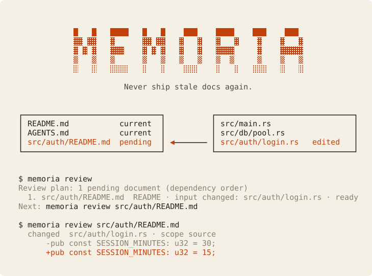
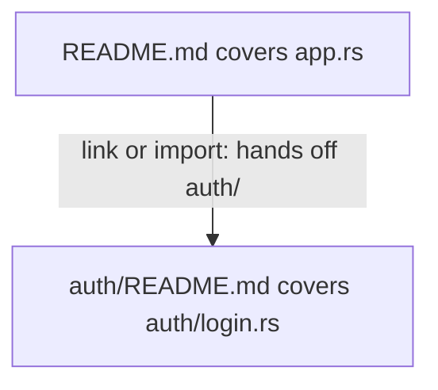
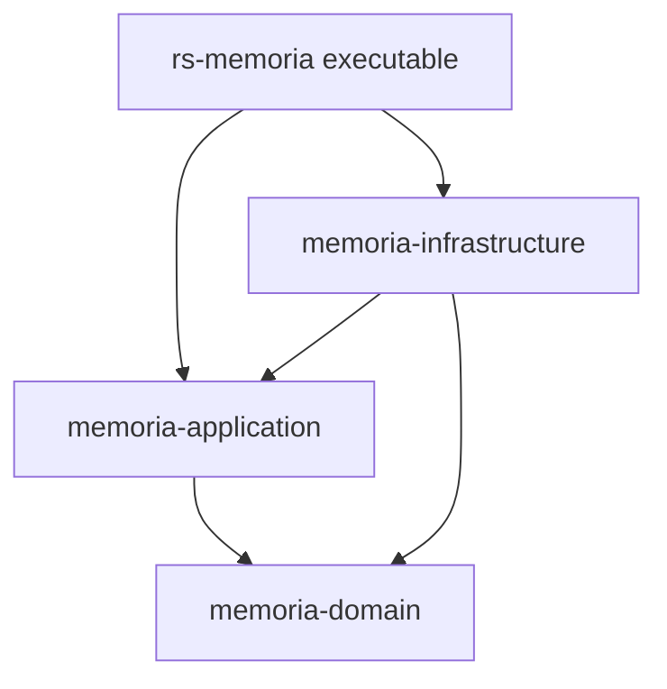

# Memoria

<p align="center">
  <a href="https://github.com/viktordanov/rs-memoria/actions/workflows/acceptance.yml"></a>
  <a href="https://github.com/viktordanov/rs-memoria/actions/workflows/setup-action.yml"></a>
  <a href="https://github.com/viktordanov/rs-memoria/releases/latest"></a>
  <a href="https://aur.archlinux.org/packages/memoria-bin"></a>
  <a href="LICENSE"></a>
</p>

<p align="center"></p>

**Memoria keeps a project's documentation current as its code changes. When a file changes, it tells you which explanations to review, what to read, and in which order, then records each review against the exact bytes that the reviewer saw.**

Documentation drift rarely announces itself. A feature changes, the tests move on, and the explanation that once made sense quietly becomes misleading. In a large repository, even finding the documents that deserve another look can be harder than fixing them, and the documents are written by people and by agents alike.

Memoria turns that into a review queue. People and agents still write and judge every explanation: Memoria does not write documentation, and it does not decide whether an explanation is correct. It decides which explanations have not been checked against their current inputs.

## Install

```sh
brew install viktordanov/tap/memoria   # macOS 13 Ventura or later
yay -S memoria-bin                     # Arch Linux, x86_64
```

Both install the latest published release. For Linux archives, other architectures, or a build from source, see [install options](#install-options).

## Contents

1. Get started
   - [Install](#install)
   - [Use cases](#use-cases)
   - [How it works](#how-it-works)
   - [The CLI at a glance](#the-cli-at-a-glance)
   - [Quick start](#quick-start)
2. Use it every day
   - [The review cycle](#the-review-cycle)
   - [Everyday tasks](#everyday-tasks)
3. Fit it to your project
   - [Choose what your documents represent](#choose-what-your-documents-represent)
   - [Project documentation guidance](#project-documentation-guidance)
   - [Run it in CI](#run-it-in-ci)
   - [Install options](#install-options)
4. Go deeper
   - [Find the right guide](#find-the-right-guide)
   - [Command-line interface](#command-line-interface)
   - [Self-hosting and development](#self-hosting-and-development)

## Use cases

Each row is a reason to arrive. The [cookbooks](docs/cookbooks/README.md) show each one in a small, tested project, and help you choose a documentation layout.

| When you need to… | Memoria… | Read |
| --- | --- | --- |
| Find every explanation that a feature change touches | Makes each document whose scope holds a changed file pending, in review order. | [Review workflow](docs/workflow.md) |
| Block a merge until the documentation reviews are done | Fails `memoria check` in CI while a review is pending. | [GitHub Actions](docs/github-actions.md) |
| Give an agent one bounded review handoff | Saves what changed, what to read, and which guidance applies in one artifact. The agent skill teaches the procedure. | [Agent integrations](docs/agents.md) |
| Keep `AGENTS.md` and `CLAUDE.md` current | Tracks each file, and adds shared writing rules to the review of each section that names them. | [Agent instructions cookbook](docs/cookbooks/agent-instructions/README.md) |
| Repeat one summary in several documents | Copies an export into each import with `memoria render`, and schedules the provider's review first. | [Concepts](docs/concepts.md) |
| Review documents after a decision that changed no file | Records a review request with your reason. | [Review workflow](docs/workflow.md) |

## How it works

Memoria remembers, for each document, the exact files and bytes that its last reviewer looked at. When those bytes change, the document goes back in the queue. Which files a document covers comes from your folders:

- **Every `README.md` is a tracked document.** Another Markdown file becomes one when it carries a Memoria marker: an export, an import, or a section. A link alone never tracks a file.
- **A document covers its own folder and below it,** until it hands a subfolder to a tracked document there with a link or an import.
- **Imports are the only edges that carry freshness between documents.** A document that imports another's summary waits for that document's review.

A small example shows the whole rule:

```text
README.md
app.rs
auth/
  README.md
  login.rs
```

| The root `README.md` says | An edit to `auth/login.rs` makes pending |
| --- | --- |
| Nothing about `auth/` | `README.md` and `auth/README.md` |
| `[Authentication](auth/README.md)` | `auth/README.md` only |
| An import of `auth/README.md#summary` | `auth/README.md`; the root waits for it |

A nested README alone removes nothing: until the root links to it or imports from it, both documents cover `auth/`, and both are reviewed. The link is the handoff. It moves `auth/` out of the root's scope and binds that decision into the root's review, so removing the link later makes the root pending again.


```mermaid
flowchart TD
    accTitle: A document covers its folder until it links or imports a document in a subfolder.
    accDescr: The root README covers app.rs. Its link to auth/README.md hands the auth folder to that README, which covers login.rs.
    root["README.md covers app.rs"] -- "link or import: hands off auth/" --> auth["auth/README.md covers auth/login.rs"]
```

A nested README alone removes nothing: until the root links to it or imports from it, both documents cover `auth/`, and both are reviewed. The link is the handoff. It moves `auth/` out of the root's scope and binds that decision into the root's review, so removing the link later makes the root pending again.

Memoria never edits your prose, except inside import blocks that you declare, and only when you run `memoria render`. The [concept guide](docs/concepts.md) explains each idea with an example and its limits.

## The CLI at a glance

Here is one change, seen from the command line. In the [documents beside the code cookbook](docs/cookbooks/beside-code/README.md), a teammate changes how `billing/tax.rs` rounds VAT. Three documents cover `billing/`, so all three become pending, in review order:

```console
$ memoria review
Review plan: 3 pending documents (dependency order)
  2. billing/README.md  README · input changed: billing/tax.rs · ready · also covered by billing/design.md, billing/notes.md
  3. billing/design.md  opted-in document · input changed: billing/tax.rs · ready · also covered by billing/README.md, billing/notes.md
  4. billing/notes.md  opted-in document · input changed: billing/tax.rs · ready · also covered by billing/README.md, billing/design.md
Next: memoria review billing/README.md
```

The review of one document starts with what changed, as a verified hunk, and then says what to read. Here a section marker in `billing/design.md` maps `tax.rs`, so the review can suggest the part to start from:

```console
$ memoria review billing/design.md
Review billing/design.md — opted-in document, pending since revision 2
Scope: 2 sources in billing/ and below
Baseline: revision 2 by fixture (no-update)
What changed since that review:
  changed  billing/tax.rs · scope source · section "tax" describes it · also covered by 2 other documents
      @@ -1,7 +1,7 @@
       /// The VAT rate in basis points: 2000 is 20%.
       pub const VAT_BASIS_POINTS: u64 = 2000;

      -/// The VAT on a subtotal, rounded down to a whole cent.
      +/// The VAT on a subtotal, rounded to the nearest cent. A half cent rounds up.
       pub fn vat(subtotal_cents: u64) -> u64 {
      -    subtotal_cents * VAT_BASIS_POINTS / 10_000
      +    (subtotal_cents * VAT_BASIS_POINTS + 5_000) / 10_000
       }
Also pending for the same changes:
  billing/README.md (covers the same folder; pending)
  billing/notes.md (covers the same folder; pending)
How to read:
  Mode: focused candidate. Eligibility only; it does not certify the prior review.
  Suggested section tax "Tax" lines 14-17: billing/tax.rs
  Read:
    billing/design.md (whole_document)
    billing/tax.rs (changed_source)
  Whole document pass: required
  Guidance: memoria guidance billing/design.md
Next:
  1. Read the whole document and the listed inputs; edit billing/design.md if it is wrong.
  2. After any edit, save a fresh artifact: dir=$(mktemp -d); memoria review billing/design.md --save "$dir"
  3. Record the result: memoria ack billing/design.md --packet <saved file> --reviewer <you> --result <updated|no-update> --note "<why>"
```

After the reviewer fixes the tax section, a fresh artifact records the result against the exact bytes that they read:

```sh
dir=$(mktemp -d)
memoria review billing/design.md --save "$dir"
memoria ack billing/design.md --packet "$dir"/memoria-manifest-billing_design.md-*.json \
  --reviewer docs-agent --result updated \
  --note "The tax section now says that VAT rounds to the nearest cent, half up."
```

`--save` prints the saved path and the exact `ack` command. The acknowledgement prints one line:

```text
Recorded billing/design.md revision 3 (updated) by docs-agent
```

The cookbook's test runs these commands and compares each output with its page. The commands you use most:

| To… | Run |
| --- | --- |
| See coverage, input size, and review state | `memoria status` |
| See why one file or document is covered, and by what | `memoria status --explain <PATH>` |
| Get the review plan and the next command | `memoria review` |
| Read one review and its guidance | `memoria review <DOCUMENT>`, `memoria guidance <DOCUMENT>` |
| Save an artifact, then record the result | `memoria review <DOCUMENT> --save <DIR>`, then `memoria ack <DOCUMENT> --packet <FILE> ...` |
| Refresh imported summaries | `memoria render` |
| Request a review with a reason | `memoria invalidate doc:<DOCUMENT> --reason "..."` |
| Validate structure, or gate CI | `memoria lint`, `memoria check` |
| See documents, handoffs, and imports as a graph | `memoria graph` |

Every command accepts `--format json`. The [complete command list](#command-line-interface) is below, and the [command reference](docs/cli.md) covers every argument, diagnostic, and exit status.

## Quick start

In a Git project that already has a root `README.md`, preview the setup:

```sh
memoria init
```

The preview reads your project, explains the model, lists the two files it would create, and writes nothing. When you are ready, create them and look at the queue:

```sh
memoria init --apply
memoria status
memoria review
```

`init --apply` creates `memoria.toml` and `memoria.lock`. It needs a root README that you wrote yourself, because the root explanation is the part only you can write. `status` gives you the overview, and `review` names the next document to look at and why.

When a document needs attention, read the project's guidance first, then look at what changed:

```sh
memoria guidance README.md
memoria review README.md
```

The review view starts with what changed since the last review and how each change relates to the document, with available verified hunks under changed inputs. The evidence budget can omit hunks without a reason, even with `--details`. Then the view lists what you still have to read, and why. You read those paths with `cat`, `sed`, your editor — whatever you already use. Memoria does not try to become your file viewer.

Compare the document with what you read, and update the prose where it no longer matches. Then run `memoria lint`, save a **fresh** artifact outside the repository, and acknowledge that exact snapshot:

```sh
memoria lint
memoria_dir=$(mktemp -d)
memoria review README.md --save "$memoria_dir"

memoria ack README.md \
  --packet "$memoria_dir"/memoria-manifest-README.md-*.json \
  --reviewer "Your name" \
  --result updated \
  --note "The README now describes the reviewed inputs."

memoria check
```

`--save` prints the saved path and the exact `ack` command. The artifact carries its own token, so `ack` needs no `--token`. Use `--result no-update` when you read the evidence and the document was already right. Either way, the acknowledgement makes that one document current and advances its revision. It records that you looked; it never claims Memoria understood the prose.

The fresh-artifact step matters. If anything changed after the review — a source file, a handoff, the guidance, an imported summary, even a provider's own context — Memoria rejects the acknowledgement rather than approving inputs nobody read. The [review workflow](docs/workflow.md) walks through the whole procedure.

## The review cycle

The [review workflow guide](docs/workflow.md) owns the cycle. This summary is imported from it:

<!-- memoria:import src="docs/workflow.md#review-cycle" -->
Every document covers the selected files in its own folder and below it.
A document hands a subfolder to a tracked document there only by a link or an import.
When an input in a document's scope changes, that document becomes pending.
Each pending document gets its own review and its own acknowledgement.

The cycle has five stages:

1. `memoria review` selects the next document, in dependency order.
2. `memoria review <DOCUMENT> --save <DIR>` saves the review artifact outside the project.
3. You or an agent reads the changes, the listed inputs, the guidance, and the whole document.
4. After any edit, a fresh artifact reconciles the review with the final bytes.
5. `memoria ack <DOCUMENT> --packet <FILE>` records the result against that exact snapshot.

The artifact is the handoff.
It names what changed, how each change relates to the document, and what the review still must read.
Its token binds the acknowledgement to one snapshot, so an old artifact cannot approve new inputs.
`memoria check` passes when no document is pending and every import is current.
<!-- /memoria:import -->

## Everyday tasks

### Point a review at one part of a document

Mark a section, and Memoria suggests it when a file that it maps changes:

```markdown
<!-- memoria:section id="auth" files="src/auth/** !src/auth/tests/**" -->
## Authentication
<!-- /memoria:section -->
```

`files` takes paths, glob patterns such as `src/auth/**`, and `!` exclusions, so a section can describe a kind of file instead of a fixed list. Check what each section matches with `memoria status --explain <DOCUMENT>`. The suggestion is advice and nothing more: it never narrows what an acknowledgement checks, and the whole-document pass is always part of the review. Anything Memoria cannot account for, such as a new file, a rename, a changed handoff, a changed mapping, a changed policy, or an unverifiable baseline, falls back to the full scope with the reason written out.

### Share one summary between documents

A provider marks an export, and a consumer declares an import of it:

```markdown
<!-- memoria:export id="summary" -->
Auth signs users in with a password or a passkey.
<!-- /memoria:export -->
```

```markdown
<!-- memoria:import src="auth/README.md#summary" -->
<!-- /memoria:import -->
```

`memoria render` refreshes only those managed copies. The provider is reviewed first, so a consumer never reviews text from an unfinished dependency.

### Commit the review state

Acknowledging changes one file, `memoria.lock`. Commit it with `memoria.toml`: the configuration is yours to edit, and the lock is machine-owned state that only Memoria writes.

```sh
git add memoria.toml memoria.lock
memoria state inspect
```

Because the state travels with the repository, a colleague who clones the project sees the same freshness that you do, even with different local Git ignore settings.

### Request a review without a file change

When a policy or an architecture decision changes, record your reason. Memoria carries it into every review it affects:

```sh
memoria invalidate subtree:src --reason "Errors are now reported as structured JSON."
memoria invalidate doc:docs/guide.md --reason "The team no longer releases on Fridays."
```

### Find out why a document is pending

```sh
memoria explain README.md
memoria status --explain src/auth/login.rs
```

`explain` lists the changed paths with available hunks and the reasons for missing evidence, and it works for current documents too. `status --explain` names the rule chain for one path and every document that covers it. `memoria state diff before.lock after.lock` compares saved review records, but it does not establish current freshness.

### Hand a reviewer everything in one file

For an offline reader, or a machine that cannot open the repository, export every reviewed byte, then read its exact saved sections:

```sh
memoria review README.md --full --save "$dir"
memoria packet view "$dir"/memoria-full-README.md-*.json --section content
```

### Review in parallel

Each artifact binds only its own document, so one acknowledgement never forces another reviewer to start again unless it changed something that reviewer read. A coordinator hands out the documents that are ready:

```sh
memoria review --format json | jq -r '.data.tasks[] | select(.ready) | .document'
```

The [workflow guide](docs/workflow.md#review-documents-in-parallel) shows how to split the work, and how to bring reviews back from separate Git worktrees.

### Label the reviewer

```sh
export MEMORIA_REVIEWER="your-name"
```

An explicit `--reviewer` always wins. The label records attribution, not authentication or authority, so agents pass their label explicitly.

Commands print their result, every warning, and every error. Advisory hints, such as a link that hands nothing off, appear only in `memoria lint` and with `--verbose`. JSON output always carries every diagnostic.

## Choose what your documents represent

What the scopes mean is up to you. Projects commonly pick one of these:

| Strategy | One document for each… |
| --- | --- |
| Architecture modules | crate, package, or layer |
| Business concepts | domain concept, with its rules and its code |
| Operational workflows | workflow, from its entry point to its outputs |

None of these is more correct than the others, and Memoria does not choose for you. The [cookbooks](docs/cookbooks/README.md#choose-a-pattern) compare four layouts by where the documents live and what one code change costs in reviews.

## Project documentation guidance

Guidance is the prose you write for whoever reviews your documentation: what these documents are for, who reads them, and how to write them.

The owner chooses the goals, the reviewer judges correctness, and Memoria checks exact inputs and review consistency. Guidance provides context; it does not grant permission or override your task.

```toml
[documentation]
guidance = [
  "Explain the operational workflow before implementation details.",
]
guidance_files = ["docs/writing-guidance.md"]
```

Read it any time, for any document:

```sh
memoria guidance
memoria guidance src/README.md
```

Guidance is advisory. It never selects files and never makes a document stale on its own. When you change it, `memoria review` reports one assessment item, and `check` still passes. `memoria guidance --changed` lists the reviewed documents that saw the older wording. If the change really does need fresh eyes, say so explicitly:

```sh
memoria guidance --changed
memoria invalidate subtree:src --reason 'The workflow explanation has new requirements'
```

That is deliberate. A wording tweak should not silently invalidate a hundred reviews, and Memoria will never do it for you.

Some rules apply to one kind of section only, such as the command list in an `AGENTS.md`. Put them in a section guide: register the file once in `section_guidance_files`, and name it in each section marker that needs it with a `guidance="PATH"` attribute. A guide edit then reaches only the documents that name it, and project guidance still wins a conflict. The [agent instructions cookbook](docs/cookbooks/agent-instructions/README.md) walks through a complete example.

## Run it in CI

Memoria can write the GitHub Actions workflow for you, and it shows you the file before it writes anything:

```sh
memoria integrations github install
memoria integrations github install --apply
```

The generated workflow calls the first-party `setup-memoria` Action, which downloads a verified prebuilt executable for the runner — x64 or ARM64 — instead of compiling Memoria from source. Then it runs `memoria check`. Memoria never adopts or overwrites a workflow file it does not own, and a pending check still means a person reviews the documentation locally.

The first command is a preview. It works in any project, even one Memoria has never seen: it prints the file it would write, names anything still missing, and changes nothing. The second command writes, so it needs an initialized project — the generated job runs `memoria check`. Author the root README first, then run `memoria init --apply`. The workflow pins one exact Memoria version. Configuration version 3 needs Memoria 0.7.0 or later, so the pinned version must be 0.7.0 or newer, and a pinned release must be published before the workflow can pass. A build writes its own version into the workflow. The [GitHub Actions guide](docs/github-actions.md) covers the pins, the checksum, the ownership record, and what each state means.

## Install options

Every package installs the latest published release, which the release badge at the top shows. This README follows the `main` branch, so it can describe changes that are not released yet: check `memoria --version` against the [changelog](CHANGELOG.md) when a command here behaves differently.

### Homebrew on macOS

The [Homebrew tap](https://github.com/viktordanov/homebrew-tap) installs a prebuilt executable for Apple Silicon or Intel Macs on macOS 13 Ventura or later:

```sh
brew install viktordanov/tap/memoria
memoria --version
```

Run `brew upgrade memoria` to move to a new release.

### Arch Linux from the AUR

The [`memoria-bin`](https://aur.archlinux.org/packages/memoria-bin) package installs the prebuilt x86_64 executable from the GitHub release. Install it with an AUR helper such as `yay`:

```sh
yay -S memoria-bin
memoria --version
```

### Prebuilt archives for Linux and macOS

Each [GitHub release](https://github.com/viktordanov/rs-memoria/releases/latest) carries archives for Linux (x86_64 and ARM64, glibc) and macOS (Apple Silicon and Intel), each with a `.sha256` checksum file. For example, on x86_64 Linux:

```sh
version=0.8.0
archive=memoria-$version-x86_64-unknown-linux-gnu.tar.gz
gh release download "v$version" -R viktordanov/rs-memoria -p "$archive*"
sha256sum -c "$archive.sha256"
tar xzf "$archive"
install -D -m 0755 "memoria-$version-x86_64-unknown-linux-gnu/memoria" ~/.local/bin/memoria
```

Set `version` to the release that you want. The Linux release also publishes a provenance file for each architecture.

### Build from source

Building needs Rust 1.99. The repository's `rust-toolchain.toml` pins that toolchain, so `rustup` selects it for you. Install from a checkout:

```sh
git clone https://github.com/viktordanov/rs-memoria.git
cd rs-memoria
cargo install --locked --path .
```

To build one release instead of the current `main`, check out its tag first, for example `git checkout v0.8.0`. An older tag pins its own toolchain: 0.8.0 builds with Rust 1.96. The executable is called `memoria`, and Cargo installs it in `~/.cargo/bin`.

## Find the right guide

| If you want to… | Read… |
| --- | --- |
| Learn the ideas behind scopes, handoffs, and imports | [Concepts](docs/concepts.md) |
| See complete, tested uses of Memoria in small projects | [Cookbooks](docs/cookbooks/README.md) |
| Keep `AGENTS.md` and `CLAUDE.md` current with shared section guides | [Agent instructions cookbook](docs/cookbooks/agent-instructions/README.md) |
| Complete a documentation review | [Review workflow](docs/workflow.md) |
| Look up a command or failure | [Command reference](docs/cli.md) |
| Understand the committed state file | [Committed state](docs/state.md) |
| Install the agent skill or a Stop hook | [Agent integrations](docs/agents.md) |
| Find every integration and its command name | [Integrations](docs/integrations.md) |
| Run Memoria in GitHub Actions | [GitHub Actions](docs/github-actions.md) |
| See release changes and earlier upgrade notes | [Changelog](CHANGELOG.md) |

Start with the concepts, then the workflow, if you are new. The command reference is the lookup guide, the [specification](docs/specification.md) preserves the product rules and their rationale, and the [agent skill](skills/memoria/SKILL.md) is the procedure an assistant follows.

## Command-line interface

This is the complete top-level interface. The command entry-point documentation owns this snapshot, and Memoria imports it here.

<!-- memoria:import src="src/README.md#cli-help" -->
```text
Keep a project's documented mental model connected to its code.

Usage: memoria [OPTIONS] <COMMAND>

Commands:
  completions   Print a shell completion script without project discovery or installation
  explain       Explain why one document is current, pending, or waiting, with verified local Git evidence
  packet        Read exact sections from a saved full export without project discovery
  init          Validate root setup inputs, or create missing configuration and state with --apply
  status        Show coverage, input size, and review state
  guidance      Show the guidance for one document, or list documents whose guidance changed since review
  state         Inspect or compare committed state without changing it
  lint          Check structure, configuration, markers, and link hints
  review        Show the ordered review plan, or the review requirements for one document
  render        Refresh declared import blocks only
  ack           Record a review result against the exact reviewed snapshot
  invalidate    Mark one document, a subtree, or the whole project for semantic review
  check         Run read-only validation for CI
  graph         Show document scopes, handoffs, imports, navigation, and status
  agent         Install or remove the managed Memoria skill and hooks for an agent
  integrations  Manage the agent skill, the agent hook, and the GitHub workflow
  help          Print this message or the help of the given subcommand(s)

Options:
      --root <DIRECTORY>  Project root. Must be the Git worktree root. Defaults to discovery from the current directory
      --format <FORMAT>   Output format [default: human] [possible values: human, json]
      --verbose           Also print advisory hints and progress notes. JSON always carries every diagnostic
  -h, --help              Print help
  -V, --version           Print version
```
<!-- /memoria:import -->

The [command reference](docs/cli.md) covers every argument, state change, diagnostic, and exit status.

## Self-hosting and development

Memoria is its own first real project. This repository has eleven READMEs and one opted-in guide, [the review workflow](docs/workflow.md). The root README imports short summaries from five other READMEs and imports the review cycle from the guide. Because the root links and imports the guide, it hands `docs/` to the guide, which covers the other pages there. The guide hands `docs/cookbooks/` to the [cookbook index](docs/cookbooks/README.md), which hands each cookbook folder to its own README. `memoria.lock` records the evidence each explanation was checked against.

Every review names the guidance in `memoria.toml`, and `memoria guidance` prints it. It points documentation writers to [the writing guide](docs/development/writing-guide.md), which shapes each page around its reader, asks agents to load the `simple-english` and `i-have-adhd` skills, gives guides such as this page a concept-led voice, and keeps Mermaid as the diagram format everywhere except the cookbooks, which try out SVG diagrams. Those are this project's choices, not defaults Memoria imposes: `memoria init --apply` writes an empty guidance list.

To watch the repository review itself:

```sh
memoria status
memoria invalidate all --reason "Review the documentation against the repository writing policy."
memoria review
```

The plan schedules the six providers before this root consumer. Run `memoria graph` to see the same scopes, handoffs, and import relationships as data, or `memoria state inspect` to read what has already been recorded.

### Repository map

The workspace follows domain-driven and clean-architecture dependency boundaries:


```mermaid
flowchart TD
    accTitle: Workspace dependencies point toward domain rules.
    accDescr: The executable depends on application and infrastructure. Infrastructure depends on application and domain. Application depends on domain.
    entry["rs-memoria executable"] --> application["memoria-application"]
    entry --> infrastructure["memoria-infrastructure"]
    infrastructure --> application
    infrastructure --> domain["memoria-domain"]
    application --> domain
```

Each arrow means that one workspace package declares a dependency on another. All paths point toward the domain, whose only runtime dependency is the `glob` crate for pattern matching. The [root manifest](Cargo.toml), [application manifest](crates/memoria-application/Cargo.toml), [infrastructure manifest](crates/memoria-infrastructure/Cargo.toml), and [domain manifest](crates/memoria-domain/Cargo.toml) are the source evidence.

The summaries below are managed imports. Each implementation README explains its folder locally, while this page gives readers a compact map of the whole system.

#### [Domain](crates/memoria-domain/README.md)

<!-- memoria:import src="crates/memoria-domain/README.md#summary" -->
The domain crate decides which selected files each document covers.
It compares recorded review inputs with current inputs.
Its rules determine which documents require review and their order.
<!-- /memoria:import -->

#### [Application](crates/memoria-application/README.md)

<!-- memoria:import src="crates/memoria-application/README.md#summary" -->
The application crate coordinates Memoria commands through domain rules.
Its ports describe external operations, and adapters supply those operations.
Each command returns structured results for the executable.
<!-- /memoria:import -->

#### [Infrastructure](crates/memoria-infrastructure/README.md)

<!-- memoria:import src="crates/memoria-infrastructure/README.md#summary" -->
The infrastructure crate implements Git, file, parser, and storage operations.
It supplies these operations through application ports.
Its writers compare expected content before replacement.
<!-- /memoria:import -->

#### [Command entry point](src/README.md)

<!-- memoria:import src="src/README.md#summary" -->
The executable parses arguments, constructs adapters, and calls the application.
It writes human text or JSON and returns a process exit status.
<!-- /memoria:import -->

#### [Command behavior tests](tests/README.md)

<!-- memoria:import src="tests/README.md#summary" -->
The integration tests invoke Memoria commands in temporary Git worktrees.
They compare output, exit statuses, and stored files.
The sample repositories stay outside this project documentation scope.
<!-- /memoria:import -->

The root README covers the root build files, the license, the source skill and its reference files, the build and acceptance scripts, the setup Action and its fixtures, the CI workflows, and `.gitattributes` — where the `/memoria.lock binary` rule keeps Git from merging or converting the state file. The configuration excludes `tests/fixtures/**` because those files represent other repositories.

<details>
<summary>Development checks</summary>

```sh
cargo fmt --all -- --check
cargo clippy --workspace --all-targets --locked -- -D warnings
cargo test --workspace --locked
cargo build --release --locked
./scripts/check-next-change-set.sh --binary ./target/release/memoria --agent-tests simulated
```

`.github/workflows/acceptance.yml` runs exactly these commands on `ubuntu-24.04`, then cross-compiles both macOS targets on Linux and inspects the results. A successful cross-build proves build compatibility, not macOS runtime behavior; a real Mac smoke check stays a manual step, described in the [release notes](docs/releases/0.2.0.md).

Acceptance also builds the two Linux release archives — x64 and ARM64 — twice each inside a builder image pinned by digest in `scripts/linux-builders.json`, compares the resulting bytes, and runs the produced executable natively on its own architecture. `.github/workflows/setup-action.yml` exercises the setup Action itself on `ubuntu-24.04`, `ubuntu-latest`, and `ubuntu-24.04-arm` against a locally built archive, and records the image each job actually ran on.

Both hosted workflows passed for the 0.5.0 release: [Setup Action](https://github.com/viktordanov/rs-memoria/actions/runs/34605152262) and [Acceptance](https://github.com/viktordanov/rs-memoria/actions/runs/34605152306). The runs verified native execution and repeat-build byte equality on x64 and ARM64, plus Ubuntu 24.04 for the `ubuntu-latest` image. The [0.5.0 release](https://github.com/viktordanov/rs-memoria/releases/tag/v0.5.0) includes the published archives and checksum sidecars. Native macOS runtime remains unverified.

```sh
python3 -m unittest discover -s tests/setup_action -p 'test_*.py'
./scripts/build-linux-release.sh --target x86_64-unknown-linux-gnu --output dist-a
./scripts/check-github-workflow-template.sh --binary ./target/release/memoria --output /tmp/generated.yml
```

Each diagram in the cookbooks has a `.txt` source beside its SVG. After you edit a source, render it again with `python3 scripts/ascii-diagram.py <SOURCE>.txt`. `python3 scripts/ascii-diagram.py --check docs/cookbooks/*.txt docs/cookbooks/*/*.txt` fails when an SVG is not the current render of its source. CI does not run this check, because the cookbook diagrams change rarely.

</details>

Memoria is available under the [MIT license](LICENSE). Created and maintained by Viktor D.

Start with `memoria status`; it will tell you what the documentation needs next.
