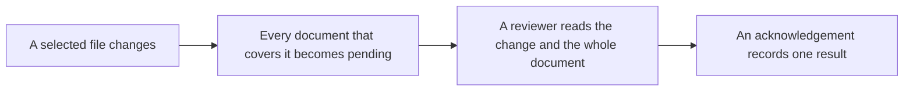

# Memoria concepts

Read this page before the [workflow guide](workflow.md) if Memoria is new to you.
It explains the five ideas that every command uses, with one small example each.

Memoria answers one question: which documentation must a person or an agent read again, because its inputs changed?
It does not write documentation, and it does not decide whether an explanation is correct.
You choose the document structure. A reviewer judges the prose. Memoria records that judgment against exact bytes.

## Contents

1. [Three structures, one cycle](#three-structures-one-cycle)
2. [Tracked document](#tracked-document)
3. [Directory scope](#directory-scope)
4. [Handoff](#handoff)
5. [Imports and review order](#imports-and-review-order)
6. [Review and acknowledgement](#review-and-acknowledgement)
7. [Examples side by side](#examples-side-by-side)

## Three structures, one cycle

A project has three separate structures.
Keep them apart, because each one answers a different question:

| Structure | Comes from | Answers |
| --- | --- | --- |
| File tree | Git | Which files exist? |
| Coverage | Folders, plus handoff links and imports | Which documents must be reviewed when this file changes? |
| Import graph | Export and import markers | Which documents wait for another document, and whose content they copy? |

The cycle uses all three.
An input changes. Each document that covers it becomes pending. Memoria states what the review must read. A reviewer judges the explanation. An acknowledgement records that judgment against one exact snapshot.



Source evidence: [scope rules](../crates/memoria-domain/src/scope.rs) and [review requirements](../crates/memoria-application/src/usecases/requirements.rs).

## Tracked document

A tracked document is a Markdown file that Memoria reviews on its own.

- Every `README.md` is a tracked document.
- Another selected Markdown file (`*.md`, `*.markdown`) is a tracked document when it carries a Memoria marker outside code: an export, an import, or a section.

```text
docs/
  workflow.md     <!-- memoria:export id="review-cycle" -->   tracked
  notes.md        no marker                                   ordinary Markdown
```

**Limits.** A link never tracks a file.
A link to `docs/notes.md` leaves it ordinary Markdown, and `docs/notes.md` stays a source input of the document that covers `docs/`.
A file that the selection rules exclude cannot become a tracked document, even with a marker.
A project guidance file is review context, never a tracked document.

## Directory scope

A tracked document covers the selected files in its own folder and in every folder below it.
Those files are its scope: the inputs that make it pending when they change.

```text
README.md        covers app.rs and auth/login.rs
app.rs
auth/
  README.md      covers auth/login.rs
  login.rs
```

In this tree, nothing hands `auth/` to `auth/README.md`.
So both documents cover `auth/login.rs`, and an edit there makes both pending.
Each one gets its own review. This is shared coverage.

**Limits.** Selection rules still apply first: `.gitignore`, the `ignore` and `include` patterns in `memoria.toml`, and reserved files.
A nested document alone removes nothing from its parent's scope.
`memoria status --explain <PATH>` shows why one path is selected and which documents cover it.

## Handoff

A handoff moves a subfolder from a parent's scope to a tracked document inside that subfolder.
The parent makes it with a link or an import to that document:

```markdown
See [Authentication](auth/README.md).
```

With this link in the root `README.md`, an edit to `auth/login.rs` makes only `auth/README.md` pending.

**Limits.**

- The target must be a tracked document strictly inside the subfolder. A link to ordinary Markdown there is navigation, not a handoff. `memoria lint` explains it with the hint `handoff_not_applied`.
- The handoff is part of the parent's review context. Adding or removing the link makes the parent pending.
- If the link goes away, the handoff ends. The parent covers the subfolder again, and its next review reads the complete current scope with the reason `handoff_changed`.
- A link-only handoff moves coverage only. It creates no waiting.

## Imports and review order

An export marks a section that a document offers as its public summary.
An import declares a managed copy of that section in another document.
The document with the export is the provider. The document with the import is the consumer.

```markdown
<!-- memoria:import src="auth/README.md#summary" -->
<!-- /memoria:import -->
```

An import is the only link that carries freshness between documents:

- When the exported text changes, the consumer becomes pending.
- While the provider is pending, the consumer waits. `memoria review` lists it as waiting, and its review reports `dependencies_pending`.
- After the provider's acknowledgement, `memoria render` copies the new text into the consumer. Then the consumer's review can start.

An import from a subfolder is also a handoff of that subfolder.

**Limits.** Only the exported section travels. A plain link creates no review order, even to a tracked document.

## Review and acknowledgement

A review is one reader's judgment that one whole document is correct for its current inputs.
Memoria supports the judgment and does not make it:

- `memoria review <DOCUMENT>` shows why the review is needed, what changed with verified hunks, the guidance to apply, and what to read.
- `memoria review <DOCUMENT> --save <DIR>` saves the review artifact. Its token binds the document's inputs, its previous review, and its context, including guidance, handoffs, and providers.
- `memoria ack` records the reviewer, the result (`updated` or `no-update`), and a note. It recomputes the token first and refuses any changed binding.

**Limits.**

- An acknowledgement records a verified result. It does not record who wrote the prose.
- A passing `memoria check` proves that every document matches its last review and that imports are rendered. It does not prove that the explanations are correct.
- Advisory sections suggest where to read. They never replace the whole-document pass.
- Guidance is review context. A guidance change does not make documents pending by itself. It asks you to [assess it](workflow.md#assess-a-guidance-change).
- A section can name a section guide: shared writing rules for one kind of section, which add to project guidance. The [agent instructions cookbook](cookbooks/agent-instructions/README.md) shows one in use.

## Examples side by side

Each row starts from this tree, with every document current:

```text
README.md
guide.md
auth/
  README.md
  login.rs
  notes.md
```

| Root `README.md` contains | Then | Why |
| --- | --- | --- |
| `[Notes](auth/notes.md)` | An edit to `auth/login.rs` makes `README.md` and `auth/README.md` pending. | An ordinary link: `auth/notes.md` has no marker, so nothing is handed off. |
| `[Auth](auth/README.md)` | The same edit makes only `auth/README.md` pending. | A handoff. |
| The `[Auth]` link is removed | `README.md` becomes pending with `handoff_changed`, and covers `auth/` again. | The handoff ended. |
| An import of `auth/README.md#summary` | A change to that export makes `README.md` pending, and it waits for `auth/README.md`. | Import waiting. |
| `guide.md` gains an export block (`<!-- memoria:export id="intro" -->` … `<!-- /memoria:export -->`) | `guide.md` becomes a tracked document. It covers the root folder too, so it shares coverage with `README.md`. | Eligible Markdown. |

The [specification](specification.md#25-scope-and-handoffs) gives the exact rules.

Next: run `memoria graph` in your project to see its documents, handoffs, and imports.
