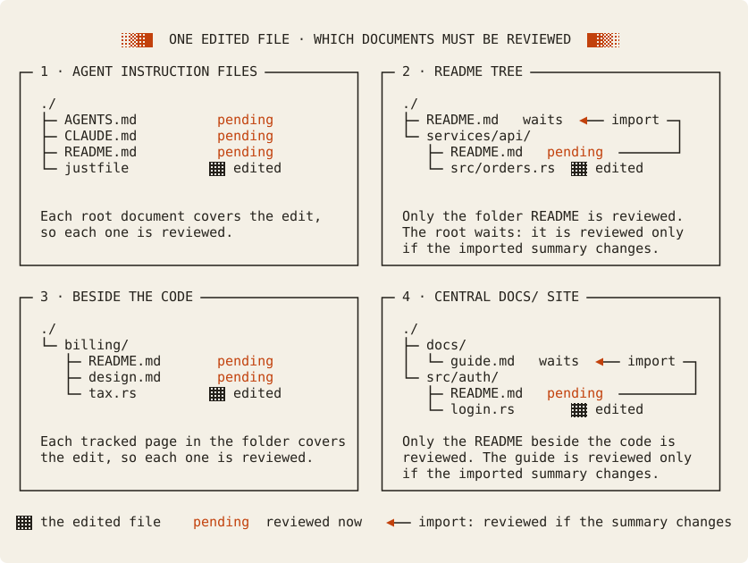

# Memoria cookbooks

A cookbook shows one complete use of Memoria in a small, realistic project.
It starts from a real problem, makes one change, and follows every review to a passing check.
Every command output in a cookbook comes from a real run, and a test compares each output block with that run.

Each cookbook shows one way to document a project. The patterns differ in where the documents live and what each one covers:

Read the [concept guide](../concepts.md) first if scopes, handoffs, and imports are new to you.
Read the [review workflow](../workflow.md) for the procedure that each cookbook uses.

## Cookbooks

| Cookbook | The problem | What it shows | Tested with |
| --- | --- | --- | --- |
| [Keep agent instructions current](agent-instructions/README.md) | `AGENTS.md` and `CLAUDE.md` keep an old command after a `justfile` change, and their writing rules apply to no other document. | Two tracked agent files, two shared section guides, a guide-only section, a guide edit that reaches exactly two documents, and a broken guide path. | Memoria 0.9.0 |
| [A README tree with central guidelines](readme-tree/README.md) | Each service has a README, the root repeats their story, and each README carries its own writing rules. | Folder handoffs, exported summaries imported by the root, a change that stops at its folder, a summary change that the root waits for, central guidance with a local sidecar, and an unlinked README. | Memoria 0.9.0 |
| [Documents beside the code](beside-code/README.md) | A design note or a runbook next to the code goes stale, and a link to it tracks nothing. | Opting a page in with a marker, shared folder coverage, a focused review on one section, a renamed mapped file, and a decision change with no code change. | Memoria 0.9.0 |
| [A central docs/ site](central-docs/README.md) | Product pages in `docs/` describe code in `src/`, and a code change never reaches them. | The pitfall of a page that only links the code, a summary imported from beside the code, a change that stays local, a summary change that travels, and an invalid export body. | Memoria 0.9.0 |

## What a cookbook proves

A cookbook proves that the commands produce the outputs on the page.
It does not prove that the prose in its example project is correct. A reviewer judges that, as in every Memoria project.

Each cookbook has three parts:

1. A fixture under [`tests/fixtures/`](../../tests/fixtures/): the example project, with its files exactly as the page shows them.
2. A folder in this directory with a `README.md`: the problem, the pattern and its diagram, each step with its real output, the tradeoffs, and when not to adopt the pattern. The folder also holds the diagram sources and their SVG files.
3. A test that runs the fixture with the built executable. It compares every file block and every output block on the page with that run.

Memoria cannot make a cookbook pending when the behavior it shows changes, because that behavior lives outside this folder.
The test does that job: a change in output fails the test until the page shows the new output.

## Write a new cookbook

1. Choose one problem that a reader has, and one project that shows it. Keep the project small enough to show every file that matters.
2. Put the project in `tests/fixtures/<name>/`. Name each README there `README.fixture.md`, so that it does not become a document of this repository.
3. Create `docs/cookbooks/<name>/README.md` for the page. Draw at least one diagram of the pattern, in the [diagram style](#diagram-style).
4. Mark each file block with `<!-- cookbook-file: PATH -->` and each output block with `<!-- cookbook-output: KEY -->` on the line before its fence.
5. Write a test that runs every step through the built executable and compares the blocks. `tests/guidance.rs` holds the first example. `MEMORIA_PRINT_COOKBOOK=1` with `--nocapture` prints fresh output blocks.
6. End the page with the costs, the limits, and when not to adopt the pattern.
7. Add a row to the table on this page.

## Diagram style

Memoria diagrams look like a monospace terminal drawing with dithered fills.
You draw each diagram as text, and [`scripts/ascii-diagram.py`](../../scripts/ascii-diagram.py) renders it as an SVG with the Memoria palette in light and dark mode.

1. Write the source as `<name>.txt` beside the page. Start it with a `title:` line (the one claim the diagram makes) and a `desc:` line (what it shows, for a reader who cannot see it). Then add a line with three dashes, then the drawing.
2. Draw on the monospace grid, at most 120 columns wide:

   | Characters | Meaning | Rendering |
   | --- | --- | --- |
   | `─ │ ┌ ┐ └ ┘ ├ ┤ ┬ ┴ ┼` | Boxes, trees, and connections | Connected ink lines |
   | `▶ ◀ ▲ ▼` | Direction: names, reads, or imports | Accent arrowheads |
   | `▓▓▓▓` | Covered by the document | Dense ordered dither |
   | `▒▒▒▒` | Shared or secondary coverage | Medium dither |
   | `░░░░` | Outside the document's scope | Light dither |
   | `«text»` | A Memoria state or concept: `pending`, `import`, `section` | Accent text |
   | `‹text›` | A path or a note in the background | Muted text |

3. Run `python3 scripts/ascii-diagram.py docs/cookbooks/<name>/<diagram>.txt`. It writes `<diagram>.svg` beside the source.
4. Embed the SVG with alt text that states the same claim as the `title:` line.
5. Run `python3 scripts/ascii-diagram.py --check` on every source before you commit. It fails when an SVG is not the current render of its source.

Keep one claim for each diagram. Show the pattern first, then how it differs from the other patterns.

Next: open [Keep agent instructions current](agent-instructions/README.md) for a complete example.
