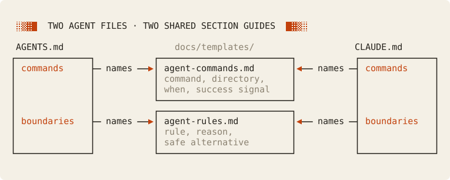
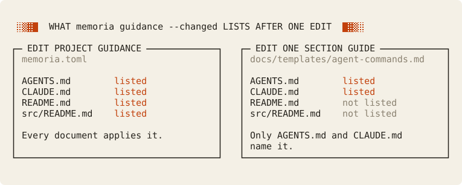

# Cookbook: keep agent instructions current

`AGENTS.md` and `CLAUDE.md` tell a coding agent which commands to run and which rules to follow. When a recipe in the `justfile` changes, both files can keep the old command, and nothing tells the team. This cookbook makes both files tracked documents, so a change to a file that they describe asks for their review. It also keeps their writing rules in shared section guides, so the rules for a command list reach only the sections that list commands.

Choose this pattern when agents work in your repository. The cost is one review for each instruction file, and for the root README too, whenever a root file that they all describe changes. Every output below comes from a real, tested run of one small project. Read [Memoria concepts](../../concepts.md) first if scopes and handoffs are new to you, and the [cookbook index](../README.md) to compare the other patterns.

## Contents

1. Set up
   - [The problem](#the-problem)
   - [The project](#the-project)
   - [Markers and guides](#markers-and-guides)
2. What happens when
   - [A command changes](#a-command-changes)
   - [A guide changes](#a-guide-changes)
   - [A guide path breaks](#a-guide-path-breaks)
3. [Tradeoffs](#tradeoffs), including when not to adopt the pattern

## The problem

An agent instruction file lists the commands and rules that a coding agent follows in a repository.
When a recipe in the `justfile` changes, the file can keep the old command, and nothing tells the team.

Memoria makes each agent instruction file a tracked document.
When a file that it describes changes, the document becomes pending, and a reviewer reads it again.

The writing rules for these files are a separate need.
A command list needs exact commands and success signals. A rule list needs reasons and safe alternatives.
Those rules do not belong in project guidance, because every review of every README would carry them.
A section guide keeps them in one file. Only the sections that name the guide use it.

**Limits.** Memoria does not make an agent obey a file, and it does not certify the prose.
It makes no claim about reading cost or token savings.

## The project

The project counts the words in a text file. Its two agent instruction files have the same two sections, and each section names a shared section guide that holds its writing rules:



The file tree:

```text
project/
├── memoria.toml            # registers two section guides
├── README.md               # links AGENTS.md, CLAUDE.md, src/README.md
├── AGENTS.md               # tracked: commands (files + guide) and boundaries (guide-only)
├── CLAUDE.md               # tracked: the same two sections
├── justfile
├── Cargo.toml
├── docs/templates/
│   ├── agent-commands.md   # exact command, working directory, when to run, success signal
│   └── agent-rules.md      # rule, reason, safe alternative
└── src/
    ├── README.md
    └── main.rs
```

At the start, every document is current.
The test fixture is [`tests/fixtures/agent-instructions`](../../../tests/fixtures/agent-instructions/), where the two README files carry placeholder names.

## Markers and guides

### Register the guides

The root `memoria.toml` lists each section guide once, under `section_guidance_files`:

<!-- cookbook-file: memoria.toml -->
```toml
version = 3
ignore = []
include = []

[documentation]
guidance = [
    "Write for a contributor who is new to this project. Use short sentences, and keep commands, paths, and names exact.",
]
guidance_files = []
section_guidance_files = [
    "docs/templates/agent-commands.md",
    "docs/templates/agent-rules.md",
]

[lint]
# The agent files link the source guide for navigation, not to import it.
missing_import_hint = false
```

A registration reserves the file. It is never a source and never a tracked document, so a guide edit cannot make a document pending.
A registration alone applies the guide to no document.
`docs/templates/` is only a convention. A guide can live at any path inside the project.

### Name a guide in a section

`AGENTS.md` maps its sections with section markers:

<!-- cookbook-file: AGENTS.md -->
```markdown
# Agent instructions

These instructions are for coding agents that work in this repository.
Read the [source guide](src/README.md) before you change code in `src/`.

<!-- memoria:section id="commands" files="justfile Cargo.toml" guidance="docs/templates/agent-commands.md" -->
## Commands

- Run `just build` from the repository root to compile the project. It succeeds when Cargo prints `Finished`.
- Run `just test` from the repository root before each commit. It runs `cargo test`, and it succeeds when every test passes.
<!-- /memoria:section -->

<!-- memoria:section id="boundaries" guidance="docs/templates/agent-rules.md" -->
## Boundaries

- Do not edit `memoria.lock` by hand. Memoria writes it when a reviewer acknowledges a review. Run `memoria ack` instead.
- Do not push to `main`. Changes are reviewed in pull requests. Open a pull request instead.
<!-- /memoria:section -->
```

Each section names its guide in a last `guidance` attribute. The path is relative to the document's folder, like an import `src`.

- The `commands` section names the files it describes (`files`) and a guide. A change to `justfile` or `Cargo.toml` suggests this section.
- The `boundaries` section is guide-only. Its rules describe no file, so no change ever suggests it.

`CLAUDE.md` has the same two sections.

### Hand off the source folder

Both agent instruction files link `src/README.md`. That link hands `src/` to the source guide.
Without the link, a tracked file at the root covers the whole folder, `src/` included, and every edit in `src/` makes it pending.

### Write the guides

A guide is plain Markdown with the writing rules for one kind of section:

<!-- cookbook-file: docs/templates/agent-commands.md -->
```markdown
# Guide: agent commands

Apply this guide to a section that lists commands for coding agents.

For each command, give:

1. The exact command, in a code span.
2. The directory to run it from.
3. When to run it.
4. The signal that it succeeded.

Name only commands that the project's files define. Check each command against those files.
```

<!-- cookbook-file: docs/templates/agent-rules.md -->
```markdown
# Guide: agent rules

Apply this guide to a section that sets rules for coding agents.

For each rule, give:

1. The rule, as one instruction.
2. The reason for the rule.
3. The safe alternative, when one exists.
```

A guide carries no Memoria marker. It is at most 65,536 bytes.

## A command changes

The `test` recipe changes from `cargo test` to `cargo nextest run`:

<!-- cookbook-file: justfile -->
```text
build:
    cargo build

test:
    cargo test
```

```diff
 test:
-    cargo test
+    cargo nextest run
```

### See what is pending

Run `memoria review`:

<!-- cookbook-output: plan -->
```text
Review plan: 3 pending documents (dependency order)
  1. AGENTS.md  opted-in document · input changed: justfile · ready · also covered by CLAUDE.md, README.md
  2. CLAUDE.md  opted-in document · input changed: justfile · ready · also covered by AGENTS.md, README.md
  3. README.md  README · input changed: justfile · ready · also covered by AGENTS.md, CLAUDE.md
Next: memoria review AGENTS.md
```

Three documents cover `justfile`. The root `README.md` covers it too, because nothing hands the root folder to an agent instruction file.

### Review AGENTS.md

1. Run `memoria review AGENTS.md`:

<!-- cookbook-output: review-agents -->
```text
Review AGENTS.md — opted-in document, pending since revision 1
Scope: 2 sources in ./ and below; hands off src/ (link, line 4)
Baseline: revision 1 by fixture (no-update)
What changed since that review:
  changed  justfile · scope source · section "commands" describes it · also covered by 2 other documents
      @@ -2,4 +2,4 @@
           cargo build

       test:
      -    cargo test
      +    cargo nextest run
Also pending for the same changes:
  CLAUDE.md (covers the same folder; pending)
  README.md (covers the same folder; pending)
How to read:
  Mode: focused candidate. Eligibility only; it does not certify the prior review.
  Suggested section commands "Commands" lines 7-10: Cargo.toml, justfile · guide: docs/templates/agent-commands.md
  Read:
    AGENTS.md (whole_document)
    Cargo.toml (section_context)
    justfile (changed_source)
  Whole document pass: required
  Guidance: memoria guidance AGENTS.md (project guidance and 2 section guides)
Next:
  1. Read the whole document and the listed inputs; edit AGENTS.md if it is wrong.
  2. After any edit, save a fresh artifact: dir=$(mktemp -d); memoria review AGENTS.md --save "$dir"
  3. Record the result: memoria ack AGENTS.md --packet <saved file> --reviewer <you> --result <updated|no-update> --note "<why>"
```

The suggested section ends with `· guide: docs/templates/agent-commands.md`. The `Guidance:` line counts the guides of the document.

2. Run `memoria guidance AGENTS.md` to read every layer:

<!-- cookbook-output: guidance-agents -->
```text
Guidance for AGENTS.md
Digest          7084b7a49923d812
Reviewed        7084b7a49923d812 (unchanged)

Project guidance, in applied order. It applies to the whole document:

  [inline memoria.toml scope=<root>]
Write for a contributor who is new to this project. Use short sentences, and keep commands, paths, and names exact.

Section guides:

  [section docs/templates/agent-commands.md] commands (lines 7-10)
# Guide: agent commands

Apply this guide to a section that lists commands for coding agents.

For each command, give:

1. The exact command, in a code span.
2. The directory to run it from.
3. When to run it.
4. The signal that it succeeded.

Name only commands that the project's files define. Check each command against those files.

  [section docs/templates/agent-rules.md] boundaries (lines 14-17)
# Guide: agent rules

Apply this guide to a section that sets rules for coding agents.

For each rule, give:

1. The rule, as one instruction.
2. The reason for the rule.
3. The safe alternative, when one exists.

Scopes that add guidance:
  <root> (1 entries, memoria.toml): memoria guidance README.md

Project guidance applies to the whole document. A section guide adds to it for the sections that name it. If they conflict, follow project guidance and report the conflict.
Guidance is review context. It never selects files and never decides freshness.
```

3. Edit the `commands` section. The guide asks for the exact command and its success signal. The new command also needs a tool:

```diff
-- Run `just test` from the repository root before each commit. It runs `cargo test`, and it succeeds when every test passes.
+- Run `just test` from the repository root before each commit. It runs `cargo nextest run`, and it succeeds when every test passes. It needs `cargo-nextest`.
```

4. Save a fresh artifact outside the project. Run `dir=$(mktemp -d)`, then `memoria review AGENTS.md --save "$dir"`:

<!-- cookbook-output: save-agents -->
```text
Review AGENTS.md — opted-in document, pending since revision 1
Scope: 2 sources in ./ and below; hands off src/ (link, line 4)
Baseline: revision 1 by fixture (no-update)
What changed since that review:
  changed  this document's own text
      @@ -7,6 +7,6 @@
       ## Commands

       - Run `just build` from the repository root to compile the project. It succeeds when Cargo prints `Finished`.
      -- Run `just test` from the repository root before each commit. It runs `cargo test`, and it succeeds when every test passes.
      +- Run `just test` from the repository root before each commit. It runs `cargo nextest run`, and it succeeds when every test passes. It needs `cargo-nextest`.
       <!-- /memoria:section -->

  changed  justfile · scope source · section "commands" describes it · also covered by 2 other documents
      @@ -2,4 +2,4 @@
           cargo build

       test:
      -    cargo test
      +    cargo nextest run
Also pending for the same changes:
  CLAUDE.md (covers the same folder; pending)
  README.md (covers the same folder; pending)
How to read:
  Mode: focused candidate. Eligibility only; it does not certify the prior review.
  Suggested section commands "Commands" lines 7-10: Cargo.toml, justfile · guide: docs/templates/agent-commands.md
  Read:
    AGENTS.md (whole_document)
    Cargo.toml (section_context)
    justfile (changed_source)
  Whole document pass: required
  Guidance: memoria guidance AGENTS.md (project guidance and 2 section guides)
Next:
  1. Read the whole document and the listed inputs; edit AGENTS.md if it is wrong.
  2. After any edit, save a fresh artifact: dir=$(mktemp -d); memoria review AGENTS.md --save "$dir"
  3. Record the result: memoria ack AGENTS.md --packet <saved file> --reviewer <you> --result <updated|no-update> --note "<why>"
Saved: $dir/memoria-manifest-AGENTS.md-<id>.json
Acknowledge after your review: memoria ack AGENTS.md --packet $dir/memoria-manifest-AGENTS.md-<id>.json --reviewer <REVIEWER> --result <updated|no-update> --note <NOTE>
```

5. Record the result with an explicit reviewer and a note that states the fact you checked:

```sh
memoria ack AGENTS.md --packet "$dir"/memoria-manifest-AGENTS.md-<id>.json \
  --reviewer docs-agent --result updated \
  --note "The test command is now cargo nextest run, and the section names the cargo-nextest tool."
```

<!-- cookbook-output: ack-agents -->
```text
Recorded AGENTS.md revision 2 (updated) by docs-agent
```

### Review CLAUDE.md

`CLAUDE.md` gets its own review, its own artifact, and its own token. An artifact of `AGENTS.md` never acknowledges `CLAUDE.md`.

1. Make the same edit in `CLAUDE.md`.
2. Run `memoria review CLAUDE.md --save "$dir"`:

<!-- cookbook-output: save-claude -->
```text
Review CLAUDE.md — opted-in document, pending since revision 1
Scope: 2 sources in ./ and below; hands off src/ (link, line 4)
Baseline: revision 1 by fixture (no-update)
What changed since that review:
  changed  this document's own text
      @@ -7,6 +7,6 @@
       ## Commands

       - Run `just build` from the repository root to compile the project. It succeeds when Cargo prints `Finished`.
      -- Run `just test` from the repository root before each commit. It runs `cargo test`, and it succeeds when every test passes.
      +- Run `just test` from the repository root before each commit. It runs `cargo nextest run`, and it succeeds when every test passes. It needs `cargo-nextest`.
       <!-- /memoria:section -->

  changed  justfile · scope source · section "commands" describes it · also covered by 2 other documents
      @@ -2,4 +2,4 @@
           cargo build

       test:
      -    cargo test
      +    cargo nextest run
Also pending for the same changes:
  AGENTS.md (covers the same folder; current)
  README.md (covers the same folder; pending)
How to read:
  Mode: focused candidate. Eligibility only; it does not certify the prior review.
  Suggested section commands "Commands" lines 7-10: Cargo.toml, justfile · guide: docs/templates/agent-commands.md
  Read:
    CLAUDE.md (whole_document)
    Cargo.toml (section_context)
    justfile (changed_source)
  Whole document pass: required
  Guidance: memoria guidance CLAUDE.md (project guidance and 2 section guides)
Next:
  1. Read the whole document and the listed inputs; edit CLAUDE.md if it is wrong.
  2. After any edit, save a fresh artifact: dir=$(mktemp -d); memoria review CLAUDE.md --save "$dir"
  3. Record the result: memoria ack CLAUDE.md --packet <saved file> --reviewer <you> --result <updated|no-update> --note "<why>"
Saved: $dir/memoria-manifest-CLAUDE.md-<id>.json
Acknowledge after your review: memoria ack CLAUDE.md --packet $dir/memoria-manifest-CLAUDE.md-<id>.json --reviewer <REVIEWER> --result <updated|no-update> --note <NOTE>
```

3. Record the result with the saved `CLAUDE.md` artifact:

<!-- cookbook-output: ack-claude -->
```text
Recorded CLAUDE.md revision 2 (updated) by docs-agent
```

### Review README.md

`README.md` names no command, so its prose stays correct.
Review it, then record `--result no-update` with a note that says so.

## A guide changes

The command guide gets one more rule:

```diff
 Name only commands that the project's files define. Check each command against those files.
+Name the tool that a command needs when the project does not install it.
```

A guide edit makes no document pending. It is a guidance change for the documents that name the guide, and only for those.

1. Run `memoria review`:

<!-- cookbook-output: plan-after-guide -->
```text
No document needs review.
Guidance changed since review for 2 documents. Assess it: memoria guidance --changed
```

2. Run `memoria guidance --changed`:

<!-- cookbook-output: changed-guide -->
```text
Guidance changed since review for 2 documents.

Change 1: 2 documents, reviewed under guidance 7084b7a49923d812, now 5fcc84a83aad6160
  AGENTS.md
  CLAUDE.md
  Current guidance sources: memoria.toml, docs/templates/agent-commands.md, docs/templates/agent-rules.md

Decide which documents this change affects. Memoria records nothing until you act.
  1. Read the current guidance: memoria guidance AGENTS.md
  2. Compare it with its history: git log -p -- memoria.toml and the guidance files above
  3. For each affected document or folder: memoria invalidate doc:<DOCUMENT> --reason "<what changed>" (or subtree:<DIRECTORY>), then review it
Documents you leave alone stay listed here until their next review. Do not acknowledge them to clear this list.
```

The list holds exactly the two documents that name the guide.

For contrast, the same kind of edit in project guidance reaches every document. This output comes from a one-word edit to the `guidance` text in `memoria.toml`:

<!-- cookbook-output: changed-global -->
```text
Guidance changed since review for 4 documents.

Change 1: 2 documents, reviewed under guidance 7084b7a49923d812, now de645c159eb211dc
  AGENTS.md
  CLAUDE.md
  Current guidance sources: memoria.toml, docs/templates/agent-commands.md, docs/templates/agent-rules.md

Change 2: 2 documents, reviewed under guidance a70d51562683fff6, now 236b6aa571238c3c
  README.md
  src/README.md
  Current guidance sources: memoria.toml

Decide which documents this change affects. Memoria records nothing until you act.
  1. Read the current guidance: memoria guidance AGENTS.md
  2. Compare it with its history: git log -p -- memoria.toml and the guidance files above
  3. For each affected document or folder: memoria invalidate doc:<DOCUMENT> --reason "<what changed>" (or subtree:<DIRECTORY>), then review it
Documents you leave alone stay listed here until their next review. Do not acknowledge them to clear this list.
```

Side by side, the two lists show the reach of each kind of edit:



3. Decide which documents the guide change affects. In this example, the new rule affects `AGENTS.md`: its command list must name tools. Request its review:

```sh
memoria invalidate doc:AGENTS.md --reason "The command guide now asks for the tool that a command needs."
```

<!-- cookbook-output: invalidate-agents -->
```text
Invalidation #1 (doc:AGENTS.md) recorded: "The command guide now asks for the tool that a command needs."
  pending  AGENTS.md
```

4. Review `AGENTS.md` as in [A command changes](#a-command-changes).
5. Do the same for `CLAUDE.md` if it is affected. A document that you leave alone stays listed until its next review.

If a guide changes after you save an artifact, `memoria ack` refuses it with `guidance_changed` (exit status 3) and writes nothing. This applies to every guide of the document, not only the guide of a suggested section. Save a fresh artifact and reconcile.

## A guide path breaks

A marker in `AGENTS.md` names `docs/templates/agent-rule.md` instead of `docs/templates/agent-rules.md`. Run `memoria lint`:

<!-- cookbook-output: broken -->
```text
error [section_guidance_unregistered]
  Path: AGENTS.md
  Line: 13
  Column: 1
  `docs/templates/agent-rule.md` is not a registered section guide. Add it to `section_guidance_files` in memoria.toml.

memoria lint failed with exit status 1
```

A broken guide path is an error, so every command stops until you fix it. A guide never drops out of review context without a message.

1. Correct the path in the marker. Or, if the new file is a real guide, register it in `section_guidance_files`.
2. Run `memoria lint` again:

<!-- cookbook-output: fixed -->
```text
Documents 4 (2 README(s)): 0 error(s), 0 warning(s), 0 hint(s)
```

## Tradeoffs

### What this setup costs

- **Two whole-document reviews.** Each agent instruction file is reviewed on its own, so one command change asks for two reviews.
- **Shared root coverage.** A root file is reviewed by every root document that does not hand it off. In this project, `README.md`, `AGENTS.md`, and `CLAUDE.md` all cover `justfile`.
- **Two places to edit.** A new guide needs a registration and a marker.
- **Moves touch every marker.** A moved guide needs the registration and every marker that names it updated. Each edited document becomes pending.

### Limits

- **Symlinks.** A symlinked agent instruction file fails with `path_unsupported`. Keep two real files.
- **Guide-only sections.** A change never suggests a guide-only section. The whole-document pass still applies its guide.
- **An ignore rule is not a registration.** An `ignore` pattern can keep a guide out of the inputs too. But it is a policy change, and every document then needs a full review.

### Conflicts between project guidance and a guide

Project guidance applies to the whole document. A section guide adds to it for the sections that name it. If they conflict, follow project guidance and report the conflict.

For example, the project guidance in this cookbook asks for short sentences. Suppose that `agent-rules.md` asked for one paragraph of history for each rule. A reviewer of the `boundaries` section keeps short sentences, writes the conflict in the `ack` note, and tells the owner. The owner settles the exception in project guidance, or changes the guide. The reviewer never edits a guide only to pass a review.

### One file or two

If your agent can load another file from its instruction file, you can keep one tracked file and make the other a short pointer.
Check your agent's documentation first. Memoria does not know how an agent loads files.
A pointer without markers is a plain source of the document that covers its folder.

### When not to adopt

- The project has one agent instruction file, and it has no shared writing rules. Project guidance and one tracked file are enough.
- The rules apply to every document. Put them in project guidance instead.
- Your Memoria executables or setup-action pins are older than 0.9.0. Memoria 0.8 refuses `section_guidance_files`. Upgrade every executable first.

Next: run `memoria guidance AGENTS.md` in your own project to see which guidance its review applies.
