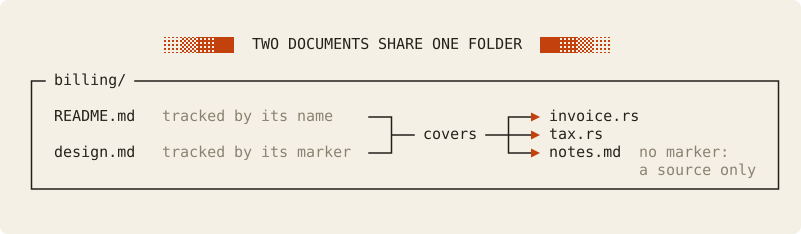
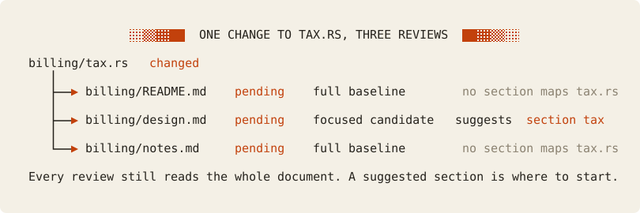
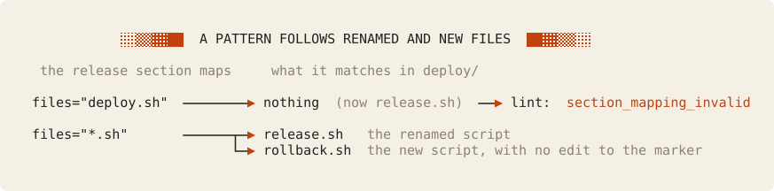

# Cookbook: documents beside the code

Keep a design note or a runbook in the folder of the code that it describes, and give it a Memoria marker. The marker makes the page a tracked document. It covers its folder like the README there, so a code change reaches it directly, and its section markers point each review at the part that describes the changed file.

Choose this pattern when an explanation is too long for the README and belongs next to its code. The cost is one more review for every change in that folder, because each tracked page there gets its own. Every output below comes from a real, tested run of one small project. Read [Memoria concepts](../../concepts.md) first if scopes and handoffs are new to you, and the [cookbook index](../README.md) to compare the other patterns.

## Contents

1. Set up
   - [The problem](#the-problem)
   - [The project](#the-project)
2. What happens when
   - [An unmarked page changes](#an-unmarked-page-is-only-a-source)
   - [Code changes in a shared folder](#a-code-change-reaches-every-page-of-its-folder)
   - [A mapped file is renamed](#a-mapped-file-is-renamed)
   - [A pattern meets a new file](#a-pattern-follows-a-new-file)
   - [A decision changes but no file does](#a-decision-changes-and-no-file-does)
3. [Tradeoffs](#tradeoffs), including when not to adopt the pattern

## The problem

Some explanations do not fit in a README. A design note gives the reasons behind the code. A runbook gives the steps to operate it. A decision record keeps one choice and its cause.
These pages work best next to the code, for example `billing/design.md` and `deploy/runbook.md`.

Without a check, such a page goes stale as quietly as a README does.
Memoria tracks every `README.md` by its name. It tracks any other Markdown file only when the file carries a Memoria marker outside code: an export, an import, or a section.
A link never tracks a file.

A tracked page covers its own folder and below, like a README in the same folder. Both documents then become pending for each change in that folder, and each one gets its own review.
A long page can map its parts to files with section markers. When a mapped file changes, the review suggests the part that describes it.

**Limits.** Memoria never writes or judges the prose. A section is advice about where to start reading. It is not proof that a reviewer understood the page, and it never replaces the whole-document pass.

## The project

Ledger sends invoices to customers. Each code folder has a README and one page beside the code:

```text
project/
├── memoria.toml
├── README.md            # links billing/README.md, deploy/README.md, billing/notes.md
├── Cargo.toml
├── billing/
│   ├── README.md        # tracked by its name
│   ├── design.md        # tracked: sections "invoice" and "tax"
│   ├── notes.md         # no marker: a source, not a document
│   ├── invoice.rs
│   └── tax.rs
└── deploy/
    ├── README.md        # tracked by its name
    ├── runbook.md       # tracked: sections "release" and "settings"
    ├── deploy.sh
    └── config.toml
```

`billing/design.md` sits beside `billing/README.md`, and its marker makes it a second document for the same folder. Both documents cover every file in `billing/`, including the unmarked `billing/notes.md`. `deploy/` has the same shape:



At the start, every document is current.
The test fixture is [`tests/fixtures/beside-code`](../../../tests/fixtures/beside-code/), where the README files carry placeholder names.

### The configuration

The project needs no special setting for this pattern:

<!-- cookbook-file: memoria.toml -->
```toml
version = 3
ignore = []
include = []

[documentation]
guidance = [
    "Write for a developer who is new to this project. Use short sentences, and keep commands, paths, and names exact.",
]
guidance_files = []

[lint]
# The design notes link their README for navigation, not to import it.
missing_import_hint = false
```

### The READMEs

The root `README.md` links each folder README. Each link hands that folder to its README, so the root covers only `Cargo.toml`:

<!-- cookbook-file: README.md -->
```markdown
# Ledger

Ledger sends invoices to customers.

- The [billing guide](billing/README.md) explains how an invoice gets its total.
- The [deploy guide](deploy/README.md) explains how to release the service.
- The [open billing questions](billing/notes.md) list what the team has not decided yet.
```

The third link points at `billing/notes.md`. It is navigation only. [An unmarked page is only a source](#an-unmarked-page-is-only-a-source) shows what that means.

`billing/README.md` lists the files and links the design note:

<!-- cookbook-file: billing/README.md -->
```markdown
# Billing

Billing turns invoice lines into a total with tax.

- `invoice.rs` holds the invoice lines and the subtotal.
- `tax.rs` computes the VAT on the subtotal.
- The [design note](design.md) explains the decisions behind both files.
```

A link to a tracked page in the same folder hands nothing off. Both documents cover `billing/`.

### A page with sections

`billing/design.md` maps each part to the file it describes:

<!-- cookbook-file: billing/design.md -->
```markdown
# Billing design

This note explains the decisions behind billing. The [billing guide](README.md) lists the files.

<!-- memoria:section id="invoice" files="invoice.rs" -->
## Invoice lines

An invoice is a list of lines. Each line holds a description and an amount in cents.
Amounts are `u64` cents, so an amount is never negative and never a fraction of a cent.
The subtotal is the sum of all lines, before tax.
<!-- /memoria:section -->

<!-- memoria:section id="tax" files="tax.rs" -->
## Tax

Billing charges VAT at 20% of the subtotal.
The tax rounds down to a whole cent, so a customer never pays more than the rate.
<!-- /memoria:section -->
```

The section markers make this page a tracked document. Each `files` value is a path relative to the page's folder.
A marker starts at column zero, with `id` first and `files` second. The body starts with a heading. The [specification](../../specification.md#461-map-document-sections-to-sources) gives the full grammar.

`billing/tax.rs` is the file that the `tax` section describes:

<!-- cookbook-file: billing/tax.rs -->
```rust
/// The VAT rate in basis points: 2000 is 20%.
pub const VAT_BASIS_POINTS: u64 = 2000;

/// The VAT on a subtotal, rounded down to a whole cent.
pub fn vat(subtotal_cents: u64) -> u64 {
    subtotal_cents * VAT_BASIS_POINTS / 10_000
}
```

`deploy/runbook.md` uses the same pattern for operations. Its last part, the release window, describes no file, so it has no section marker:

<!-- cookbook-file: deploy/runbook.md -->
```markdown
# Deploy runbook

Use this runbook to release Ledger. The [deploy guide](README.md) lists the files.

<!-- memoria:section id="release" files="deploy.sh" -->
## Release

1. Run `./deploy.sh` from the `deploy/` folder.
2. Open `http://ledger.example.com:8080/health`. The release succeeded when the page shows `ok`.
<!-- /memoria:section -->

<!-- memoria:section id="settings" files="config.toml" -->
## Settings

`config.toml` names the server in `host` and the port in `port`.
<!-- /memoria:section -->

## Release window

Release on a weekday between 09:00 and 16:00 UTC.
```

### See the shared coverage

Run `memoria status --explain billing/tax.rs`:

<!-- cookbook-output: status-explain -->
```text
Documents       5: 3 READMEs, 2 opted-in documents; 2 handoffs; 5 sources covered by more than one document
Selected files  6
Input size      775 B
Reviews         5 current, 0 pending, 0 never reviewed, 0 waiting
Invalidations   0 active, 0 documents pending
Navigation      0 document(s) not reachable from the root
Coverage        0 selected file(s) that no document covers
Excluded        reserved:configuration=1, reserved:document=3, reserved:state=1

Documents:
  current          README.md
  current          billing/README.md
  current          billing/design.md
  current          deploy/README.md
  current          deploy/runbook.md

Explain billing/tax.rs
  outcome  selected
  reason   eligible in Git and matched by no Memoria rule
  covered by billing/README.md, billing/design.md
  handed off by README.md (link at README.md:5) to billing/README.md
  section  billing/design.md#tax via tax.rs
```

The status counts 2 opted-in documents beside 3 READMEs. Five sources are covered by more than one document.
`billing/tax.rs` is covered by `billing/README.md` and `billing/design.md`. The root `README.md` does not cover it, because its link hands `billing/` off.
The last line names the section that maps the file, and the `files` token that names it.

## An unmarked page is only a source

`billing/notes.md` has no Memoria marker. The root README links it, but a link never tracks a file.
The page is a plain source of every document that covers `billing/`.

### Edit the unmarked page

A teammate adds a question about currency to `billing/notes.md`:

```diff
 A refund needs a credit note. We have no design for credit notes yet.
+
+## Currency
+
+Every amount is in euro cents. We have no plan for a second currency.
```

1. Run `memoria review`:

<!-- cookbook-output: plan-notes -->
```text
Review plan: 2 pending documents (dependency order)
  2. billing/README.md  README · input changed: billing/notes.md · ready · also covered by billing/design.md
  3. billing/design.md  opted-in document · input changed: billing/notes.md · ready · also covered by billing/README.md
Next: memoria review billing/README.md
```

The edit makes both billing documents pending, as a code change does. `billing/notes.md` itself is not in the plan.
The numbers are places in the dependency order of all documents, so this list starts at 2.

2. Run `memoria explain billing/notes.md` to see why:

<!-- cookbook-output: explain-notes -->
```text
error [document_not_found]
  Path: billing/notes.md
  billing/notes.md is ordinary Markdown with no Memoria marker, so it is a
  source covered by billing/README.md, billing/design.md, not a tracked
  document; add an import, export, or section marker to track it
  covered_by:
    -
      billing/README.md
    -
      billing/design.md

memoria explain failed with exit status 1
```

For a link to unmarked Markdown in a subfolder, `lint` can report the hint `handoff_not_applied` with reason `untracked_markdown`.
In this project, `lint` reports nothing, because the link to `billing/README.md` already hands `billing/` off.

### Opt the page in

If the page explains code, give it a marker. Here, the credit notes question is about invoice lines, so a section maps it to `invoice.rs`:

<!-- cookbook-file: billing/notes.md -->
```markdown
# Open billing questions

<!-- memoria:section id="credit-notes" files="invoice.rs" -->
## Credit notes

A refund needs a credit note. We have no design for credit notes yet.
<!-- /memoria:section -->

## Currency

Every amount is in euro cents. We have no plan for a second currency.
```

An export or an import marker also opts a page in. A section is the right marker when a part of the page describes a file.

1. Run `memoria review`:

<!-- cookbook-output: plan-opt-in -->
```text
Review plan: 3 pending documents (dependency order)
  2. billing/README.md  README · input changed: billing/notes.md · ready
  3. billing/design.md  opted-in document · input changed: billing/notes.md · ready
  4. billing/notes.md  opted-in document · never reviewed · ready
Next: memoria review billing/README.md
```

`billing/notes.md` is now a tracked document with no previous review.

2. Run `memoria review billing/design.md`:

<!-- cookbook-output: review-design-opt-in -->
```text
Review billing/design.md — opted-in document, pending since revision 1
Scope: 2 sources in billing/ and below
Baseline: revision 1 by fixture (no-update)
What changed since that review:
  removed  billing/notes.md · scope source · no section of this document describes it
      @@ -1,5 +1,0 @@
      -# Open billing questions
      -
      -## Credit notes
      -
      -A refund needs a credit note. We have no design for credit notes yet.
      Note (removed_file): This input was removed from the requested boundary. A full export carries the old body without a deletion hunk. This explanation retains the verified deletion evidence.
How to read:
  Mode: full baseline. Review the whole document against its complete current scope, not only the changes.
  document_classification_changed [billing/notes.md]: a source gained a Memoria marker and is now a tracked document, so it left this document's scope; review the complete current scope
  Read first:
    billing/design.md (whole_document)
  Then read the rest of the scope: 2 unchanged sources. List the sources: memoria status --explain billing/design.md
  Whole document pass: required
  Guidance: memoria guidance billing/design.md
Next:
  1. Read the whole document and the listed inputs, then the rest of the scope; edit billing/design.md if it is wrong.
  2. After any edit, save a fresh artifact: dir=$(mktemp -d); memoria review billing/design.md --save "$dir"
  3. Record the result: memoria ack billing/design.md --packet <saved file> --reviewer <you> --result <updated|no-update> --note "<why>"
```

`billing/notes.md` left the scope of `billing/design.md`. The cause is `document_classification_changed`, and the review is a full baseline. The same applies to `billing/README.md`.

3. Run `memoria review billing/notes.md`. The `How to read` part of the output is:

<!-- cookbook-output: review-notes-first -->
```text
How to read:
  Mode: full baseline. Review the whole document against its complete current scope, not only the changes.
  baseline_missing [billing/notes.md]: this document has no previous review to compare against; review its complete scope
  Read first:
    billing/notes.md (whole_document)
  Then read the rest of the scope: 2 unchanged sources. List the sources: memoria status --explain billing/notes.md
  Whole document pass: required
  Guidance: memoria guidance billing/notes.md
```

A first review always reads the complete scope.

4. Review all three documents. Acknowledge each one with its own fresh artifact, as in the next scenario.

## A code change reaches every page of its folder

Billing changes how it rounds tax. The VAT now rounds to the nearest cent, and a half cent rounds up:

```diff
-/// The VAT on a subtotal, rounded down to a whole cent.
+/// The VAT on a subtotal, rounded to the nearest cent. A half cent rounds up.
 pub fn vat(subtotal_cents: u64) -> u64 {
-    subtotal_cents * VAT_BASIS_POINTS / 10_000
+    (subtotal_cents * VAT_BASIS_POINTS + 5_000) / 10_000
 }
```

By now three documents cover `billing/`, because the last scenario opted in `billing/notes.md`. The change reaches all three, and only the page with a section for `tax.rs` gets a suggestion:



### See what is pending

Run `memoria review`:

<!-- cookbook-output: plan-tax -->
```text
Review plan: 3 pending documents (dependency order)
  2. billing/README.md  README · input changed: billing/tax.rs · ready · also covered by billing/design.md, billing/notes.md
  3. billing/design.md  opted-in document · input changed: billing/tax.rs · ready · also covered by billing/README.md, billing/notes.md
  4. billing/notes.md  opted-in document · input changed: billing/tax.rs · ready · also covered by billing/README.md, billing/design.md
Next: memoria review billing/README.md
```

Three documents cover `billing/`, so one change asks for three reviews.

### Review billing/design.md

1. Run `memoria review billing/design.md`:

<!-- cookbook-output: review-design-tax -->
```text
Review billing/design.md — opted-in document, pending since revision 2
Scope: 2 sources in billing/ and below
Baseline: revision 2 by fixture (no-update)
What changed since that review:
  changed  billing/tax.rs · scope source · section "tax" describes it · also covered by 2 other documents
      @@ -1,7 +1,7 @@
       /// The VAT rate in basis points: 2000 is 20%.
       pub const VAT_BASIS_POINTS: u64 = 2000;

      -/// The VAT on a subtotal, rounded down to a whole cent.
      +/// The VAT on a subtotal, rounded to the nearest cent. A half cent rounds up.
       pub fn vat(subtotal_cents: u64) -> u64 {
      -    subtotal_cents * VAT_BASIS_POINTS / 10_000
      +    (subtotal_cents * VAT_BASIS_POINTS + 5_000) / 10_000
       }
Also pending for the same changes:
  billing/README.md (covers the same folder; pending)
  billing/notes.md (covers the same folder; pending)
How to read:
  Mode: focused candidate. Eligibility only; it does not certify the prior review.
  Suggested section tax "Tax" lines 14-17: billing/tax.rs
  Read:
    billing/design.md (whole_document)
    billing/tax.rs (changed_source)
  Whole document pass: required
  Guidance: memoria guidance billing/design.md
Next:
  1. Read the whole document and the listed inputs; edit billing/design.md if it is wrong.
  2. After any edit, save a fresh artifact: dir=$(mktemp -d); memoria review billing/design.md --save "$dir"
  3. Record the result: memoria ack billing/design.md --packet <saved file> --reviewer <you> --result <updated|no-update> --note "<why>"
```

The review is a `focused candidate`. It suggests the `tax` section, because that section maps `billing/tax.rs`.
`Whole document pass: required` still applies. A suggested section tells you where to start, not where to stop.

2. Edit the `tax` section. Its old sentence says that the tax rounds down:

```diff
-The tax rounds down to a whole cent, so a customer never pays more than the rate.
+The tax rounds to the nearest cent. A half cent rounds up.
```

3. Save a fresh artifact outside the project. Run `dir=$(mktemp -d)`, then `memoria review billing/design.md --save "$dir"`:

<!-- cookbook-output: save-design -->
```text
Review billing/design.md — opted-in document, pending since revision 2
Scope: 2 sources in billing/ and below
Baseline: revision 2 by fixture (no-update)
What changed since that review:
  changed  this document's own text
      @@ -14,5 +14,5 @@
       ## Tax

       Billing charges VAT at 20% of the subtotal.
      -The tax rounds down to a whole cent, so a customer never pays more than the rate.
      +The tax rounds to the nearest cent. A half cent rounds up.
       <!-- /memoria:section -->
  changed  billing/tax.rs · scope source · section "tax" describes it · also covered by 2 other documents
      @@ -1,7 +1,7 @@
       /// The VAT rate in basis points: 2000 is 20%.
       pub const VAT_BASIS_POINTS: u64 = 2000;

      -/// The VAT on a subtotal, rounded down to a whole cent.
      +/// The VAT on a subtotal, rounded to the nearest cent. A half cent rounds up.
       pub fn vat(subtotal_cents: u64) -> u64 {
      -    subtotal_cents * VAT_BASIS_POINTS / 10_000
      +    (subtotal_cents * VAT_BASIS_POINTS + 5_000) / 10_000
       }
Also pending for the same changes:
  billing/README.md (covers the same folder; pending)
  billing/notes.md (covers the same folder; pending)
How to read:
  Mode: focused candidate. Eligibility only; it does not certify the prior review.
  Suggested section tax "Tax" lines 14-17: billing/tax.rs
  Read:
    billing/design.md (whole_document)
    billing/tax.rs (changed_source)
  Whole document pass: required
  Guidance: memoria guidance billing/design.md
Next:
  1. Read the whole document and the listed inputs; edit billing/design.md if it is wrong.
  2. After any edit, save a fresh artifact: dir=$(mktemp -d); memoria review billing/design.md --save "$dir"
  3. Record the result: memoria ack billing/design.md --packet <saved file> --reviewer <you> --result <updated|no-update> --note "<why>"
Saved: $dir/memoria-manifest-billing_design.md-<id>.json
Acknowledge after your review: memoria ack billing/design.md --packet $dir/memoria-manifest-billing_design.md-<id>.json --reviewer <REVIEWER> --result <updated|no-update> --note <NOTE>
```

4. Record the result with an explicit reviewer and a note that states the fact you checked:

```sh
memoria ack billing/design.md --packet "$dir"/memoria-manifest-billing_design.md-<id>.json \
  --reviewer docs-agent --result updated \
  --note "The tax section now says that VAT rounds to the nearest cent, half up."
```

<!-- cookbook-output: ack-design -->
```text
Recorded billing/design.md revision 3 (updated) by docs-agent
```

### Review billing/README.md and billing/notes.md

Each document gets its own review, its own artifact, and its own acknowledgement. An artifact of `billing/design.md` never acknowledges another document.

`billing/README.md` has no sections, so nothing narrows its review. Run `memoria review billing/README.md`. The `How to read` part of the output is:

<!-- cookbook-output: review-readme-tax -->
```text
How to read:
  Mode: full baseline. Review the whole document against its complete current scope, not only the changes.
  unmapped_change [billing/tax.rs]: no valid section describes this changed source, so the review cannot narrow to a part of the document
  Read first:
    billing/README.md (whole_document)
    billing/tax.rs (changed_source)
  Then read the rest of the scope: 1 unchanged source. List the sources: memoria status --explain billing/README.md
  Whole document pass: required
  Guidance: memoria guidance billing/README.md
```

The cause is `unmapped_change`: no section of this document maps `billing/tax.rs`. `billing/notes.md` gets the same full baseline, because its only section maps `invoice.rs`.
Neither page says how tax rounds. Review each one, save a fresh artifact, and record `--result no-update` with a note that says so.

## A mapped file is renamed

The team renames `deploy/deploy.sh` to `deploy/release.sh`. The `release` section of `deploy/runbook.md` still names `deploy.sh`.

1. Run `memoria lint`:

<!-- cookbook-output: lint-rename -->
```text
warning [section_mapping_invalid]
  Path: deploy/runbook.md
  Line: 5
  Column: 1
  section "release": deploy/deploy.sh is not a selected regular source file; a
  section can only name sources in this document's scope

Documents 6 (3 README(s)): 0 error(s), 1 warning(s), 0 hint(s)
```

A broken mapping is a warning, so `lint` passes. The section stays in the page, but Memoria uses none of its advice.

2. Run `memoria review deploy/runbook.md`. The `How to read` part of the output is:

<!-- cookbook-output: review-runbook-rename -->
```text
How to read:
  Mode: full baseline. Review the whole document against its complete current scope, not only the changes.
  mapping_invalid [deploy/runbook.md]: the document's section mappings are invalid, so none of its advice can narrow this review; see the section_mapping_invalid diagnostics
  path_set_changed [deploy/deploy.sh]: a source left this document's scope; a rename appears as a removal plus an addition
  path_set_changed [deploy/release.sh]: a source was added to this document's scope; a rename appears as a removal plus an addition
  Read first:
    deploy/runbook.md (whole_document)
    deploy/release.sh (changed_source)
  Then read the rest of the scope: 1 unchanged source. List the sources: memoria status --explain deploy/runbook.md
  Whole document pass: required
  Guidance: memoria guidance deploy/runbook.md
```

One invalid mapping withdraws the advice of the whole page, so the `settings` section suggests nothing either. The review is a full baseline. A rename appears as one removed source and one added source.

3. Correct the mapping and the step in `deploy/runbook.md`. The `release` section describes the shell scripts of the folder, so map them with the pattern `*.sh` instead of one name. Then correct the file list of `deploy/README.md`:

```diff
-<!-- memoria:section id="release" files="deploy.sh" -->
+<!-- memoria:section id="release" files="*.sh" -->
 ## Release

-1. Run `./deploy.sh` from the `deploy/` folder.
+1. Run `./release.sh` from the `deploy/` folder.
```

4. Run `memoria lint` again:

<!-- cookbook-output: lint-fixed -->
```text
Documents 6 (3 README(s)): 0 error(s), 0 warning(s), 0 hint(s)
```

5. Save a fresh artifact of `deploy/runbook.md`. The `How to read` part of the output is:

<!-- cookbook-output: save-runbook-fixed -->
```text
How to read:
  Mode: full baseline. Review the whole document against its complete current scope, not only the changes.
  mapping_changed [deploy/runbook.md]: the document's section mappings changed since the last review; a changed association cannot reduce the required scope
  path_set_changed [deploy/deploy.sh]: a source left this document's scope; a rename appears as a removal plus an addition
  path_set_changed [deploy/release.sh]: a source was added to this document's scope; a rename appears as a removal plus an addition
  Read first:
    deploy/runbook.md (whole_document)
    deploy/release.sh (changed_source)
  Then read the rest of the scope: 1 unchanged source. List the sources: memoria status --explain deploy/runbook.md
  Whole document pass: required
  Guidance: memoria guidance deploy/runbook.md
```

The corrected mapping is a changed association, so the cause is `mapping_changed`. The review stays a full baseline. The next change to `release.sh` gets a focused candidate again.
Memoria compares the files that a mapping names, not its text. `*.sh` names `release.sh`, and the last review saw `deploy.sh`, so the association changed.

6. Record the result for `deploy/runbook.md`. Then review and acknowledge `deploy/README.md`.

## A pattern follows a new file

The team adds `deploy/rollback.sh`, which returns the server to the previous release. Nobody edits the runbook marker.

The `release` section now maps the pattern `*.sh`. The literal path `deploy.sh` broke at the rename, because it named one file. The pattern names every shell script in the folder, so it already matches the new one:



1. Run `memoria review`:

<!-- cookbook-output: plan-rollback -->
```text
Review plan: 2 pending documents (dependency order)
  5. deploy/README.md  README · input changed: deploy/rollback.sh · ready · also covered by deploy/runbook.md
  6. deploy/runbook.md  opted-in document · input changed: deploy/rollback.sh · ready · also covered by deploy/README.md
Next: memoria review deploy/README.md
```

A new file in `deploy/` makes both documents of the folder pending, as any added source does.

2. Run `memoria review deploy/runbook.md`:

<!-- cookbook-output: review-runbook-added -->
```text
Review deploy/runbook.md — opted-in document, pending since revision 2
Scope: 3 sources in deploy/ and below
Baseline: revision 2 by docs-agent (updated)
What changed since that review:
  added    deploy/rollback.sh · scope source · section "release" describes it · also covered by 1 other document
Also pending for the same changes:
  deploy/README.md (covers the same folder; pending)
How to read:
  Mode: full baseline. Review the whole document against its complete current scope, not only the changes.
  path_set_changed [deploy/rollback.sh]: a source was added to this document's scope; a rename appears as a removal plus an addition
  Read first:
    deploy/runbook.md (whole_document)
    deploy/rollback.sh (changed_source)
  Then read the rest of the scope: 2 unchanged sources. List the sources: memoria status --explain deploy/runbook.md
  Whole document pass: required
  Guidance: memoria guidance deploy/runbook.md
Next:
  1. Read the whole document and the listed inputs, then the rest of the scope; edit deploy/runbook.md if it is wrong.
  2. After any edit, save a fresh artifact: dir=$(mktemp -d); memoria review deploy/runbook.md --save "$dir"
  3. Record the result: memoria ack deploy/runbook.md --packet <saved file> --reviewer <you> --result <updated|no-update> --note "<why>"
```

The `release` pattern `*.sh` already matches the new script, so the change line says `section "release" describes it`.
The review is still a full baseline. An added file has no earlier review that a focused reading could build on, and the cause `path_set_changed` says so.

3. Add a rollback step to the `release` section, then save and acknowledge the runbook. Add `rollback.sh` to the file list of `deploy/README.md`, then save and acknowledge it too.

4. Run `memoria status --explain deploy/runbook.md` to see what each section maps now. The `Explain` part of the output is:

<!-- cookbook-output: explain-runbook -->
```text
Explain deploy/runbook.md
  outcome  document
  reason   Markdown with a Memoria marker (first at line 5): an opted-in document
  kind     opted_in
  scope    3 source(s)
             deploy/config.toml
             deploy/release.sh
             deploy/rollback.sh
  sections valid
  section  release: *.sh -> 2 source(s)
             deploy/release.sh
             deploy/rollback.sh
  section  settings: config.toml -> 1 source(s)
             deploy/config.toml
```

The output lists every source in the page's scope, then each section's tokens and every source that they match.

5. A later change to `rollback.sh` gets a focused review. Run `memoria review deploy/runbook.md` after an edit to the script. The `How to read` part of the output is:

<!-- cookbook-output: review-runbook-pattern -->
```text
How to read:
  Mode: focused candidate. Eligibility only; it does not certify the prior review.
  Suggested section release "Release" lines 6-10: *.sh (2 matches; read deploy/rollback.sh)
  Read:
    deploy/runbook.md (whole_document)
    deploy/rollback.sh (changed_source)
  Whole document pass: required
  Guidance: memoria guidance deploy/runbook.md
```

The suggestion shows the authored pattern and its 2 matches. It lists only the match that changed as a read, so a pattern over a large folder does not make the reading list large.
A literal path in `files` is always listed in full, as before.

## A decision changes and no file does

The team decides to stop releases on Fridays. No file changes, so no document becomes pending.
The release window part of `deploy/runbook.md` is now wrong. Request its review with a reason:

1. Run `memoria invalidate doc:deploy/runbook.md --reason "The team no longer releases on Fridays."`:

<!-- cookbook-output: invalidate -->
```text
Invalidation #1 (doc:deploy/runbook.md) recorded: "The team no longer releases on Fridays."
  pending  deploy/runbook.md
```

2. Run `memoria review`:

<!-- cookbook-output: plan-invalidate -->
```text
Review plan: 1 pending document (dependency order)
  6. deploy/runbook.md  opted-in document · semantic review [1]: The team no longer releases on Fridays. · ready
Next: memoria review deploy/runbook.md
```

Only the runbook is pending. `deploy/README.md` shares the folder, but an invalidation of one document reaches only that document.

3. Run `memoria review deploy/runbook.md`:

<!-- cookbook-output: review-runbook-invalidate -->
```text
Review deploy/runbook.md — opted-in document, pending since revision 4
Scope: 3 sources in deploy/ and below
Baseline: revision 4 by fixture (no-update)
Semantic review requests:
  [1] The team no longer releases on Fridays.
How to read:
  Mode: full baseline. Review the whole document against its complete current scope, not only the changes.
  semantic_invalidation [deploy/runbook.md]: invalidation 1 requires a semantic review: The team no longer releases on Fridays.
  Read first:
    deploy/runbook.md (whole_document)
  Then read the rest of the scope: 3 unchanged sources. List the sources: memoria status --explain deploy/runbook.md
  Whole document pass: required
  Guidance: memoria guidance deploy/runbook.md
Next:
  1. Read the whole document and the listed inputs, then the rest of the scope; edit deploy/runbook.md if it is wrong.
  2. After any edit, save a fresh artifact: dir=$(mktemp -d); memoria review deploy/runbook.md --save "$dir"
  3. Record the result: memoria ack deploy/runbook.md --packet <saved file> --reviewer <you> --result <updated|no-update> --note "<why>"
```

The reason appears in the review. No source changed, so no section is suggested.

4. Edit the release window:

```diff
-Release on a weekday between 09:00 and 16:00 UTC.
+Release from Monday to Thursday, between 09:00 and 16:00 UTC. Do not release on a Friday.
```

5. Save a fresh artifact, then record the result:

```sh
memoria ack deploy/runbook.md --packet "$dir"/memoria-manifest-deploy_runbook.md-<id>.json \
  --reviewer docs-agent --result updated \
  --note "The release window now ends on Thursday, as the team decided."
```

<!-- cookbook-output: ack-runbook -->
```text
Recorded deploy/runbook.md revision 5 (updated) by docs-agent
Cleared invalidations: #1
```

The acknowledgement clears the invalidation that the reviewed artifact included.

6. Run `memoria check`:

<!-- cookbook-output: check -->
```text
OK: 6 document(s) current, imports rendered, no coverage or structure errors.
```

## Tradeoffs

### What this setup costs

- **One review for each page in the folder.** Each tracked page in a folder becomes pending for every change there. In this project, one change to `tax.rs` asks for three reviews.
- **Every opted-in page adds a review.** Opting in `billing/notes.md` made it a third reviewer of every billing change. Opt in a page only when it explains the code in its folder.
- **Mappings to maintain.** A rename, a move, or a deleted file breaks a literal path in a mapping. The fix is an edit to the page, and that edit makes the page pending. A pattern such as `*.sh` follows renamed and new files with no edit. Use `!` to remove files from a pattern, for example `src/** !src/generated/**`.

### Limits

- **Sections are advice only.** A section adds or removes no input. It has no freshness and no acknowledgement of its own.
- **The whole-document pass always applies.** A focused candidate names a place to start. The reviewer still reads the whole page.
- **One invalid mapping withdraws all advice.** Memoria cannot tell which mapping the author meant, so it suggests no section of that page.
- **A section names only its own scope.** A path or a pattern is relative to the page's folder, and Memoria refuses `..`. A page in `billing/` cannot map a file in `deploy/`. A pattern matches only sources in the page's scope.
- **A pattern does not make an added file focused.** A new file that a pattern matches is named in the review, but the review is a full baseline until that file is reviewed once.
- **A link is not a marker.** Only an export, an import, or a section marker opts a page in. Marker text inside fenced code does not count.

### How this differs from the other patterns

- [Agent instruction files](../agent-instructions/README.md) are tracked pages at the root. They share root coverage with the root README, and they add shared section guides.
- A [README tree with central guidelines](../readme-tree/README.md) keeps one README for each folder. It has no second page to review, and imports carry summaries upward.
- A [central docs folder](../central-docs/README.md) keeps pages away from the code. A page there covers no code, and it gets code changes only through what it imports.

In this pattern, two pages share one code folder by design: a short README and a long design note. The cost is one review for each page.

### When not to adopt

- The README already holds the explanation. A second page adds a review and no new fact.
- The page describes code in several folders. A section cannot map files outside its own folder. Use a page with imports, as in a central docs folder.
- The page is a log or a scratch list that nobody keeps correct. Leave it unmarked. Then it is a source, and an edit to it asks the folder's documents for a review.

Next: run `memoria status` in your own project and count the opted-in documents beside each README.
