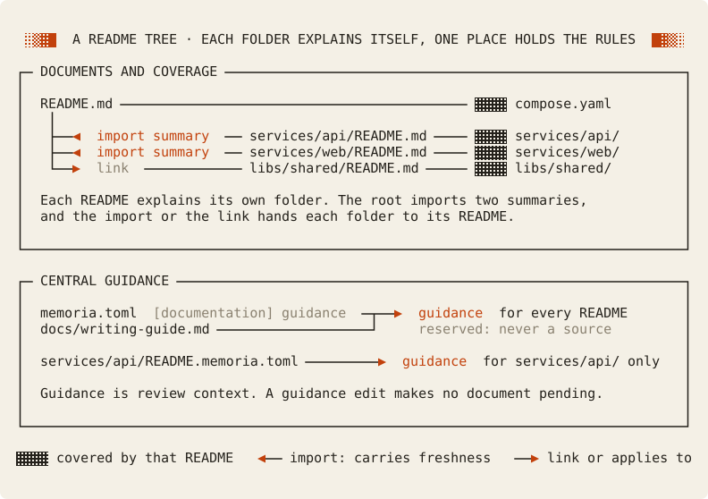
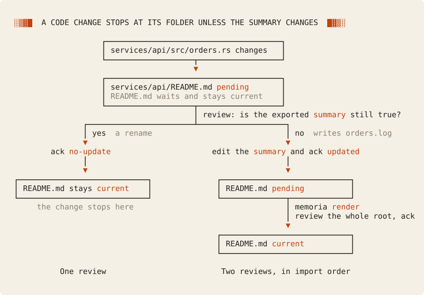

# Cookbook: a README tree with central guidelines

Give every important folder a README that explains it, let the root README import a short summary from each one, and keep the writing rules in one central place. A code change then reaches only the README of its own folder. The root hears about it only when that folder's exported summary changes, so the root stays a short, current map instead of a second copy of every story.

Choose this pattern when each folder has its own story and the root needs a map. The cost is two reviews for a summary change: the folder README first, then the root. Every output below comes from a real, tested run of one small project. Read [Memoria concepts](../../concepts.md) first if scopes, handoffs, and imports are new to you, and the [cookbook index](../README.md) to compare the other patterns.

## Contents

1. Set up
   - [The problem](#the-problem)
   - [The project](#the-project)
2. What happens when
   - [A change keeps the summary true](#a-change-that-keeps-the-summary-true)
   - [A change changes the summary](#a-change-that-changes-the-summary)
   - [A central guideline changes](#a-central-guideline-changes)
   - [A parent does not link a README](#a-readme-that-its-parent-does-not-link)
3. [Tradeoffs](#tradeoffs), including when not to adopt the pattern

## The problem

A project with several services often has one README in each service folder.
The root README tells a new developer what each service does.
When a service changes, two things go wrong:

- The service README keeps an old explanation, and nothing tells the team.
- The root README repeats the old explanation in its own words, so a fix in one place leaves the other place wrong.

The writing rules have a separate problem.
When each README carries its own rules, the rules drift apart, and no reviewer reads all of them.

This pattern answers both problems:

1. Each folder README explains its own folder. Memoria makes it pending when a file in that folder changes.
2. Each service README exports a two-sentence summary. The root imports that summary and does not repeat it.
3. The root `memoria.toml` holds the writing rules for every README. A `README.memoria.toml` sidecar adds local rules for one folder.

**Limits.** Memoria does not write or judge the prose. A reviewer decides whether each README is correct.
Memoria makes no claim about reading cost or token savings.

## The project

The project is a small online book shop with two services and one shared library:

```text
project/
├── memoria.toml                    # central guidance for every README
├── README.md                       # imports two summaries, links libs/shared
├── compose.yaml
├── docs/
│   └── writing-guide.md            # guidance file: review context, never a source
├── services/
│   ├── api/
│   │   ├── README.md               # exports "summary"
│   │   ├── README.memoria.toml     # sidecar: local guidance for services/api/
│   │   └── src/orders.rs
│   └── web/
│       ├── README.md               # exports "summary"
│       └── src/cart.ts
└── libs/shared/
    ├── README.md
    └── src/money.rs
```

At the start, every document is current.
The test fixture is [`tests/fixtures/readme-tree`](../../../tests/fixtures/readme-tree/), where the README and sidecar files carry placeholder names.



### Each folder explains itself

`services/api/README.md` explains the orders API. Its summary sits inside an export:

<!-- cookbook-file: services/api/README.md -->
```markdown
# Orders API

This folder owns the orders API.
Run `cargo run` in this folder. The API listens on port 8080.

<!-- memoria:export id="summary" -->
### Orders API

The orders API accepts orders over HTTP and keeps them in memory. It depends on no other service.
<!-- /memoria:export -->

## Endpoints

- `POST /orders` stores one order and returns `201 Created`.
- `GET /orders/{id}` returns one order, or `404 Not Found`.
```

The export marks the two sentences that other documents can import. The rest of the README belongs to the API folder alone.
`services/web/README.md` has the same shape. `libs/shared/README.md` has no export.

### The root imports the summaries

The root README declares one import for each service summary, and links the shared library:

<!-- cookbook-file: README.md -->
```markdown
# Shop

Shop sells books online. It has two services and one shared library.
Run `docker compose up` from this folder to start both services.

## Services

<!-- memoria:import src="services/api/README.md#summary" -->
### Orders API

The orders API accepts orders over HTTP and keeps them in memory. It depends on no other service.
<!-- /memoria:import -->

<!-- memoria:import src="services/web/README.md#summary" -->
### Web shop

The web shop shows the book list and the cart. It sends each order to the orders API.
<!-- /memoria:import -->

## Libraries

- [libs/shared](libs/shared/README.md) holds code that more than one service uses.
```

Memoria writes the text between the import markers. Run `memoria render` to update it. Do not edit it by hand.
Each import and the link hand a folder to its README. So a file in `services/api/` makes only `services/api/README.md` pending, not the root.
Only the imports carry freshness. When an exported summary changes, the root becomes pending. The link carries no freshness.

Run `memoria graph` to see the structure:

<!-- cookbook-output: graph -->
```text
Nodes:
  current          README.md (1 file(s))
  current          libs/shared/README.md (1 file(s))
  current          services/api/README.md (1 file(s))
  current          services/web/README.md (1 file(s))
Edges:
  handoff README.md -> libs/shared/README.md
  handoff README.md -> services/api/README.md
  handoff README.md -> services/web/README.md
  import  README.md -> services/api/README.md#summary
  import  README.md -> services/web/README.md#summary
  link    README.md -> libs/shared/README.md
```

### One central place holds the writing rules

The root `memoria.toml` gives inline guidance and names one guidance file:

<!-- cookbook-file: memoria.toml -->
```toml
version = 3
ignore = []
include = []

[documentation]
guidance = [
    "Write for a developer who joins the team. Start each README with what its folder owns, then how to run it.",
]
guidance_files = ["docs/writing-guide.md"]

[lint]
# The root links the shared library for navigation. It imports no summary from it.
missing_import_hint = false
```

<!-- cookbook-file: docs/writing-guide.md -->
```markdown
# Writing guide

Apply this guide to every README in this project.

1. Keep the exported summary to two sentences: what the folder does, and what it depends on.
2. Name commands, paths, and ports exactly.
3. Explain a folder in its own README. A parent README imports the summary and does not repeat it.
```

A guidance file is reserved review context. It is never a source and never a tracked document, so an edit to it makes no document pending.

### A sidecar adds local rules for one folder

The API folder needs one more rule. A `README.memoria.toml` beside its README adds it:

<!-- cookbook-file: services/api/README.memoria.toml -->
```toml
[documentation]
guidance = [
    "List every HTTP endpoint with its method and path, and say what it returns.",
]
```

The sidecar guidance applies to documents in `services/api/` and below. No other README sees it.
Run `memoria guidance services/api/README.md` to see every layer in the order that a review applies it:

<!-- cookbook-output: guidance-api -->
```text
Guidance for services/api/README.md
Digest          9bf8adf004da0075
Reviewed        9bf8adf004da0075 (unchanged)

Effective guidance, in applied order:

  [inline memoria.toml scope=<root>]
Write for a developer who joins the team. Start each README with what its folder owns, then how to run it.

  [file docs/writing-guide.md scope=<root>]
# Writing guide

Apply this guide to every README in this project.

1. Keep the exported summary to two sentences: what the folder does, and what it depends on.
2. Name commands, paths, and ports exactly.
3. Explain a folder in its own README. A parent README imports the summary and does not repeat it.

  [inline services/api/README.memoria.toml scope=services/api]
List every HTTP endpoint with its method and path, and say what it returns.

Scopes that add guidance:
  <root> (2 entries, memoria.toml): memoria guidance README.md
  services/api (1 entries, services/api/README.memoria.toml): memoria guidance services/api/README.md

Guidance is review context. It never selects files and never decides freshness.
```

Root guidance comes first, then the sidecar. Memoria does not override, deduplicate, or rank the entries.

## A change that keeps the summary true



A developer renames the `items` field in `services/api/src/orders.rs` to `by_id`. The behavior of the API does not change.

1. Run `memoria review`:

<!-- cookbook-output: plan-refactor -->
```text
Review plan: 1 pending document (dependency order)
  2. services/api/README.md  README · input changed: services/api/src/orders.rs · ready
     current  README.md  waiting on services/api/README.md
Next: memoria review services/api/README.md
```

Only `services/api/README.md` is pending. The root README stays current.
The root waits because the API review can change the summary that it imports. The plan numbers each document by its place in the whole dependency order.

2. Run `memoria review services/api/README.md`:

<!-- cookbook-output: review-refactor -->
```text
Review services/api/README.md — README, pending since revision 1
Scope: 1 source in services/api/ and below
Handed services/api/ by README.md (import, line 8)
Baseline: revision 1 by fixture (no-update)
What changed since that review:
  changed  services/api/src/orders.rs · scope source · no section of this document describes it
      @@ -1,15 +1,15 @@
       use std::collections::HashMap;

       pub struct Orders {
      -    items: HashMap<u64, String>,
      +    by_id: HashMap<u64, String>,
       }

       impl Orders {
           pub fn create(&mut self, id: u64, book: String) {
      -        self.items.insert(id, book);
      +        self.by_id.insert(id, book);
           }

           pub fn get(&self, id: u64) -> Option<&String> {
      -        self.items.get(&id)
      +        self.by_id.get(&id)
           }
       }
Downstream:
  export summary → README.md (waits for this review)
How to read:
  Mode: full baseline. Review the whole document against its complete current scope, not only the changes.
  unmapped_change [services/api/src/orders.rs]: no valid section describes this changed source, so the review cannot narrow to a part of the document
  Read first:
    services/api/README.md (whole_document)
    services/api/src/orders.rs (changed_source)
  Rest of the scope: none. The list above is the complete scope.
  Whole document pass: required
  Guidance: memoria guidance services/api/README.md
Next:
  1. Read the whole document and the listed inputs; edit services/api/README.md if it is wrong.
  2. After any edit, save a fresh artifact: dir=$(mktemp -d); memoria review services/api/README.md --save "$dir"
  3. Record the result: memoria ack services/api/README.md --packet <saved file> --reviewer <you> --result <updated|no-update> --note "<why>"
```

The `Downstream:` line names the root README, which imports the summary.
The rename does not change what the README says. The endpoints and the summary stay true.

3. Save a fresh artifact outside the project. Run `dir=$(mktemp -d)`, then `memoria review services/api/README.md --save "$dir"`.
4. Record the result with `--result no-update` and a note that states the fact you checked:

```sh
memoria ack services/api/README.md \
  --packet "$dir"/memoria-manifest-services_api_README.md-<id>.json \
  --reviewer docs-agent --result no-update \
  --note "The rename is internal. The endpoints and the summary stay true."
```

<!-- cookbook-output: ack-refactor -->
```text
Recorded services/api/README.md revision 2 (no-update) by docs-agent
```

5. Run `memoria review` again:

<!-- cookbook-output: plan-after-refactor -->
```text
No document needs review.
```

The exported summary did not change, so the root README needs no review. The change stopped at the API folder.

## A change that changes the summary

The API starts to append each order to a log file:

```diff
 use std::collections::HashMap;
+use std::fs::File;
+use std::io::Write;

 pub struct Orders {
     by_id: HashMap<u64, String>,
+    log: File,
 }

 impl Orders {
     pub fn create(&mut self, id: u64, book: String) {
+        writeln!(self.log, "{id}\t{book}").unwrap();
         self.by_id.insert(id, book);
     }
```

1. Run `memoria review`:

<!-- cookbook-output: plan-behavior -->
```text
Review plan: 1 pending document (dependency order)
  2. services/api/README.md  README · input changed: services/api/src/orders.rs · ready
     current  README.md  waiting on services/api/README.md
Next: memoria review services/api/README.md
```

The plan is the same as for the rename. Memoria cannot tell a rename from a behavior change. The reviewer decides.

2. Review `services/api/README.md`. The summary says that the API keeps orders in memory. That is no longer the full story, so edit the export:

```diff
-The orders API accepts orders over HTTP and keeps them in memory. It depends on no other service.
+The orders API accepts orders over HTTP, keeps them in memory, and appends each one to `orders.log`. It depends on no other service.
```

3. Save a fresh artifact, then record `--result updated`:

<!-- cookbook-output: ack-behavior -->
```text
warning [imports_outdated]
  Path: README.md
  Line: 8
  Column: 1
  import of services/api/README.md#summary differs from the current export; run `memoria render`

Recorded services/api/README.md revision 3 (updated) by docs-agent
```

The warning tells you that the root README still holds the old summary.

4. Run `memoria review`:

<!-- cookbook-output: plan-render -->
```text
warning [imports_outdated]
  Path: README.md
  Line: 8
  Column: 1
  import of services/api/README.md#summary differs from the current export; run `memoria render`

Review plan: 1 pending document (dependency order)
  4. README.md  README · input changed: services/api/README.md#summary · ready  (run `memoria render` first)
Next: memoria render README.md
```

The root README is pending because its import changed. Its review cannot start until the copy is current.

5. Run `memoria render`:

<!-- cookbook-output: render -->
```text
warning [imports_outdated]
  Path: README.md
  Line: 8
  Column: 1
  import of services/api/README.md#summary differs from the current export; run `memoria render`

updated  README.md
    line 8: services/api/README.md#summary (114 -> 149 bytes)
```

6. Run `memoria review README.md`:

<!-- cookbook-output: review-root -->
```text
Review README.md — README, pending since revision 1
Scope: 1 source in ./ and below; hands off libs/shared/ (link, line 22), services/api/ (import, line 8) and services/web/ (import, line 14)
Baseline: revision 1 by fixture (no-update)
What changed since that review:
  changed  this document's own text
      @@ -8,6 +8,6 @@
       <!-- memoria:import src="services/api/README.md#summary" -->
       ### Orders API

      -The orders API accepts orders over HTTP and keeps them in memory. It depends on no other service.
      +The orders API accepts orders over HTTP, keeps them in memory, and appends each one to `orders.log`. It depends on no other service.
       <!-- /memoria:import -->

  changed  import of services/api/README.md#summary
      @@ -1,3 +1,3 @@
       ### Orders API

      -The orders API accepts orders over HTTP and keeps them in memory. It depends on no other service.
      +The orders API accepts orders over HTTP, keeps them in memory, and appends each one to `orders.log`. It depends on no other service.
How to read:
  Mode: full baseline. Review the whole document against its complete current scope, not only the changes.
  imports_changed [services/api/README.md#summary]: an imported contract changed; review the provider first, render, then review this document against its current scope
  Read first:
    README.md (whole_document)
    services/api/README.md#summary (current_import)
  Then read the rest of the scope: 1 unchanged source and 1 unchanged import. List the sources: memoria status --explain README.md
  Whole document pass: required
  Guidance: memoria guidance README.md
Next:
  1. Read the whole document and the listed inputs, then the rest of the scope; edit README.md if it is wrong.
  2. After any edit, save a fresh artifact: dir=$(mktemp -d); memoria review README.md --save "$dir"
  3. Record the result: memoria ack README.md --packet <saved file> --reviewer <you> --result <updated|no-update> --note "<why>"
```

The mode is `full baseline` with the reason `imports_changed`. Read the whole root README again, not only the new summary.
In this project, the new summary fits the root page, and the text around it stays true.

7. Save a fresh artifact, then record `--result no-update`. The rendered copy is not an author edit.

<!-- cookbook-output: ack-root -->
```text
Recorded README.md revision 2 (no-update) by docs-agent
```

8. Run `memoria check`:

<!-- cookbook-output: check -->
```text
OK: 4 document(s) current, imports rendered, no coverage or structure errors.
```

A passing check proves that every document matches its last review and that every import is rendered. It does not prove that the summaries are correct.

## A central guideline changes

The team adds one rule to the central writing guide:

```diff
 3. Explain a folder in its own README. A parent README imports the summary and does not repeat it.
+4. In a service README, list each environment variable that the service reads.
```

1. Run `memoria review`:

<!-- cookbook-output: plan-guide -->
```text
No document needs review.
Guidance changed since review for 4 documents. Assess it: memoria guidance --changed
```

A guidance edit makes no document pending. The text that a reviewer applies changed, but the reviewed inputs did not.

2. Run `memoria guidance --changed`:

<!-- cookbook-output: changed-guide -->
```text
Guidance changed since review for 4 documents.

Change 1: 3 documents, reviewed under guidance 12ffb98b77c2a3f6, now f2afe821b68fe5aa
  README.md
  libs/shared/README.md
  services/web/README.md
  Current guidance sources: memoria.toml, docs/writing-guide.md

Change 2: 1 document, reviewed under guidance 9bf8adf004da0075, now 039afacdb25c9989
  services/api/README.md
  Current guidance sources: memoria.toml, docs/writing-guide.md, services/api/README.memoria.toml

Decide which documents this change affects. Memoria records nothing until you act.
  1. Read the current guidance: memoria guidance README.md
  2. Compare it with its history: git log -p -- memoria.toml and the guidance files above
  3. For each affected document or folder: memoria invalidate doc:<DOCUMENT> --reason "<what changed>" (or subtree:<DIRECTORY>), then review it
Documents you leave alone stay listed here until their next review. Do not acknowledge them to clear this list.
```

Every README saw the old guide, so all four are listed. The API README is in its own group, because its sidecar gives it different guidance.

3. Decide which documents the change affects. The new rule is about service READMEs. The root and the shared library are not services, so leave them alone.
4. Request a review of the `services/` subtree only:

```sh
memoria invalidate subtree:services \
  --reason "The writing guide now asks each service README to list its environment variables."
```

<!-- cookbook-output: invalidate -->
```text
Invalidation #1 (subtree:services) recorded: "The writing guide now asks each service README to list its environment variables."
  pending  services/api/README.md
  pending  services/web/README.md
```

5. Run `memoria review services/web/README.md`:

<!-- cookbook-output: review-web -->
```text
Review services/web/README.md — README, pending since revision 1
Scope: 1 source in services/web/ and below
Handed services/web/ by README.md (import, line 14)
Baseline: revision 1 by fixture (no-update)
Semantic review requests:
  [1] The writing guide now asks each service README to list its environment variables.
Downstream:
  export summary → README.md (waits for this review)
How to read:
  Mode: full baseline. Review the whole document against its complete current scope, not only the changes.
  guidance_changed [services/web/README.md]: project documentation guidance changed since the last review; read the current guidance in full
  semantic_invalidation [services/web/README.md]: invalidation 1 requires a semantic review: The writing guide now asks each service README to list its environment variables.
  Read first:
    services/web/README.md (whole_document)
  Then read the rest of the scope: 1 unchanged source. List the sources: memoria status --explain services/web/README.md
  Whole document pass: required
  Guidance: memoria guidance services/web/README.md (changed since the last review; apply the current text)
Next:
  1. Read the whole document and the listed inputs, then the rest of the scope; edit services/web/README.md if it is wrong.
  2. After any edit, save a fresh artifact: dir=$(mktemp -d); memoria review services/web/README.md --save "$dir"
  3. Record the result: memoria ack services/web/README.md --packet <saved file> --reviewer <you> --result <updated|no-update> --note "<why>"
```

The `Read:` list names only the README, because no source changed. To apply the new rule, also read `services/web/src/cart.ts`. It reads `API_URL`.

6. Review the API README. The API reads no environment variable, so record `--result no-update`:

<!-- cookbook-output: ack-api-guide -->
```text
Recorded services/api/README.md revision 4 (no-update) by docs-agent
Cleared invalidations: #1
```

7. Add the variable to the web README, outside its export:

```diff
+## Environment
+
+- `API_URL` sets the address of the orders API. The default is `http://localhost:8080`.
```

8. Save a fresh artifact, then record `--result updated`:

<!-- cookbook-output: ack-web-guide -->
```text
Recorded services/web/README.md revision 2 (updated) by docs-agent
Cleared invalidations: #1
```

The export did not change, so the root README does not become pending.

9. Run `memoria review`:

<!-- cookbook-output: plan-after-guide -->
```text
No document needs review.
Guidance changed since review for 2 documents. Assess it: memoria guidance --changed
```

The root and the shared library stay listed until their next review. Memoria records no "assessed" decision. Do not acknowledge them only to clear this list.

### Contrast: an edit to the sidecar

The sidecar guidance reaches only its own subtree. This output comes from a one-line edit to `services/api/README.memoria.toml` alone:

<!-- cookbook-output: changed-sidecar -->
```text
Guidance changed since review for 1 document.

Change 1: 1 document, reviewed under guidance 9bf8adf004da0075, now a7f85fafead8ab28
  services/api/README.md
  Current guidance sources: memoria.toml, docs/writing-guide.md, services/api/README.memoria.toml

Decide which documents this change affects. Memoria records nothing until you act.
  1. Read the current guidance: memoria guidance services/api/README.md
  2. Compare it with its history: git log -p -- memoria.toml and the guidance files above
  3. For each affected document or folder: memoria invalidate doc:<DOCUMENT> --reason "<what changed>" (or subtree:<DIRECTORY>), then review it
Documents you leave alone stay listed here until their next review. Do not acknowledge them to clear this list.
```

If a rule applies to every README, put it in the root `memoria.toml` or in a central guidance file. If a rule applies to one folder, put it in a sidecar.

## A README that its parent does not link

A developer adds `services/mailer/README.md` and `services/mailer/src/mail.rs`, but does not link the new README from the root.

1. Run `memoria lint`:

<!-- cookbook-output: lint-mailer -->
```text
hint [handoff_absent]
  Path: README.md
  services/mailer/README.md is a tracked document inside this document's folder,
  but this document neither links to it nor imports it, so both documents cover
  services/mailer/ and both are reviewed for changes there. Link to
  services/mailer/README.md to hand that folder off, or keep both reviews
  subtree: services/mailer
  target: services/mailer/README.md

warning [navigation_disconnected] — 1 item(s)
  Path: services/mailer/README.md
  no link or import path from the root README reaches this document
  scope_files: 1
Next action:
  Add a normal link from an already reachable README.

Documents 5 (5 README(s)): 0 error(s), 1 warning(s), 1 hint(s)
```

The hint `handoff_absent` names the cost: the root README and the mailer README both cover `services/mailer/`.
Each change in that folder asks for two reviews.

2. Run `memoria status --explain services/mailer/src/mail.rs`:

<!-- cookbook-output: explain-mailer -->
```text
warning [navigation_disconnected] — 1 item(s)
  Path: services/mailer/README.md
  no link or import path from the root README reaches this document
  scope_files: 1
Next action:
  Add a normal link from an already reachable README.

Documents       5: 5 READMEs, 0 opted-in documents; 3 handoffs; 1 source covered by more than one document
Selected files  5
Input size      860 B
Reviews         3 current, 1 pending, 1 never reviewed, 0 waiting
Invalidations   0 active, 0 documents pending
Navigation      1 document(s) not reachable from the root
Coverage        0 selected file(s) that no document covers
Excluded        reserved:configuration=1, reserved:document=5, reserved:guidance-file=1, reserved:sidecar=1, reserved:state=1

Documents:
  current          libs/shared/README.md
  current          services/api/README.md
  never_reviewed   services/mailer/README.md  [never_reviewed]  (disconnected)
  current          services/web/README.md
  pending          README.md  [input_changed]

Explain services/mailer/src/mail.rs
  outcome  selected
  reason   eligible in Git and matched by no Memoria rule
  covered by README.md, services/mailer/README.md
```

The last line shows the shared coverage.

3. Add a link to the mailer README in the root README:

```diff
+- [services/mailer](services/mailer/README.md) sends an email for each new order.
+
 ## Libraries
```

4. Run `memoria lint` again:

<!-- cookbook-output: lint-fixed -->
```text
Documents 5 (5 README(s)): 0 error(s), 0 warning(s), 0 hint(s)
```

The link hands `services/mailer/` to its README. The root README is pending because its own text changed, and the mailer README needs its first review.

## Tradeoffs

### What this pattern costs

- **Two reviews for a summary change.** A change to an exported summary needs a review of the folder README, a render, and a full review of the root.
- **A summary is a contract.** A reviewer must decide each time whether a code change changes the summary. Memoria cannot tell.
- **Every README needs a link or an import.** A missing link means shared coverage and two reviews for each change.
- **Guidance changes need a decision.** A central rule change lists every README. A person decides which ones to invalidate.

### Limits

- **Only the summary travels.** The root learns about a folder change only when the exported text changes. A plain link carries no freshness.
- **Guidance never selects files.** A guidance change makes no document pending. Use `memoria invalidate` to request a review.
- **The read list follows changes, not rules.** After a guidance change, read the sources that the new rule asks about.
- **Export bodies.** An export body accepts absolute web and email links only. Relative links are invalid inside an export.

### How this differs from the other patterns

- [Agent instruction files](../agent-instructions/README.md) keep the rules for one kind of section in section guides. This pattern keeps rules for every README in one central place.
- [Documents beside the code](../beside-code/README.md) put more than one tracked document in a folder. This pattern keeps one README for each folder.
- [A central docs folder](../central-docs/README.md) keeps pages away from the code. A page there sees code only through imports. Here, each README sits in the folder that it explains.

### When not to adopt

- The project is one folder. One root README is enough.
- The root README must explain each service in detail. An import copies only a short summary.
- Different teams need different writing rules for most folders. Many sidecars split the rules again.

Next: run `memoria graph` in your own project, and look for a folder README that has no `handoff` edge from its parent.
