# Memoria workflow

A Memoria review connects one document to the exact inputs that a reviewer examined.

The plan chooses the next action, the packet supplies evidence, and the acknowledgement records the result.
A human or agent owns the prose decision.
Memoria owns input comparisons, import copies, and review state.

## Start in a Git project

Prepare the documentation boundaries:

1. Invoke `memoria init` at the worktree root.
2. Examine the generated configuration for source files that require exclusion.
3. Add a `README.md` to each directory that requires a separate explanation.
4. Declare short exports and their imports.
5. Invoke `memoria lint`.

The nearest README owns each selected file until another README creates a boundary.
`memoria init` preserves valid existing files.
The [command reference](cli.md#configuration-and-ownership) describes selection rules and reserved files.

<details>
<summary>Export and import example</summary>

The provider `src/retrieval/README.md` contains this export:

```markdown
<!-- memoria:export id="summary" -->
Retrieval selects documents that are relevant to a query.
<!-- /memoria:export -->
```

The root README declares this import:

```markdown
<!-- memoria:import src="src/retrieval/README.md#summary" -->
<!-- /memoria:import -->
```

The import path is relative to the consumer README.
Export bodies accept absolute web and email links.
Relative links, raw HTML, and reference-style links are invalid inside exports.
The plan requests `memoria render` before a packet for a consumer with outdated imports.

</details>

## Review one document

Save packets outside the project so that they do not become source inputs.

The commands in this procedure use `jq` to read JSON fields.
The variable `memoria_packet` identifies the packet file.

### Select the next action

Read the plan:

1. Invoke `memoria review --format json`.
2. Read `data.next_action`.
3. If the action is `render`, invoke `memoria render <README.md>` for the reported document.
4. After an import update, invoke `memoria review --format json` again.

If `data.tasks` is empty, the plan has no pending review.
If tasks remain without a next action, the diagnostics identify the dependencies that prevent progress.
A document with `data.next_action.kind` equal to `review` can receive a packet.

### Capture the packet

Set the document path to the path from the plan:

```sh
memoria_document='crates/memoria-application/README.md'
```

Create a packet file outside the project:

```sh
memoria_packet=$(mktemp /tmp/memoria-review.XXXXXX.json)
```

Write the packet with the CLI:

```sh
memoria review "$memoria_document" --format json > "$memoria_packet"
```

The example path names a boundary in this repository.
For another project, the plan supplies that project path.

### Examine the evidence

Examine the packet fields:

1. Read `data.context.instructions` for the applicable writing rules.
2. Read `data.covered_invalidations` for the requested semantic changes.
3. Examine `data.content` for the README, owned files, and imported exports.
4. Examine `data.context.changes` and `data.context.diffs` for changed inputs.
5. Examine `data.context.exports` for the summaries and their consumers.

The packet also contains the previous review and Git context.
An unavailable diff does not imply unchanged content.
The current content remains in the packet.

### Update the explanation

Prepare the final text:

1. If the explanation requires changes, edit its authored text.
2. If the plan requests an import update, invoke `memoria render <README.md>`.
3. Examine the prose against the packet writing rules.
4. Invoke `memoria lint`.
5. After an edit, obtain a fresh packet with the capture command.

The packet includes the document bytes.
The `updated` result does not permit acknowledgement with a packet from before an edit.
The fresh packet must contain the final text that the reviewer examined.

### Record the acknowledgement

Read the token from the final packet:

```sh
memoria_token=$(jq -r '.data.token' "$memoria_packet")
```

Record the review result:

```sh
memoria ack "$memoria_document" --packet "$memoria_packet" \
  --token "$memoria_token" --reviewer "GPT-Astra 6" --result updated \
  --note "The document explains the reviewed ownership and error paths."
```

The reviewer name identifies the person or agent responsible for this review.
The example uses `GPT-Astra 6` for this documentation pass.

For another reviewer, replace that name with the actual reviewer name.
If no document edit was necessary, use `--result no-update`.

The note must describe the actual evidence for the result.

After acknowledgement, invoke `memoria review` for the next action.
After the plan is empty, invoke `memoria lint`.
Then invoke `memoria check`.

## The packet stays authoritative until the state save



The **write lock** encloses the state transition and final comparison.
The **red branch** ends acknowledgement before the state save.
A successful acknowledgement clears only the invalidations that the packet covered for this document.
Source evidence: [prepare_review.rs:90](../crates/memoria-application/src/usecases/prepare_review.rs#L90), [ack.rs:193](../crates/memoria-application/src/usecases/ack.rs#L193), and [state.rs:359](../crates/memoria-infrastructure/src/state.rs#L359).

## Self-hosting cycle

This repository uses six documentation boundaries and five imports into the root README.
The root owns this guide, the command reference, and the diagram assets.
The crate and binary READMEs own their local implementation inputs.
The test README owns the integration suites.

The documentation cycle has five stages:

1. The owner changes writing instructions in `memoria.yml`.
2. `memoria invalidate all` records a reason for all six boundaries.
3. The plan orders providers before the root consumer.
4. The reviewer updates and acknowledges each document through its packet.
5. `memoria lint` and `memoria check` examine the final structure and review state.

If a provider export changes, the plan requests `render` before the root packet.
If the export stays unchanged, that provider change does not create a consumer review cause.
An explicit invalidation of `all` still requires every captured boundary to receive an acknowledgement.
A new invalidation after packet creation remains pending after acknowledgement of that older packet.

The writing instructions do not change fingerprints.
This repository policy requests strict Simplified English, short sections, visible ownership, and source evidence.
The reviewer applies those rules to prose and diagrams.
Memoria lint does not enforce sentence length or semantic accuracy.
The writing policy does not establish certified ASD-STE100 compliance without the official dictionary.

Source evidence: [memoria.yml](../memoria.yml), [schedule.rs:66](../crates/memoria-domain/src/schedule.rs#L66), and [review.rs:645](../crates/memoria-domain/src/review.rs#L645).

## Resolve a rejected acknowledgement

| Diagnostic | Meaning | Next action |
| --- | --- | --- |
| `snapshot_changed` | The reviewed inputs changed. | Examine the differences before a fresh packet. |
| `revision_conflict` | A later acknowledgement replaced the reviewed revision. | Obtain a fresh packet. |
| `dependencies_pending` | A provider prevents this review. | Process the provider from the plan. |
| `packet_integrity_failed` | The packet content differs from its digest. | Obtain the packet again through the CLI. |
| `note_invalid` | The note does not satisfy the text rules. | Write a specific note with at least three words. |

A successful acknowledgement can report `still_pending: true` for newer invalidations.
If output delivery fails after a mutation, `memoria status` shows the resulting state.
The [command reference](cli.md#exit-statuses) maps the remaining exit statuses.

## Use the final check in CI

Invoke the read-only check:

```sh
memoria check --format json
```

The check fails for pending reviews, outdated imports, unowned files, and invalid documentation structure.
Navigation warnings and ordinary link hints do not fail the check.
The check makes no LLM call.

<details>
<summary>Manual pre-commit hook</summary>

Memoria does not install hooks.
A manually installed executable `.git/hooks/pre-commit` can contain this script:

```sh
#!/bin/sh
exec memoria check
```

If the check fails, the hook rejects the commit.
It does not start a prose review.

</details>

## Agent packages and state recovery

The [source skill](../skills/memoria/SKILL.md) describes the generic Memoria procedure.
The binary embeds that text at build time.
The root writing policy supplies this repository-specific guidance through each packet.

Examine an installation plan:

```sh
memoria agent install --target codex --dry-run
```

The [agent package reference](cli.md#agent-packages) describes installation, removal, and recovery.
A corrupt state file causes `state_corrupt` with exit 4.
Memoria does not reset corrupt state.
Recovery requires a known valid copy of `.memoria/state.json` from repository history or a backup.
A lock file after a crash is harmless because the operating system releases the advisory lock.

## Continue

Invoke `memoria review` to obtain the next documentation action.
