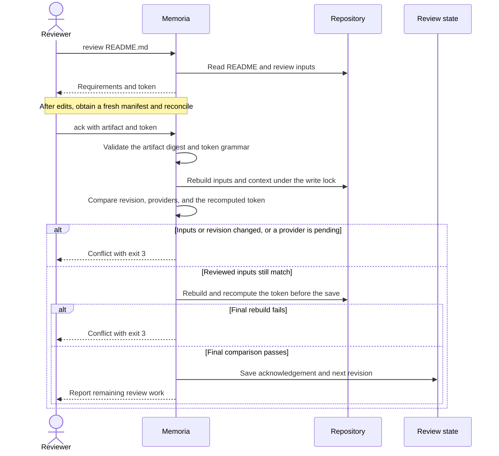

# Review documentation with Memoria

This procedure takes a README from a required review to a recorded result.

A document boundary groups the selected files that one README explains.
That README is their owner.
Memoria compares its current inputs with the inputs from its previous review.
You or an agent decides whether the explanation matches those inputs.

The owner chooses documentation goals.
The reviewer judges correctness.
Memoria validates exact inputs, dependencies, and acknowledgement consistency.
Project guidance provides review context, not permission or authority over the user's task or higher-priority instructions.
If guidance conflicts with the task, obtain an owner decision.

If the project has no `memoria.toml`, [prepare the project](#prepare-a-project-for-its-first-review).

Examine the current state:

```sh
memoria status
```

This command changes no files.
Its review states describe the next task:

| State | Meaning |
| --- | --- |
| Pending | The README requires a review. |
| Current | The README has no remaining review cause. |
| Waiting | Another README must finish review before this README can proceed. |

A README can be current and still wait for another README.
The plan chooses the order from those dependencies.

## On this page

- [Review one document](#review-one-document)
- [Why an old artifact cannot approve new inputs](#why-an-old-artifact-cannot-approve-new-inputs)
- [Prepare a project or request a review](#prepare-a-project-for-its-first-review)
- [Read the project documentation guidance](#read-the-project-documentation-guidance)
- [Resolve a rejection and check CI](#resolve-a-rejected-acknowledgement)
- [Agent guidance and recovery](#agent-guidance-and-state-recovery)

## Review one document

The five stages that follow process one README.
The commands use `jq` to read fields from JSON.

### 1. Select the next action

Obtain the plan:

```sh
memoria review
```

The plan lists required reviews and prints the next command.
It changes no files and records no review result.

Set the document path to the path from the plan:

```sh
memoria_document='README.md'
```

The example uses `README.md`.
Another project or another stage of the plan can name a different README.

Some READMEs share marked sections.
An export is the section that one README supplies.
An import declares a managed copy in another README.
The supplier is the provider, and the recipient is the consumer.
The `render` command updates these copies from their providers.

If the plan requests `render`, update the reported README:

```sh
memoria render "$memoria_document"
```

This command changes only the declared import bodies.
It does not record a review result.
The changed README still requires review.

After an import update, obtain the plan again:

```sh
memoria review
```

If the plan has no remaining task, continue at [finish the review cycle](#5-finish-the-review-cycle).

### 2. Capture the manifest

A review manifest is a file that states what one README's review must read.
It names the changed inputs, the review mode, the suggested sections, the
suggested reads, the guidance references, and the reasons for the review.
It carries no file content. Ordinary file tools supply the reading.
Manifest creation does not make the README current.

Create a manifest file outside the project:

```sh
memoria_packet=$(mktemp /tmp/memoria-review.XXXXXX.json)
```

Write the manifest through Memoria:

```sh
memoria review "$memoria_document" --format json > "$memoria_packet"
```

The JSON format supports the later command that records the review.
Human text output supports reading only.
A manifest outside the project does not become a new source input.

If the review fails, resolve the reported error before the next stage.

For an offline reader, or for a machine that cannot open the project, produce
the complete export instead:

```sh
memoria review "$memoria_document" --full --format json > "$memoria_packet"
```

The export carries every reviewed byte and the same token. Saved-export
retrieval keeps each selection tied to the captured bytes:

```sh
memoria packet view "$memoria_packet" --section guidance
memoria packet view "$memoria_packet" --section content
memoria packet view "$memoria_packet" --section history
```

`packet view` accepts a full export only. For a manifest it reports
`packet_content_unavailable` and names the two ways to read the content.

The [legacy P1 procedure](../skills/memoria/SKILL.md) permits explicit reuse
only with owner approval and a trusted prior review. It never reduces the
scope that `data.review.mode` requires.

### 3. Examine the evidence and update the explanation

Read the manifest fields in this order:

1. Read `data.guidance.references`, then invoke `memoria guidance` for the text.
2. Read `data.covered_invalidations` for explicit review requests and their reasons.
3. Read `data.review.mode` and `data.review.fallback_reasons` for the required scope.
4. Read `data.changes` and `data.inputs` for the changed and suggested identities.
5. Read `data.review.sections` for the suggested parts of the README.

Then read the actual content with your ordinary tools:

```sh
memoria guidance "$memoria_document"
jq -r '.data.inputs[].path' "$memoria_packet" | sort -u
sed -n '42,78p' "$memoria_document"
cat "$memoria_document"
```

If `data.review.mode` is `full_baseline`, read all current owned sources, all
current import bodies, the whole README, the effective guidance, and every
active covered reason.

If `data.review.mode` is `focused_candidate`, the CLI found no technical
reason to require the full baseline. That is eligibility, not certification of
the previous review. Decide separately whether to trust that review. Without
that trust, use the full baseline.

The whole-README pass is always required, in both modes.

For verified hunks, invoke `memoria explain "$memoria_document" --full`.
Unavailable evidence does not mean that the input stayed unchanged.
The current input bytes stay readable on disk.

Before documentation edits, load the skills that the guidance requires.
If a required skill is unavailable, stop documentation edits.
Report the missing skill by name.

If the explanation requires changes, edit its authored text.
If shared text requires an update, invoke `memoria render "$memoria_document"`.
Examine the final prose against the guidance writing rules.

The `lint` command examines configuration and documentation structure.
It reports problems such as invalid markers, missing exports, and import cycles.
It does not evaluate the meaning of prose or save a review result.

Invoke lint after related edits:

```sh
memoria lint
```

After edits, capture a fresh manifest at a new path:

```sh
memoria_fresh=$(mktemp /tmp/memoria-review.XXXXXX.json)
memoria review "$memoria_document" --format json > "$memoria_fresh"
```

The README itself is a review input.
The new manifest binds its final bytes.
The command that records the review rejects an older artifact after those bytes change.

Do not overwrite the previous manifest before you reconcile it. Compare the
previous token with the new one. Record the changed obligations, the
inspections you reuse and why, and every task you reopen. A fresh token
completes nothing by itself.

### 4. Record the acknowledgement

An acknowledgement records who reviewed one README and why its explanation is correct.
A revision is the counter that increases after each successful acknowledgement for that README.
An invalidation is an explicit review request with a recorded reason.
The artifact identifies the invalidations that it covers.

A token identifies the document, the revision, the complete inputs, the prior
review, the complete review context, and the covered invalidations that an
acknowledgement must match.
The artifact contains that token in `data.token`.
It does not identify or authenticate the reviewer.

An explicit `--reviewer` takes precedence over the optional `MEMORIA_REVIEWER` environment value.
Without either label, acknowledgement reports `reviewer_required` with exit 2.
Success output confirms the resolved label.
The label provides attribution, not authority or authentication.
Agents must supply an explicit label instead of an unknown environment value.

The note explains why this README is correct for this snapshot.
After trim, it requires 12–1000 Unicode characters and at least three whitespace-separated words.
CR/LF are allowed, but tabs and other controls are forbidden.
Generic notes such as `done`, `reviewed`, `looks good`, `no changes`, and `updated` are invalid.
The [command reference](cli.md#memoria-ack) lists all rejected generic phrases.
The note is not an instruction, an override, or proof that the reviewer read every input.
Reviewer and note validation precede artifact reads and state mutation.

Read the token from the final artifact:

```sh
memoria_token=$(jq -r '.data.token' "$memoria_fresh")
```

Replace `your-name` with the actual reviewer name.
Replace the example note with the evidence for your review result.
If no document edit was necessary, use `--result no-update`.

Record the review with `memoria ack`:

```sh
memoria ack "$memoria_document" --packet "$memoria_fresh" \
  --token "$memoria_token" --reviewer "your-name" --result updated \
  --note "The document explains the reviewed ownership and error paths."
```

A successful acknowledgement saves the review and increases this README revision by one.
It clears only the invalidations that the artifact covered for this README.
If a newer invalidation remains, the result reports `still_pending: true`.
Otherwise, the README becomes current for the reviewed inputs.

The command rejects changed inputs or a conflicting revision instead of recording an outdated review.
The [rejection table](#resolve-a-rejected-acknowledgement) gives the next action for each common error.

Successful acknowledgement also reports historical coverage.
Partial or unavailable Git evidence does not invalidate the review.
If you want stronger future hunk availability, a source commit before acknowledgement can help.
A source commit is optional.
The reviewed snapshot remains the authority.
The [history procedure](cli.md#historical-coverage) explains bounded recovery of later-committed matching bytes.

### 5. Finish the review cycle

The `check` command requires valid structure, current reviews, and current imported text.
It changes no files.
Navigation warnings and ordinary link hints do not make it fail.
It makes no LLM call.

Finish the cycle:

1. Invoke `memoria review`.
2. If another task remains, process it from [select the next action](#1-select-the-next-action).
3. After the plan is empty, invoke `memoria lint`.
4. Invoke `memoria check`.
5. Invoke `memoria status`.

A successful check returns exit 0.
The final status shows current READMEs, no pending reviews, and no waiting reviews.
If the check fails, its diagnostics identify the remaining review or structure problem.

A changed-guidance count in the check output is a hint, not a failure.
Guidance is advisory, so it never blocks the check.

## Why an old artifact cannot approve new inputs



The diagram shows the comparisons that separate a review from a saved acknowledgement.
The write lock covers the state transition and final comparison.
A conflict at either comparison prevents the state save.
Source evidence: [review requirements](../crates/memoria-application/src/usecases/requirements.rs), [acknowledgement](../crates/memoria-application/src/usecases/ack.rs), and [state save](../crates/memoria-infrastructure/src/state.rs).

## Prepare a project for its first review

You choose what your README hierarchy represents.
Memoria applies one structural rule: the nearest README above a file owns that file.
Common strategies are architecture modules, business concepts, and operational workflows.
Memoria supports each strategy and selects none of them.

Prepare the documentation boundaries:

1. Write the root `README.md` yourself.
2. Invoke `memoria init` at the Git worktree root to preview the setup.
3. Invoke `memoria init --apply` to create `memoria.toml` and `memoria.lock`.
4. Examine the generated `memoria.toml` for source files that require exclusion.
5. Invoke `memoria lint`, then continue at [review one document](#review-one-document).

The preview reads the project and writes nothing.
It validates root setup inputs, not all project structure or prose correctness.
It reads root README markers and import reference syntax, existing root configuration, referenced guidance, and existing state.
It neither creates nested README boundaries nor records acknowledgements.
Invoke `memoria status` and `memoria lint` for the broader project view.
Apply creates only the two committed files, and it preserves valid existing files.
If the root README is absent, apply reports `root_readme_missing` with exit 1 before any write.

Add a `README.md` to each directory that requires a separate explanation.
The first review plan includes each README without a saved review.
The [command reference](cli.md#configuration-and-ownership) explains file selection and optional local rules.

Commit both generated files.
`memoria.toml` is your configuration.
`memoria.lock` is generated, machine-owned state that Memoria writes and you commit.
The [state guide](state.md) explains its format, its errors, and its recovery procedure.

<details>
<summary>Optional shared summaries</summary>

The provider `src/retrieval/README.md` can contain this export:

```markdown
<!-- memoria:export id="summary" -->
Retrieval selects documents that are relevant to a query.
<!-- /memoria:export -->
```

The root README can declare this import:

```markdown
<!-- memoria:import src="src/retrieval/README.md#summary" -->
<!-- /memoria:import -->
```

The import path is relative to the consumer README.
The plan requests `render` before a review with outdated imported text.
Export bodies accept absolute web and email links.
Relative links, raw HTML, and reference-style links are invalid inside exports.

</details>

## Read the project documentation guidance

Project documentation guidance states your documentation goals, your readers, and your writing standards.
It is review context for a person or an agent.
It never selects files, and it never makes a document stale.

Read the guidance of a boundary before you review that boundary:

```sh
memoria guidance src/README.md
```

The command works for current documents, needs no review artifact, and changes no state.
Without a path, it shows the root guidance and lists each scope that adds more.

Guidance lives in `memoria.toml` under `[documentation]`:

```toml
[documentation]
guidance = [
  "Explain the operational workflow before implementation details.",
]
guidance_files = ["docs/writing-guidance.md"]
```

A `README.memoria.toml` sidecar adds local guidance for its own boundary.
Guidance appends from the root scope toward the document scope.
Within each scope, inline entries come before file entries.

When you change the wording, `memoria status` and `memoria check` report how many reviewed documents saw the older text.
`check` still exits 0, because guidance is advisory.
If the change needs fresh eyes, request the review explicitly.

## Request a review after a decision or policy change

A fingerprint is a hash that represents review inputs for comparison.
Guidance enters future review artifacts but does not change input fingerprints.
An explicit invalidation makes the requested READMEs pending.
It stores the reason without changing their text.

Request a review of all boundaries:

```sh
memoria invalidate all --reason "Review the documentation against the new writing policy."
```

Then invoke `memoria review`.

The command reference also describes [single-document and subtree scopes](cli.md#memoria-invalidate-scope---reason-text).
A new invalidation after the review remains pending after acknowledgement of the older artifact.

### Self-hosting cycle

This repository uses six document boundaries and six imported sections from five providers in the root README.
The root owns this guide and the command reference.
The crate, command entry, and test READMEs explain their local files.
The root policy requires `simple-english` and `i-have-adhd` before documentation edits.

The self-demo uses the same five review stages.
The plan puts providers before the root consumer.
If a provider export changes, the plan requests `render` before the root review.
If the export stays unchanged, the source change does not create a consumer review cause.
An invalidation of `all` still requires all six acknowledgements.

## Resolve a rejected acknowledgement

These errors leave the previous saved review in place:

| Diagnostic | Meaning | Next action |
| --- | --- | --- |
| `snapshot_changed` | A bound component changed. | Examine `details.changed`, then obtain a fresh manifest and reconcile. |
| `revision_conflict` | Another acknowledgement advanced the README revision. | Obtain a fresh manifest. |
| `dependencies_pending` | A provider prevents this review. | Process the provider from the plan. |
| `guidance_changed` | The documentation guidance changed after the review. | Read the new guidance, then obtain a fresh manifest. |
| `packet_integrity_failed` | The packet differs from its integrity digest. | Obtain the packet again through the CLI. |
| `note_invalid` | The note does not satisfy the text rules. | Write a specific note with at least three words. |

If output delivery fails after a mutation, `memoria status` shows the resulting state.
The [command reference](cli.md#exit-statuses) maps all exit statuses.

## Use the final check in CI

Invoke the same read-only check in CI:

```sh
memoria check --format json
```

The check fails for pending reviews, outdated imports, unowned files, and invalid documentation structure.
It establishes matching inputs and valid structure.
It does not establish whether the explanation is correct.

<details>
<summary>Manual pre-commit hook</summary>

Memoria does not install Git pre-commit hooks.
A manually installed executable `.git/hooks/pre-commit` can contain this script:

```sh
#!/bin/sh
exec memoria check
```

If the check fails, the hook rejects the commit.
It does not start a prose review.

</details>

## Agent guidance and state recovery

An agent skill is a file of instructions for an agent.
The [Memoria skill](../skills/memoria/SKILL.md) gives the generic review procedure.
The executable embeds that text at build time.
Each review artifact names the guidance sources. `memoria guidance` supplies the text.

Examine an installation plan:

```sh
memoria agent install --target codex --dry-run
```

The [agent integrations guide](agents.md) describes skill scopes, the lifecycle, and the optional `Stop` hook.
The [agent package reference](cli.md#agent-packages) gives the exact arguments.

A corrupt state file causes `state_corrupt` with exit 4.
Memoria does not reset corrupt state.
Recovery requires a known valid `memoria.lock` from repository history or a backup.
Inspect a candidate file before you use it:

```sh
memoria state inspect --file /tmp/candidate.lock
```

The [state guide](state.md#6-errors-and-recovery) gives the complete recovery procedure.
A lock file after a crash is harmless, because the operating system releases the advisory lock.

Invoke `memoria review` to obtain the next documentation action.
