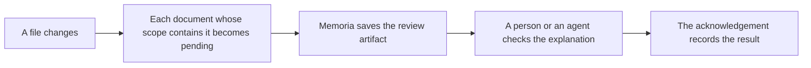
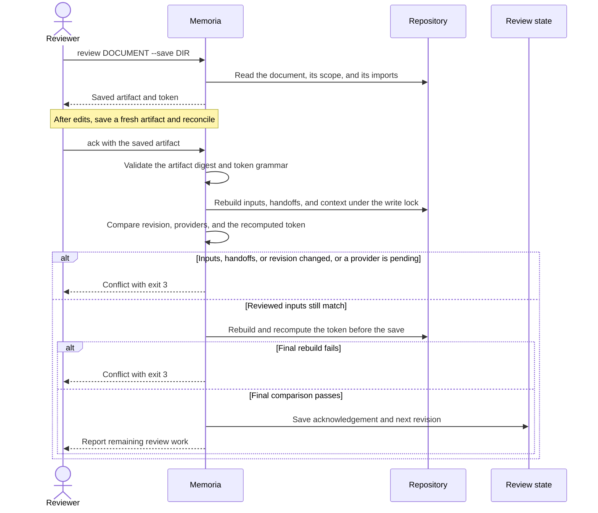

# Review documentation with Memoria

This procedure takes a document from a required review to a recorded result.

A tracked document is a Markdown file that Memoria reviews on its own.
Every `README.md` is a tracked document.
Another Markdown file becomes one when it carries a Memoria marker, like this guide.
Each document covers the selected files in its own folder and below it.
Memoria compares a document's current inputs with the inputs from its previous review.
You or an agent decides whether the explanation matches those inputs.

The owner chooses documentation goals.
The reviewer judges correctness.
Memoria validates exact inputs, dependencies, and acknowledgement consistency.
Project guidance provides review context, not permission or authority over the user's task or higher-priority instructions.
If guidance conflicts with the task, obtain an owner decision.

If the project has no `memoria.toml`, [prepare the project](#prepare-a-project-for-its-first-review).
If a term on this page is new to you, read the [concept guide](concepts.md) first.

Examine the current state:

```sh
memoria status
```

This command changes no files.
Its review states describe the next task:

| State | Meaning |
| --- | --- |
| Pending | The document requires a review. |
| Current | The document has no remaining review cause. |
| Waiting | Another document must finish review before this document can proceed. |

A document can be current and still wait for another document.
The plan chooses the order from those dependencies.

## On this page

- [The review cycle](#the-review-cycle)
- [Review one document](#review-one-document)
- [Scopes, handoffs, and shared reviews](#scopes-handoffs-and-shared-reviews)
- [Why an old artifact cannot approve new inputs](#why-an-old-artifact-cannot-approve-new-inputs)
- [Review documents in parallel](#review-documents-in-parallel)
- [Assess a guidance change](#assess-a-guidance-change)
- [Prepare a project or request a review](#prepare-a-project-for-its-first-review)
- [Upgrade a project to Memoria 0.7](#upgrade-a-project-to-memoria-07)
- [Resolve a rejection and check CI](#resolve-a-rejected-acknowledgement)
- [Agent guidance and recovery](#agent-guidance-and-state-recovery)

## The review cycle

<!-- memoria:export id="review-cycle" -->
Every document covers the selected files in its own folder and below it.
A document hands a subfolder to a tracked document there only by a link or an import.
When an input in a document's scope changes, that document becomes pending.
Each pending document gets its own review and its own acknowledgement.

The cycle has five stages:

1. `memoria review` selects the next document, in dependency order.
2. `memoria review <DOCUMENT> --save <DIR>` saves the review artifact outside the project.
3. You or an agent reads the changes, the listed inputs, the guidance, and the whole document.
4. After any edit, a fresh artifact reconciles the review with the final bytes.
5. `memoria ack <DOCUMENT> --packet <FILE>` records the result against that exact snapshot.

The artifact is the handoff.
It names what changed, how each change relates to the document, and what the review still must read.
Its token binds the acknowledgement to one snapshot, so an old artifact cannot approve new inputs.
`memoria check` passes when no document is pending and every import is current.
<!-- /memoria:export -->


```mermaid
flowchart LR
    accTitle: A code change becomes a recorded documentation review.
    accDescr: The documents whose scope contains the changed file become pending. Memoria states each review, and an acknowledgement records one decision.
    change["A file changes"] --> pending["Each document whose scope contains it becomes pending"]
    pending --> artifact["Memoria saves the review artifact"]
    artifact --> decision["A person or an agent checks the explanation"]
    decision --> ack["The acknowledgement records the result"]
```

The diagram makes one claim: a change reaches every document whose scope contains the changed file.
Source evidence: [scope rules](../crates/memoria-domain/src/scope.rs) and [review requirements](../crates/memoria-application/src/usecases/requirements.rs).

## Review one document

The five stages that follow process one document.
The commands use `jq` to read fields from JSON.

### 1. Select the next action

Obtain the plan:

```sh
memoria review
```

The plan lists required reviews and prints the next command.
It changes no files and records no review result.

Set the document path to the path from the plan:

```sh
memoria_document='README.md'
```

The example uses `README.md`.
Another stage of the plan can name a different document, for example an opted-in guide.

Some documents share marked sections.
An export is the section that one document supplies.
An import declares a managed copy in another document.
The supplier is the provider, and the recipient is the consumer.
The `render` command updates these copies from their providers.

If the plan requests `render`, update the reported document:

```sh
memoria render "$memoria_document"
```

This command changes only the declared import bodies.
It does not record a review result.
Run `memoria explain` again to see whether the rendered document requires review.

If the plan is empty, go to [finish the review cycle](#5-finish-the-review-cycle).
Never acknowledge an empty plan.

### 2. Save the artifact

A review artifact is a file that states what one document's review must read.
It names the changes and their relationships, the review mode, the suggested sections, the suggested reads, the guidance references, and the reasons for the review.
The default artifact carries no file content. Ordinary file tools supply the reading.

Create a directory outside the project, then save the artifact there:

```sh
memoria_dir=$(mktemp -d)
memoria review "$memoria_document" --save "$memoria_dir" --format json > "$memoria_dir/receipt.json"
memoria_artifact=$(jq -r '.data.path' "$memoria_dir/receipt.json")
```

The receipt names the saved file, its token, and the next `ack` command.
The saved bytes are exactly the bytes that `--format json` prints for the same snapshot.
`--save` refuses a directory inside the Git worktree, including an ignored one, because a saved artifact there could become a review input.

For an offline reader, or for a machine that cannot open the project, save the complete export instead:

```sh
memoria review "$memoria_document" --full --save "$memoria_dir" --format json
```

The export carries every reviewed byte and the same token.
`memoria packet view` reads its exact saved sections.

### 3. Examine the evidence and update the explanation

Read the artifact fields in this order:

1. Read `data.guidance.references`, then run `memoria guidance` for the text.
2. Read `data.covered_invalidations` for explicit review requests and their reasons.
3. Read `data.changes` and each `relationship` for what changed and how it relates to the document.
4. Read `data.review.mode` and `data.review.fallback_reasons` for the required reading.
5. Read `data.inputs` and `data.review.sections` for the suggested reads.

The human view shows the same facts, change first.
Under each changed input, it shows the verified hunk from Git: the exact lines between the reviewed bytes and the current bytes.

```sh
memoria review "$memoria_document"
memoria guidance "$memoria_document"
```

The default view shows at most 40 hunk lines for each change and 160 lines in total.
If it cuts a hunk, its last line names `memoria review "$memoria_document" --details`, which shows all computed hunks in full. The evidence budget can omit hunks without a reason, even with `--details`.

If `data.review.mode` is `full_baseline`, read all current scope sources, all current import bodies, the whole document, the effective guidance, and every active covered reason.

If `data.review.mode` is `focused_candidate`, the CLI found no technical reason to require the full baseline.
That is eligibility, not certification of the previous review.
Decide separately whether to trust that review.
Without that trust, use the full baseline.

The whole-document pass is always required, in both modes.

`data.downstream` names the export consumers that wait for this review and the other documents that cover the same changed sources.
Use them as prompts for judgment.
They are not proof that a change matters.

If Git no longer holds the reviewed bytes, the view says `No hunk` with the reason code.
Unavailable evidence does not mean that the input stayed unchanged: read the whole input.
`memoria explain "$memoria_document"` answers a different question: why a document is current, pending, or waiting.

Before documentation edits, load the skills that the guidance requires.
If a required skill is unavailable, stop documentation edits and report the missing skill by name.
If the explanation requires changes, edit its authored text.
If shared text requires an update, run `memoria render "$memoria_document"`.
Then run `memoria lint`.

After edits, save a fresh artifact:

```sh
memoria review "$memoria_document" --save "$memoria_dir" --format json > "$memoria_dir/fresh.json"
memoria_artifact=$(jq -r '.data.path' "$memoria_dir/fresh.json")
```

The document itself is a review input.
The new artifact binds its final bytes.
Compare the new requirements with your completed inspection, and read what is new.
A fresh token completes nothing by itself.

### 4. Record the acknowledgement

An acknowledgement records who reviewed one document and why its explanation is correct.
A revision is the counter that increases after each successful acknowledgement for that document.
An invalidation is an explicit review request with a recorded reason.

The saved artifact carries its token.
`ack` reads the token from the artifact, and then recomputes the complete token from the repository.
Pass `--token` only to check the artifact against a token that you kept.

An explicit `--reviewer` takes precedence over the optional `MEMORIA_REVIEWER` environment value.
Without either label, acknowledgement reports `reviewer_required` with exit 2.
The label provides attribution, not authority or authentication.
Agents must supply an explicit label.

The note explains why this document is correct for this snapshot.
After trim, it requires 12–1000 Unicode characters and at least three whitespace-separated words.
Generic notes such as `done`, `reviewed`, `looks good`, `no changes`, and `updated` are invalid.
The [command reference](cli.md#memoria-ack) lists all rejected phrases.

Record the review:

```sh
memoria ack "$memoria_document" --packet "$memoria_artifact" \
  --reviewer "your-name" --result updated \
  --note "The document explains the reviewed ownership and error paths."
```

If no document edit was necessary, use `--result no-update`.
A successful acknowledgement saves the review and increases this document's revision by one.
It clears only the invalidations that the artifact covered for this document.
It never clears another document, even one that covers the same sources.

The command rejects changed inputs or a conflicting revision instead of recording an outdated review.
The [rejection table](#resolve-a-rejected-acknowledgement) gives the next action for each common error.

### 5. Finish the review cycle

The `check` command requires valid structure, current reviews, and current imported text.
It changes no files, and it makes no LLM call.
Navigation warnings and hints do not make it fail.

1. Run `memoria review`.
2. If another task remains, process it from [select the next action](#1-select-the-next-action).
3. If the plan reports a guidance change, [assess it](#assess-a-guidance-change).
4. After the plan is empty, run `memoria lint`.
5. Run `memoria check`.

A successful check returns exit 0.
A guidance change never makes the check fail.
The plan reports it once, as its own assessment item.

## Scopes, handoffs, and shared reviews

Each document covers its own folder and below it.
A nested document alone removes nothing from a parent's scope.
A parent stops covering a subfolder only when it links to or imports a tracked document strictly inside that subfolder.
That reference is a handoff.

```text
README.md
app.rs
auth/
  README.md
  login.rs
```

| Root `README.md` says | An edit to `auth/login.rs` makes pending |
| --- | --- |
| Nothing about `auth/` | `README.md` and `auth/README.md` |
| `[Authentication](auth/README.md)` | `auth/README.md` only |
| An import of `auth/README.md#summary` | `auth/README.md`; the root waits for it |

A handoff binds coverage into the parent's review context.
Adding or removing the link makes the parent pending, and its next review uses the full baseline with the reason `handoff_changed`.
A link-only handoff creates no waiting.
An import keeps its waiting edge and its content freshness.

Two documents in the same folder always cover the same sources.
A change there makes both pending, and each needs its own review.
The artifact lists the other document under `data.downstream.co_covering`.

A link to Markdown that carries no Memoria marker is not a handoff.
`memoria lint` reports `handoff_not_applied` with the reason, and `handoff_absent` for a nested document that its parent does not hand off.
Before you add or remove a link to a document in a subfolder, run `memoria status --explain` for a file in that subfolder.
The [specification](specification.md#25-scope-and-handoffs) gives the exact rules.

## Why an old artifact cannot approve new inputs


```mermaid
sequenceDiagram
    accTitle: Acknowledgement compares the reviewed inputs before it saves state.
    accDescr: Memoria states the review requirements. Acknowledgement rebuilds every bound component and recomputes the token. A conflict ends the command without a state save.
    actor Reviewer
    participant Memoria
    participant Repository
    participant State as Review state
    Reviewer->>Memoria: review DOCUMENT --save DIR
    Memoria->>Repository: Read the document, its scope, and its imports
    Memoria-->>Reviewer: Saved artifact and token
    Note over Reviewer,Memoria: After edits, save a fresh artifact and reconcile
    Reviewer->>Memoria: ack with the saved artifact
    Memoria->>Memoria: Validate the artifact digest and token grammar
    Memoria->>Repository: Rebuild inputs, handoffs, and context under the write lock
    Memoria->>Memoria: Compare revision, providers, and the recomputed token
    alt Inputs, handoffs, or revision changed, or a provider is pending
        Memoria-->>Reviewer: Conflict with exit 3
    else Reviewed inputs still match
        Memoria->>Repository: Rebuild and recompute the token before the save
        alt Final rebuild fails
            Memoria-->>Reviewer: Conflict with exit 3
        else Final comparison passes
            Memoria->>State: Save acknowledgement and next revision
            Memoria-->>Reviewer: Report remaining review work
        end
    end
```

The diagram shows the comparisons that separate a review from a saved acknowledgement.
The write lock covers the state transition and the final comparison.
A conflict at either comparison prevents the state save.
Source evidence: [review requirements](../crates/memoria-application/src/usecases/requirements.rs), [acknowledgement](../crates/memoria-application/src/usecases/ack.rs), and [state save](../crates/memoria-infrastructure/src/state.rs).

## Review documents in parallel

Several reviewers can work at the same time in one checkout.
Each artifact binds only its own document: its inputs, its previous review, and its context.
Another reviewer's acknowledgement of a different document does not change that binding.

The work splits into two roles:

| Role | Does |
| --- | --- |
| Coordinator | Runs `memoria review --format json`. Gives each reviewer a different document from `data.tasks` with `ready: true`. Runs `render`, the guidance assessment, and the final `check`. |
| Reviewer | Saves the artifact for its own document, reviews it, and runs `memoria ack`. It does not select other work and does not run the final check. |

A reviewer follows these rules:

1. Review only the assigned document.
2. If `ack` reports `state_busy`, run the same `ack` again. The artifact stays valid.
3. If `ack` reports `snapshot_changed`, `guidance_changed`, or `revision_conflict`, save a fresh artifact and reconcile.
4. If `review` reports `dependencies_pending`, return the document to the coordinator.

Real dependencies still stop work.
A changed source that two documents cover refuses both older artifacts.
A consumer cannot start until its provider is acknowledged and its import is rendered.
Two reviewers of one document get `revision_conflict` for the second acknowledgement, so no record is lost.

`memoria ack` waits up to 10 seconds when another write command, such as another acknowledgement, holds the write lock.
`MEMORIA_LOCK_WAIT_MS` changes that wait, and `0` restores the immediate `state_busy`.

### Separate Git worktrees

A linked worktree has its own copy of `memoria.lock`.
Two copies cannot be merged, because the file is binary.
Acknowledge in the main checkout only:

1. In the worktree, edit and commit the documentation and sources.
2. After the last edit, run `memoria review <DOCUMENT> --save <DIR>` with a directory outside every worktree. Do not run `memoria ack` there.
3. Merge the branch into the main checkout.
4. In the main checkout, run `memoria ack <DOCUMENT> --packet <FILE>` with that artifact.

The acknowledgement recomputes the token in the main checkout.
It succeeds only when the merged inputs, the previous review, and the context equal what the reviewer saw.
If another merge changed any of them, it reports `snapshot_changed` or `revision_conflict`.
Then save a fresh artifact in the main checkout and reconcile.

## Prepare a project for its first review

You choose what your document tree represents.
Common strategies are architecture modules, business concepts, and operational workflows.
Memoria supports each strategy and selects none of them.

1. Write the root `README.md` yourself.
2. Run `memoria init` at the Git worktree root to preview the setup.
3. Run `memoria init --apply` to create `memoria.toml` and `memoria.lock`.
4. Examine the generated `memoria.toml` for source files that require exclusion.
5. Run `memoria lint`, then continue at [review one document](#review-one-document).

The preview reads the project and writes nothing.
Apply creates only the two committed files, and it preserves valid existing files.
If the root README is absent, apply reports `root_readme_missing` with exit 1 before any write.

Add a `README.md` to each folder that requires a separate explanation, and link to it from the parent.
To track a guide that is not a README, give it an export, an import, or a section marker.
The first review plan includes each document without a saved review.

Commit both generated files.
`memoria.toml` is your configuration.
`memoria.lock` is generated, machine-owned state.
The [state guide](state.md) explains its format, its errors, and its recovery procedure.

<details>
<summary>Optional shared summaries</summary>

The provider `src/retrieval/README.md` can contain this export:

```markdown
<!-- memoria:export id="summary" -->
Retrieval selects documents that are relevant to a query.
<!-- /memoria:export -->
```

The root README can declare this import:

```markdown
<!-- memoria:import src="src/retrieval/README.md#summary" -->
<!-- /memoria:import -->
```

The import path is relative to the consumer document.
An import from a subfolder is also a handoff of that subfolder.
Export bodies accept absolute web and email links.
Relative links, raw HTML, and reference-style links are invalid inside exports.

</details>

## Read the project documentation guidance

Project documentation guidance states your documentation goals, your readers, and your writing standards.
It is review context.
It never selects files, and it never makes a document stale.

```sh
memoria guidance src/README.md
```

Guidance lives in `memoria.toml` under `[documentation]`.
A `README.memoria.toml` sidecar adds local guidance for documents in its folder and below.
When you change the wording, the plan reports one assessment item.
The next section explains that decision.

## Assess a guidance change

A guidance change does not make a document pending.
The text that a reviewer applied changed, but the reviewed inputs did not.
Only you can decide which documents the new text affects.

`memoria review` reports the change in one line:

```text
Guidance changed since review for 26 documents. Assess it: memoria guidance --changed
```

Assess it in four steps:

1. Run `memoria guidance --changed`. It groups the documents by the guidance that their last review saw.
2. Read the current text with `memoria guidance <DOCUMENT>`.
3. Compare the text with its history, for example `git log -p -- memoria.toml`.
4. For each affected document or folder, run `memoria invalidate doc:<DOCUMENT>` or `subtree:<DIRECTORY>` with the reason. Then review those documents.

The assessment writes nothing.
A document that you leave alone stays in the list until its next review, because Memoria records no "assessed" decision.
Do not acknowledge a document only to clear this list: an acknowledgement states that you reviewed it against the current guidance.

## Request a review after a decision or policy change

An explicit invalidation makes the requested documents pending.
It stores the reason without changing their text.

```sh
memoria invalidate all --reason "Review the documentation against the new writing policy."
```

Then run `memoria review`.
The command reference also describes [single-document and subtree scopes](cli.md#memoria-invalidate-scope---reason-text).

### Self-hosting cycle

This repository has six READMEs and one opted-in guide: this page.
The root README links to this guide and imports its `review-cycle` export, so it hands `docs/` to this guide.
This guide covers the other pages under `docs/`.
The crate, command entry, and test READMEs explain their local files.
The root policy requires `simple-english` and `i-have-adhd` before documentation edits.

## Upgrade a project to Memoria 0.7

Memoria 0.7 reads configuration version 3 only.

1. Update every executable (local, agents, and CI) to 0.7.0 together.
2. Change `version = 2` to `version = 3` in `memoria.toml` and in any `README.memoria.toml` that declares a version.
3. Run `memoria status` and `memoria review`. Do not acknowledge yet.
4. Read each `handoff_absent` hint. A README that neither links nor imports a README in a subfolder now covers that subfolder too.
5. Add the link, or accept the extra reviews.
6. Decide on new opted-in documents. Each one covers its folder.
7. Save new review artifacts. Memoria 0.6 artifacts are refused.
8. Review each document normally. There is no bulk acknowledgement.

The existing `memoria.lock` is read as-is.
Its records are the baselines, and no upgrade converts, resets, or backfills them.
The first acknowledgement rewrites the file as lock format 3 and keeps every record.
After that write, Memoria 0.6 cannot inspect the file.
A record from 0.6 has no coverage evidence until its document's next acknowledgement.
Until then, a source that enters its scope can report `coverage_unrecorded` with a reason: review the complete current scope.
The [changelog](../CHANGELOG.md) gives the complete migration procedure.

## Resolve a rejected acknowledgement

These errors leave the previous saved review in place:

| Diagnostic | Meaning | Next action |
| --- | --- | --- |
| `snapshot_changed` | A bound component changed. | Examine `details.changed`, then save a fresh artifact and reconcile. |
| `revision_conflict` | Another acknowledgement advanced the document revision. | Save a fresh artifact. |
| `dependencies_pending` | A provider prevents this review. | Process the provider from the plan. |
| `guidance_changed` | The documentation guidance changed after the review. | Read the new guidance, then save a fresh artifact. |
| `state_busy` | Another command kept the write lock for the whole wait. | Run the same command again. Keep the artifact. |
| `packet_integrity_failed` | The artifact differs from its integrity digest. | Save the artifact again through the CLI. |
| `packet_schema_invalid` | The file is an old or foreign artifact, or a save receipt. | Pass the saved artifact from this release. |
| `note_invalid` | The note does not satisfy the text rules. | Write a specific note with at least three words. |

The [command reference](cli.md#exit-statuses) maps all exit statuses.

## Use the final check in CI

```sh
memoria check --format json
```

The check fails for pending reviews, outdated imports, uncovered files, and invalid documentation structure.
It establishes matching inputs and valid structure.
It does not establish whether the explanation is correct.

<details>
<summary>Manual pre-commit hook</summary>

Memoria does not install Git pre-commit hooks.
A manually installed executable `.git/hooks/pre-commit` can contain this script:

```sh
#!/bin/sh
exec memoria check
```

If the check fails, the hook rejects the commit.
It does not start a prose review.

</details>

## Agent guidance and state recovery

The [Memoria skill](../skills/memoria/SKILL.md) gives agents the review procedure in five stages, with three reference files that load on demand.
The executable embeds all four files at build time.
The [agent integrations guide](agents.md) describes skill scopes, the lifecycle, and the optional `Stop` hook.

A corrupt state file causes `state_corrupt` with exit 4.
Memoria does not reset corrupt state.
Recovery requires a known valid `memoria.lock` from repository history or a backup.

```sh
memoria state inspect --file /tmp/candidate.lock
```

The [state guide](state.md#6-errors-and-recovery) gives the complete recovery procedure.

Run `memoria review` to obtain the next documentation action.
